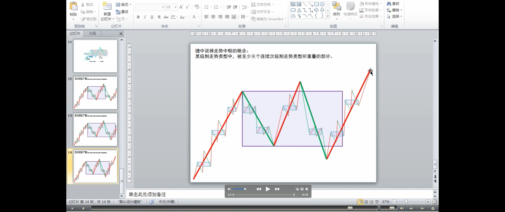
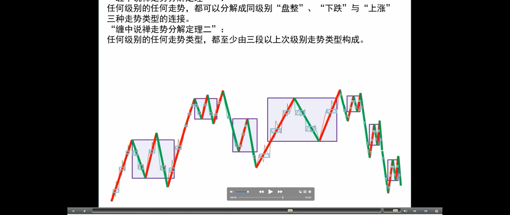
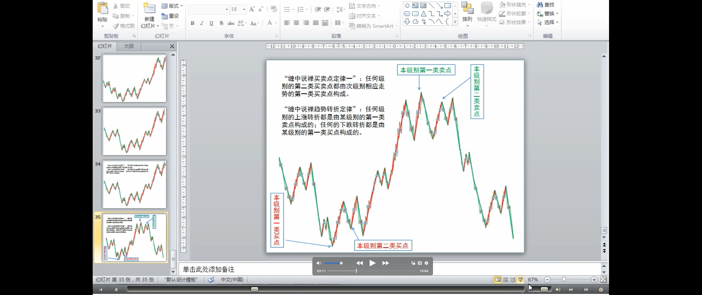
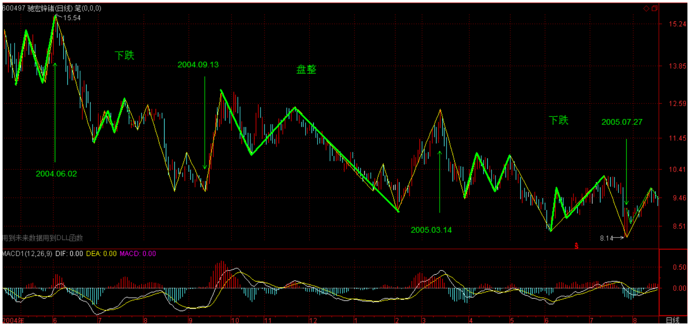
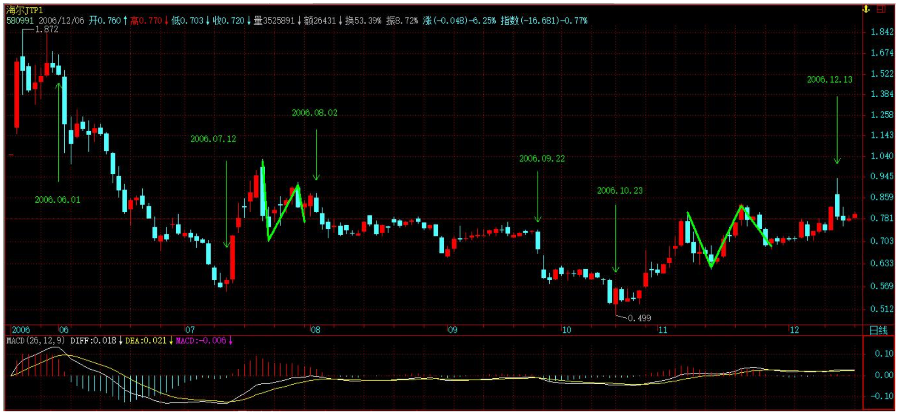
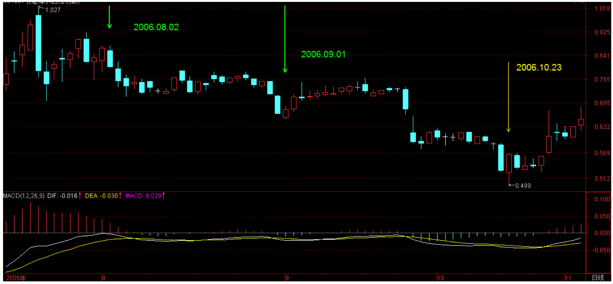
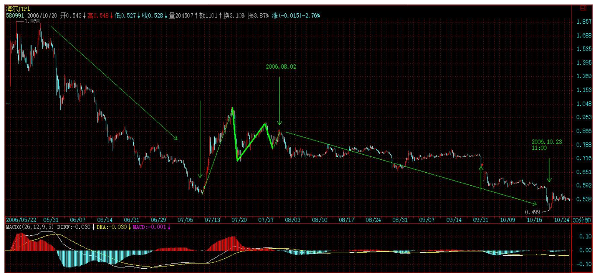
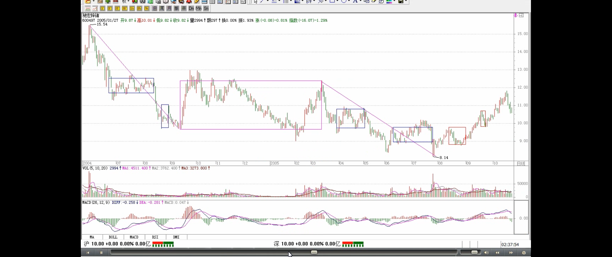
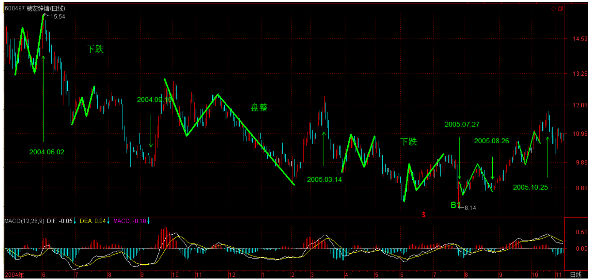

# 教你炒股票 17：走势终完美

> 参考芷涵的开头
> - 任何事情即使再简单，想要做好都不简单。
> - 往往以为我们有所了解了，但实际上都未入流。
> - 缠师引领你冲破赌命一条的宿命。
> - 顶天立地，敢于承担，才能有所收获。

> 任何级别的所有走势：趋势和盘整
>
> - 趋势：上涨和下跌
>
> - 这四个概念的来源：从无数图形的分析实践中总结出来的
> - 是技术分析的基础

**任何级别的所有走势，都能分解成趋势与盘整两类，而趋势又分为上涨与下跌两类**。**以上结论，不是从天而降的，而是从无数图形的分析实践中总结出来的**，正如《论语》所说“由诲女，知之乎！知之为，知之；不知为，不知；是知也。”（请看本 ID 相应系列的解释）**这个从实际图形中总结出来的简单经验，却是一切有关技术分析理论的唯一坚实基础**。**这个基础**，所有接触技术分析的人都知道，但可惜没有人能深究下去，然后就沉入技术指标、交易系统等苦海不能自拔。试想，基础都没搞清楚，又有什么可立起来？而基础稳固了，技术指标、交易系统等都是小儿科了。

> 技术分析基本原理一：走势终完美
>
> - 怎么得来的？实践中总结出来的，从无数图形的分析实践中总结出来的
>
> - 这个原理的重要性：静态的很难实用的视角，动态的可以实用的视角
> 
> 患/不患：《论语》详解:给所有曲解孔子的人(30)

由上可得到 **“缠中说禅技术分析基本原理一”** ：任何级别的任何走势类型终要完成。后面一句用更简练的话，就是 **“走势终完美”** 。**这个原理的重要性**在于把实践中总结出来的、很难实用的、静态的“所有级别的走势都能分解成趋势与盘整”，转化成动态的、可以实用的“走势类型终要完成”，这就是论语所说的智慧：“所有级别的走势都能分解成趋势与盘整”是“不患”的，是无位次的，而“走势类型终要完成”的“走势终完美”以“所有级别的走势都能分解成趋势与盘整”的无位次而位次之，而“患”之。

> 任何走势的当下，要面对的一个问题：无法判断后面的走势
>
> 但根据基本原理一可知：走势在不完美到完美的动态过程中
>
> 患：患得患失，担忧，引申为不确定；不患：不担忧，引申为确定（来自知乎）。
>
> 患：相对，不患：绝对（“逐句讲解”15 课）

因为在实际操作中，面对是都是鲜活的、当下的，而正如《论语》所说的，“由知、德者，鲜矣！”，必须直面这种当下、鲜活，才能创造。**而在任何一个走势的当下，无论前面是盘整还是趋势，都有一个两难的问题：究竟是继续延续还是改变**。例如，原来是在一个趋势中，该趋势是否延续还是改变成相反的趋势或盘整，这样的问题在当下的层次上永远是“不患”的，无位次的。任何宣称自己能解决这个两难问题的，就如同在地球上宣称自己不受地球引力影响一样无效，这是任何面对技术图形的人都必须时刻牢记的。但这个两难的“不患“，在“所有级别的走势都能分解成趋势与盘整”的“不患”下，又成了其“患”，就因此可以位次（该问题的理解，可以参考本 ID 关于《论语》相关章节的解释）。**正因为当下的走势是两难的，也就是在不完美到完美的动态过程中，这就构成了其“不患”而位次的基础**。“走势终完美”，而走势“不患”地可以分解成趋势与盘整，换言之，“趋势终完美，盘整也终完美”。

> 走势终完美的两个方面的含义:
>
> - 走势类型最终要完成
> - 某种走势类型完成以后，就会转化为其他走势类型

**“走势终完美”这句话有两个不可分割的方面：任何走势，无论是趋势还是盘整，在图形上最终都要完成。另一方面，一旦某种类型的走势完成以后，就会转化为其他类型的走势，这就是“不患”而有其位次**。在技术分析里，不同的位次构成不同的走势类型，各种位次以无位次而位次。而如何在不同位次之间的灵活运动，是实际操作中最困难的部分，也是技术分析最核心的问题之一。

> 定义：中枢(v1.0)
>
> 最低级别中枢的定义(v1.0)、一般最低级别为 1/5 分钟

为了深入研究这复杂问题，必须先引入缠中说禅**走势中枢的概念：** 某级别走势类型中，被至少三个连续次级别走势类型所重叠的部分（注解：y 轴-价格重叠），**称为缠中说禅走势中枢** 。换言之，缠中说禅走势中枢就是至少三个连续次级别走势类型重叠部分所构成。这里有一个递归的问题，就是这次级别不能无限下去，就像有些半吊子哲学胡诌什么“一分为二”，而“分”不是无限的，按照量子力学，物质之分是有极限的，同样，级别之次也不可能无限，在实际之中，对最后不能分解的级别，其缠中说禅走势中枢就不能用“至少三个连续次级别走势类型所重叠”定义，**而定义为至少三个该级别单位 K 线重叠部分**。一般来说，对实际操作，**都把这最低的不可分解级别设定为 1 分钟或 5 分钟线**，当然，也可以设定为 1 秒种线，但这都没有太大区别。

> 定义：盘整（中枢定义）
>
> 定义：趋势
>
> - 趋势：上涨/下跌（疑问：包括 2 个吗？包括）

有了上面的定义，就可以在任何一个级别的走势中找到“缠中说禅走势中枢”。**有了该中枢，就可以给“盘整”、“趋势”给出一个最精确的定义：**
**缠中说禅盘整：** 在任何级别的任何走势中，某完成的走势类型**只包含一个**缠中说禅走势中枢，就称为该级别的缠中说禅盘整。
**缠中说禅趋势：** 在任何级别的任何走势中，某完成的走势类型**至少包含两个以上（ 2 个或 2 个以上）** 依次同向的缠中说禅走势中枢，就称为该级别的缠中说禅趋势。该方向向上就称为**上涨**，向下就称为**下跌**。

> 走势必然包含中枢的证明
>
> 技术分析基本原理二（疑问：由走势类型的定义可以得出这个？1:任何级别的走势必然包含一个或以上的中枢）

**那么，是否可能在某级别存在这样的走势，不包含任何缠中说禅走势中枢？** 这是不可能的。因为任何图形上的“向上+向下+向上”或“向下+向上+向下”都必然产生某一级别的缠中说禅走势中枢，没有缠中说禅走势中枢的走势图只意味着在整张走势图形上只存在两个可能，就是一次向下后永远向上，或者一次向上后永远向下。要出现这两种情况，该交易品种必然在一定时期交易后永远被取消交易，而这里探讨走势的一般情况，其前提就是该走势可以不断延续下去，不存在永远取消交易的情况，所以，相应有
**“缠中说禅技术分析基本原理二”：** 任何级别任何完成的走势类型（注解：走势），必然包含一个以上（注解：一个或一个以上）的缠中说禅走势中枢。

> 走势分解定理一（同级别分解）(中枢/走势类型/原理一)
>
> 走势分解定理二（高低级别之间分解）

由原理一、二以及缠中说禅走势中枢的定义，就可以严格证明：
**“缠中说禅走势分解定理一”：** 任何级别的任何走势，都可以分解成同级别“盘整”、“下跌”与“上涨”三种走势类型的连接。
**“缠中说禅走势分解定理二“：** 任何级别的任何走势类型，都至少由三段以上次级别走势类型构成（注解：由中枢、盘整、趋势的定义推导出。盘整由至少三个次级别走势类型构成，趋势是至少五个）。

> 第一类买点/第一类卖点（疑问：如何确定一类买卖点？用背驰确定）
>
> - 第一类买点：下跌走势转化的关节点
> - 第一类卖点：上涨走势转化的关节点
>
> 第二类买点/第二类卖点
>
> - 第二类买点：在第一类买点出现后第一次次级别回调制造的低点
> - 第二类买点安全的原因
>
> 第二类买点跟第一类买点的关系

这些证明都很简单，就和初中几何的证明一样，有兴趣自己来一下。由上面的原理和定理，就可以严格地给出**具体操作唯一可以依赖的两个坚实的基础**。因为某种类型的走势完成以后就会转化为其他类型的走势，对于下跌的走势来说，一旦完成，只能转化为上涨与盘整，因此，一旦能把握**下跌走势转化的关节点**买入，就在市场中占据了一个最有利的位置，而这个买点，就是前面反复强调的 **“第一类买点”** ；而因为无论是趋势还是盘整在图形上最终都要完成，所以**在第一类买点出现后第一次次级别回调制造的低点**，是市场中第二有利的位置，**为什么？** 因为上涨和盘整必然要在图形上完成，而上涨和盘整在图形上的要求，是必须包含三个以上的次级别运动，因此后面必须还至少有一个向上的次级别运动，**这样的买点是绝对安全的**，其安全性由走势的“不患”而保证，这，就是在前面反复强调的**第二类买点**。买点的情况说了，**卖点的情况反之亦然**。
综上所述，就不难明白为什么本 ID 在前面反复强调这两类买卖点了。因为该两类买卖点是被最基础的分析所严格保证的，就如同几何中严格定理一样，只要找准了这两类买卖点，在市场的实际走势中是战无不胜的，是波涛汹涌的市场中最坚实的港湾。**关于该两类买卖点与走势及上述原理、定理间密不可破的逻辑关系（注解：中枢、上涨-下跌-盘整、技术分析基本原理一），必须切实理解体会，这是所有操作中最坚实、最不能混淆的基础。**

> 买卖点定律一（疑问：确定吗？如果次级别回调是盘整呢？）

由上面的原理、定理，就可以继续证明前面已经说过的“**缠中说禅买卖点定律一**”：任何级别的第二类买卖点都由次级别相应走势的第一类买（卖）点构成。

> 趋势转折定律

这样，就像前面曾说过的，**任何由第一、二类买卖点构成的缠中说禅买卖点，都可以归结到不同级别的第一类买卖点**。由此得到“**缠中说禅趋势转折定律**”：
任何级别的上涨转折都是由某级别的第一类卖点构成的；任何的下跌转折都是由某级别的第一类买点构成的。
**注意**，这某级别不一定是次级别，因为次级别里可以是第二类买卖点（疑问：这个和买卖点定律冲突了？表达的不严谨导致），而且还有这种情况，就是不同级别同时出现第一类买卖点，也就是出现不同级别的同步共振，所以这里只说是某级别。

本 ID 以上对技术分析的理论构建，绝对前无古人，就像欧几里德之于几何一样。这**是为纷繁的技术分析找到了一个坚实的理论基础，由这些原理、定理，可以继续引申出不同的定理，就像几何里面一样**。这些定理，都是抛开一切偶然因数的，而实际的操作，必须建立在此之上，才会长期立于不败之地。

> 例子

**这些问题以后还要逐步展开**，这里先把两个前面已经让各位思考例子来分析一下，**让各位对趋势、级别、走势中枢等概念有一个感性的认识**，毕竟上面抽象的方法并不是每个人都能理解的：

驰宏锌锗：为什么从 2004 年 6 月 2 日到 2005 年 7 月 27 日，构成标准的“下跌+盘整+下跌”的走势， 而类似的图形在 580991 上不算，这唯一的原因就是因为后者在日线的下跌中并不构成日线级别的缠中说禅走势中枢  ，而在 30 分钟线上，这个中枢是明确的。所以 580991 只构成 30 分钟级别上的“下跌+盘整+下跌”。

其后的上涨，对 600497 驰宏锌锗， 2005 年 7 月 27 日到 10 月 25 日，明确地出现在日线上的上涨走势（为什么？因为在日线上明确地看到两个缠中说禅走势中枢）。而 580991 从 2006 年 10 月 23 日到 12 月 13 日，只构成日线上的盘整走势（为什么？因为在日线上明确地看到一个缠中说禅走势中枢）。

两者力度上有如此区别的技术上的原因就是上面两个：一、“下跌+盘整+下跌”走势的出现级别不同，一个是日线，一个是 30 分钟的。二、其后的第一段走势，一个是日线上涨，一个是日线盘整。

> 几条思考题

以上内容，足够各位消化几天了。后面还有很多内容，逐一写来。但请注意版权，发现抄袭的本 ID 要抓来狗头铡给铡了。最后布置几条思考题：

1、 连接两相邻同级别缠中说禅走势中枢的一定是趋势吗？一定是次级别的趋势吗？

2、 **背驰是两相邻同向趋势间，后者比前者的走势力度减弱所造成的**，如果用均线或 MACD 等判断其力度，一定要在同级别的图上吗？同级别的 MACD 红绿柱子背驰一定反映某级别趋势间出现背驰吗？是相应级别的趋势出现背驰吗？

3、 盘整的高低点是如何造成的。（这个问题有点难度，提示，用缠中说禅走势中枢以及级别等进行分析。）

4、再布置一个具体的股票 请分析一下北辰 12 月 7 日以来走势的具体级别、走势类型。

5、除了那四个作业，请再好好分析这个例子: 580991，从上市到 10 月 23 日，在日线上构成“下跌”走势，其后 是一个未完成的走势类型，暂时只构成一个中枢。而在 30 分钟线上，6 月 2 日至 10 月 23 日是典型的“下跌+盘整+下 跌”，是三种完成的走势类型的连接，好好把这里面的区别理解，才算 有点真明白。

## 课后回复

- 好好消化，如何把抽象的理论变成自己的直觉，无论是谁，可不是
  一两天的事情。

- 本 ID 十分理解各位急着挣钱的心理，但这种心理本来就是市场参与 者的大忌，连自己的心都控制不住，对自己的贪婪、欲望都不能控制， 是不能在市场中长久成功的。
  心态平和点，焦躁没有智慧。

- 用均线或 MACD 看背驰都是辅助性的，都不是最重要的，最重要的 是把今天的搞清楚，这是最重要的。
  关于背驰相关的问题，本 ID 后面会继续说的。**先把逻辑关系搞清楚:走势--级别--趋势--前后趋势比较--背驰--用均线等辅助判断背驰。**
  所以先把前面搞清楚，别困在一些某节上，前面明白了，后面自然
  清楚。
  难道没有均线、没有 MACD 就判断不了背驰?显然不是。那只是辅
  助。

- > 问：既然高手 无论在牛市还是熊市都能在股市提款，为什么缠 mm2001 年~2005 年却不看一眼股 票呢?**是否像你这样的高手也要回避熊市呢?那么职业股民在熊市中岂不要转行了?**
  >
  > 答：本 ID 又不等钱花，为什么要花精力在熊市里忙?**有技术，熊市一样挣钱，这没错，但这种钱本 ID 早没兴趣了**。 人生有很多事情可以干，关键是要明白当下最值得干什么。有大牛 市，本 ID 当然不会错过，那种破熊市里的破行情，值得本 ID 去浪费时间吗?

- **那几个作业请各位认真思考，一定要多从中枢的概念出发，因为有
  了中枢的概念，盘整、趋势都没包含其中的，那是比盘整、趋势更基本
  的概念。**
  大盘走势没什么特别的，还是沿用以前的老招数，一旦两市走势背
  离就会出现震荡，而且深圳走势更明确，这些都在以前反复说过的，自
  己以后都可以继续灵活应用。
  还有就是缺口的问题，一旦在下方留下缺口，对短线就有考验，能
  不补当然是强势的，但考验是必须的。像上海昨天、今天连续出现缺口
  的走势，出现震荡是理所当然的。

- 关于第四个作业，可以换一个提法。对北辰，本 ID 曾说会强力反 抽，前两天还有人质疑本 ID 怎么反抽还不出现。不知道这两天的反抽算
  不算强力了。强不强力且不说，关键各位要把知识学到。用走势终完美的逻辑关系在相应走势级别中说明这两天北辰走势的
  必然性。

- > 问：尊敬的楼主:熬夜做功课，有些收获，批评指正，谢谢谢谢!!!! （省略。。。）
  >
  > 答：**你思考的入口是对的，就是要从缠中说禅中枢出发，但每道题都没有把特例思考好，一种特殊的情况往往是操作中最大的敌人，而能否把所有特殊的情况都思考到，这是很关键的地方**。请继续努力，多给自己出点难题，把所有你现在回答不能包含的特殊情况都思考一下。

- > 问：前几天问的问题,可能楼主没看到.现在问楼主另一问题.半仓操作,始终做日内 差,可行性大吗?按你所了解的对于坐庄户来说,日内差价所得能构成最后收益的 多大比例?
  >
  > 答：**资金量不大是可能的，盘整时间越长，成本越低。盘整是用来降低自己成本的，抬高别人成本的。** 有空教各位坐庄。开盘，先下。

- > 问：请问老师:日线的次级别的类型是指 60 分钟的还是 30 分钟的走势
  >
  > 答：一般用 30 分钟。

- > 问：单位 K 线的重叠，形成中枢，这些中枢构成的走势，是这一级别图线上最小级别 的走势;这些最小级别的走势形成的中枢，构成的走势，是高一级别的。所以， 一个特定级别的中枢和走势构成了更高级别的中枢和走势;也就是说，中枢和走 势，都是有其自己特定级别的，都是要在其自身的级别中进行判定的。这个说法 是不是正确呢?请博主点拨一下
  >
  > 答：站在纯理论的角度，是可以说低级别走势的积累、迭加构成高级别的走势，但这里没有什么必然的规律，如果有，就可以用这些规律把市场的走势给构造出来了，这显然是不对的。正因为如果，就不能从低级别看起，分析图形，要从高看到低。低级别走势的意义，是在高级别意义的彰显后才能彰显。

- > 问：数女好!请教个问题,5 分钟线,15 分钟线,30 分钟线,日 K 线显示的信息出现矛盾时, 尤其是目前较敏感的时间,应该以 5 分钟线,15 分钟线为准吧?
  >
  > 答：怎么会有矛盾信息?例如 5 分钟出现下跌，日线出现上涨，这能算矛盾吗?站在日线的角度，那 5 分钟的下跌只构成一个小的回挡。至于看哪个，关键是你的资金量与操作频率，如果资金量小，频率快的，5 分钟图上一旦出现危险，就可以退出来了。而对资金量大的，5 分钟图的危险没什么意义，除非这种危险演化成日线上的危险。

- > 问：问题 3、在看图过程中发现，不管是以月线、周线还是日线为标准，最后都要走 到以最小的 1 分钟线上去，因为每一级的趋势或盘整都须次级别的走势来确定，而次一级别的又须更次一级别的走势确定，直到 1 分钟图上(以现在大多数软件 的功能)才以三根 K 线重叠来判定中枢，是这样的吗?缠姐是怎么用的呢?
  >
  > 答：错，次级别的前三个走势类型都是完成的才构成该级别的中枢，完成的走势类型，在次级别图上是很明显的，根本就不用看到再下面的级别去。

- > 问：缠姐有问题请教: 1、因没图，用假设的例子举例:有一段是上涨趋势从 5 元涨到 10 元，而后在 10 元附近形成了一个中枢，而后下跌至 8 元附近形成一个中枢，后再下跌至 6 元后趋势改变，请问 10 元至 6 元算不算是一次在高一级别的下跌趋势，不知我 说明白没有，意思就是**刚好在顶部有一个中枢的，其后下跌中又形成一次中枢， 因高点处中枢是转折点，既对前边的上涨有关，也与其后的下跌有关**，请指教.
  >
  > 答：如果你说的那些中枢都是同一级别的，就构成了上涨+下跌的走势。如果上面的中枢构成了更高级别的中枢，就构成“上涨+盘整+下跌”的走势。这种走势，往往意味着在大级别中是一个大的盘整。
  >
  > 问：2、两个同向中枢能否的轻微重叠，假如是一个向上的趋势，第二个中枢的下边 与第一个中枢的上边有重叠，这种情况会不会出现?
  >
  > 答：这将会构成高一级别的中枢。而在本级别中，也将这看成一个中枢。在一个趋势中，中枢之间是绝对不重叠的。
