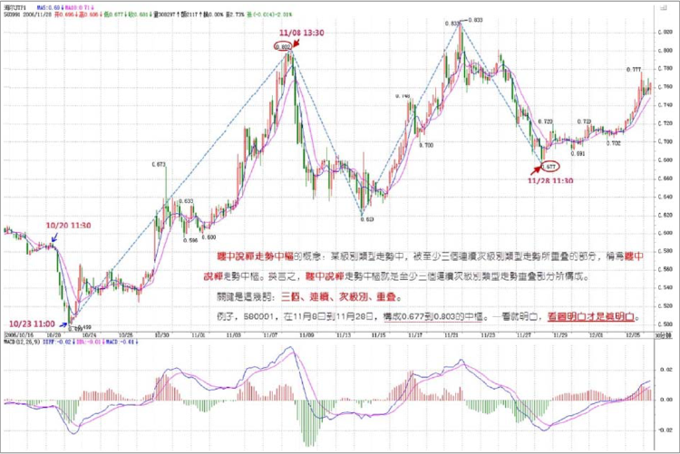
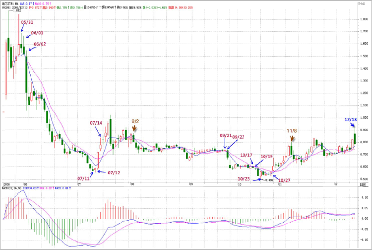
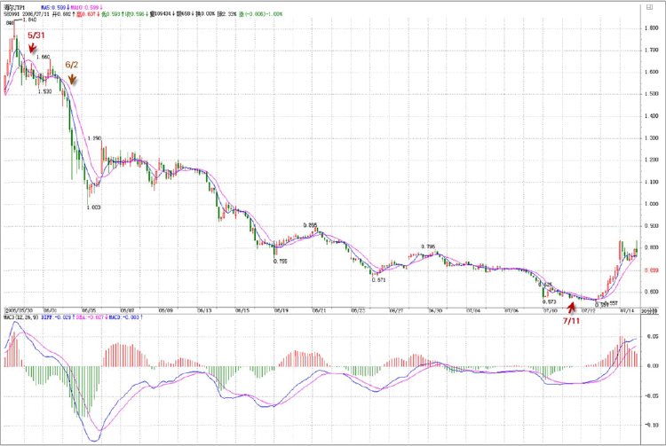
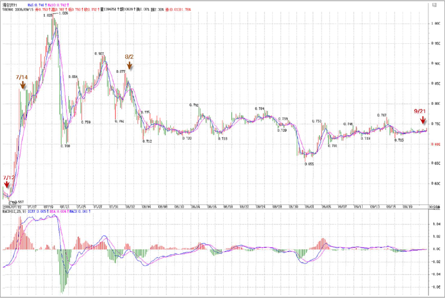
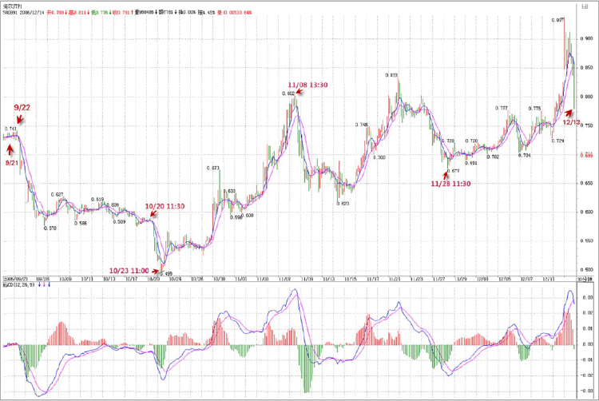

# 课后回答

## 14、各位知道为什么智慧难得吗？（06.12.18）
缠中说禅 2006-12-18 17:06:54：公告

各位知道为什么智慧难得吗？就因为偷心不死，整天想着捷径，想着一夜暴富。

你看看真正成功的人，有哪个是靠中彩票的？要在市场上成功，首先要把这偷心给废了，否则学什么都没用，一到场上就犯糊涂，然后就后悔、自责，然后又继续犯糊涂。

道理是死的，用的是人，人没道理，什么道理都没用。

没错，本 ID 可以告诉你消息，让你买所谓的黑马，但就算让你买了，你可能也守不住。你回头看看，有多少黑马是你曾经买过的，如果都留到现在，你还用找黑马吗？别说找不到黑马，而是好好想想，为什么黑马都避着自己。

## 15、都不对。（06.12.18）

2006-12-18 15:04:25：您说“而580991从2006年10月23日到12月13日，只构成日线上的盘整走势（为什么？因为在日线上明确地看到一个缠中说禅走势中枢）”。这句话中提到的那个缠中说禅走势中枢是指10/23~11/8，还是11/14~11/21，如果看30分钟图，应该是指前者对吗？

缠中说禅：都不对，是11月8日到11月28日，是三个次级别趋势构成。

## 16、各位把下面这个定义好好读读。（06.12.18）

缠中说禅 2006-12-18 16:34:32：各位把下面这个定义好好读读：

缠中说禅走势中枢的概念：某级别走势类型中，被至少三个连续次级别走势类型所重叠的部分，称为缠中说禅走势中枢。换言之，缠中说禅走势中枢就是至少三个连续次级别走势类型重叠部分所构成。

关键是这几词：三个、连续、次级别、重叠。

例子，580991，在11月8日到11月28日，构成0.677到0.803的中枢。一看就明白，看图明白才是真明白。

## 19、好好把这里面的区别理解。（06.12.19）

2006-12-19 21:33:25：580991在10月23日至11月08日那次又是什么趋势呢？和这个中枢是什么关系？11月28日之后至今又是什么趋势呢？是不是因为只有一个中枢的存在，而把10月23日至今天的走势都当成盘整，那如果明天以后一直上涨而形成第二个中枢，那这第二个中枢的起点从哪算起，从11月28日？为什么10月23日至11月08日不计入三个连续次级别类型走势？

缠中说禅：你的问题在于把“下跌+盘整+下跌”和“下跌”搞混了。580991，从上市到10月23日，在日线上构成“下跌”走势，其后是一个未完成的走势类型，暂时只构成一个中枢。而在30分钟线上，6月2日至10月23日是典型的“下跌+盘整+下跌”，是三种完成的走势类型的连接，好好把这里面的区别理解，才算有点真明白。

