# 教你炒股票 20：缠中说禅走势中枢级别扩张及第三类买卖点

> 定义：中枢（增加）：前三个
>
> 当下的中枢走势的两种情况（感觉有三种情况：趋势、中枢延伸、产生更大级别中枢）
>
> 定义：中枢延伸（中枢维持-住）
>
> 定义：趋势（增加条件）：趋势的两个中枢（包含波动），不能有重叠（中枢区间没有重叠且中枢波动也没有重叠）
>
> 定义：中枢升级（第一种情况）：中枢区间没有重叠，但中枢波动有重叠（产生一个更大级别的缠中说禅走势中枢）
> - **更大级别中枢产生的方式：中枢扩张升级，中枢延伸升级，次级别走势类型重叠形成。**
> - 疑问🤔️：中枢区间没有重叠，但后一个中枢区间跟前一个中枢的波动有重叠，是中枢升级？

前面已经很明确地指出，缠中说禅**走势中枢**由**前三个**连续次级别走势类型的重叠部分确定，**其后的走势有两种情况：** 一、该走势中枢的延伸（注解：中枢维持-住）。二、产生新的同级别走势中枢（归纳🐢：两个方向的破坏-向上/向下的新中枢。包括两种情况：趋势、中枢级别扩张）。而在**趋势里，同级别的前后缠中说禅走势中枢是不能有任何重叠的，这包括任何围绕走势中枢产生的任何瞬间波动之间的重叠**。因此，**如果三个连续次级别走势类型的重叠区间（注解：中枢区间）虽然不和前面的走势中枢有任何重叠，但围绕该中枢产生的波动触及前面走势中枢延续（延伸）时的某个瞬间波动区间，这时候，就不能认为该走势类型是趋势**，而只是**产生一个更大级别的缠中说禅走势中枢（归纳🐢：中枢升级的第一种情况）**。
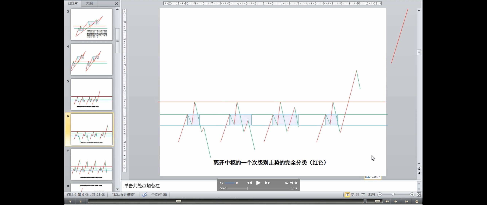
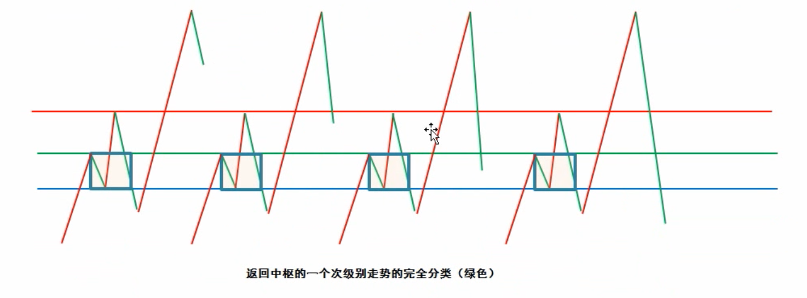
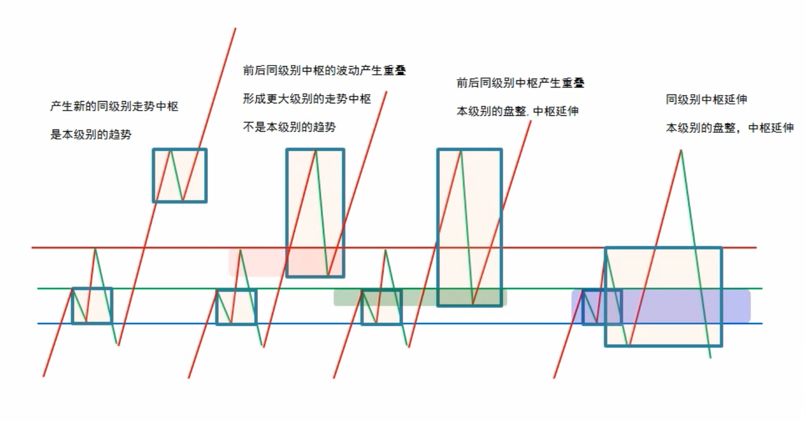
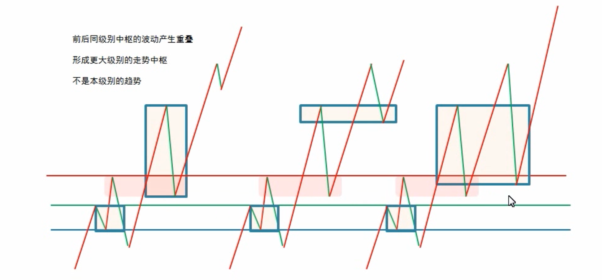
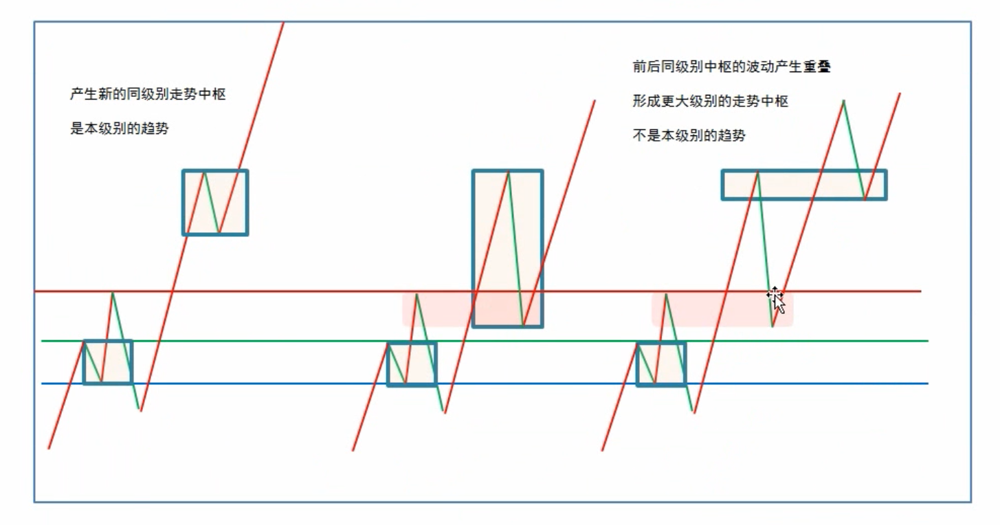
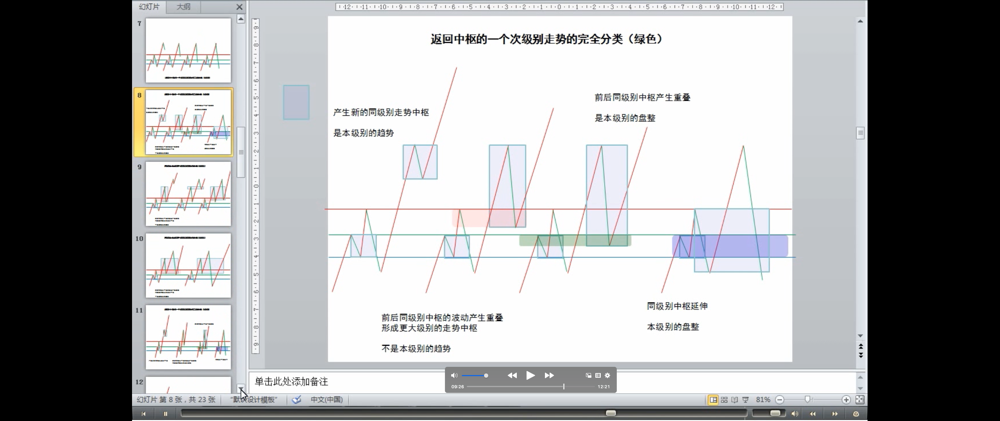
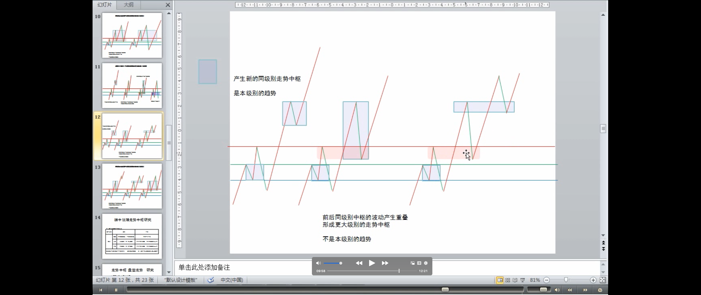

> 定义：中枢延伸（严格定义）（疑问：与中枢维持一个意思-中枢定理二，缠师为什么又定义一个名词？）
>
> 定义：中枢升级：产生更大级别的走势中枢
>
> - 后中枢区间与前中枢区间没有重叠，后中枢区间与前中枢波动没有重叠，但后中枢波动与前中枢波动重叠
> - 后中枢区间与前中枢区间没有重叠，后中枢区间与前中枢波动重叠

这里，必须把两种情况严格区分。**一、走势中枢以及其延伸**。这种情况下，所有围绕走势中枢产生的前后两个次级波动都必须至少有一个触及走势中枢的区间。
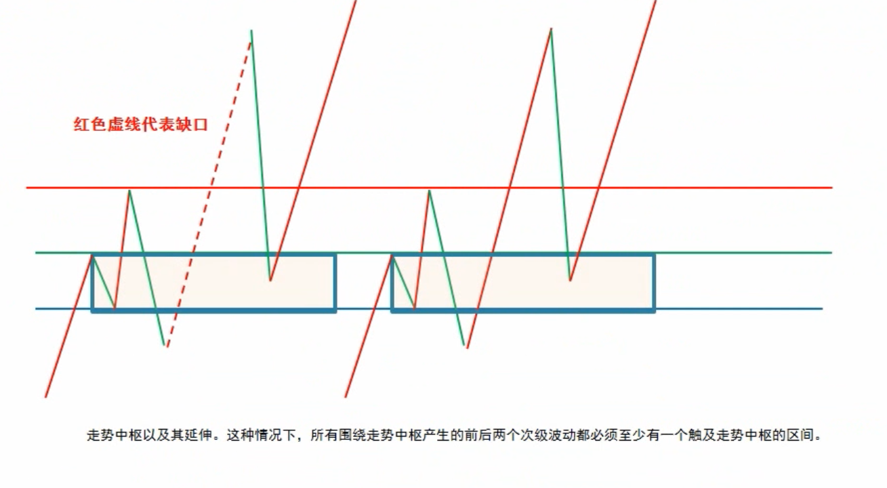
否则，就必然产生一个新的三次连续次级走势类型的重叠部分离开原来的走势中枢，这与走势中枢的延续矛盾。二、一个走势中枢完成前，其波动触及上一个[走势中枢或延伸时]的某个瞬间波动区间（疑问🤔️：触及前三段的波动或延伸时的波动？），由此**产生更大级别的走势中枢**。

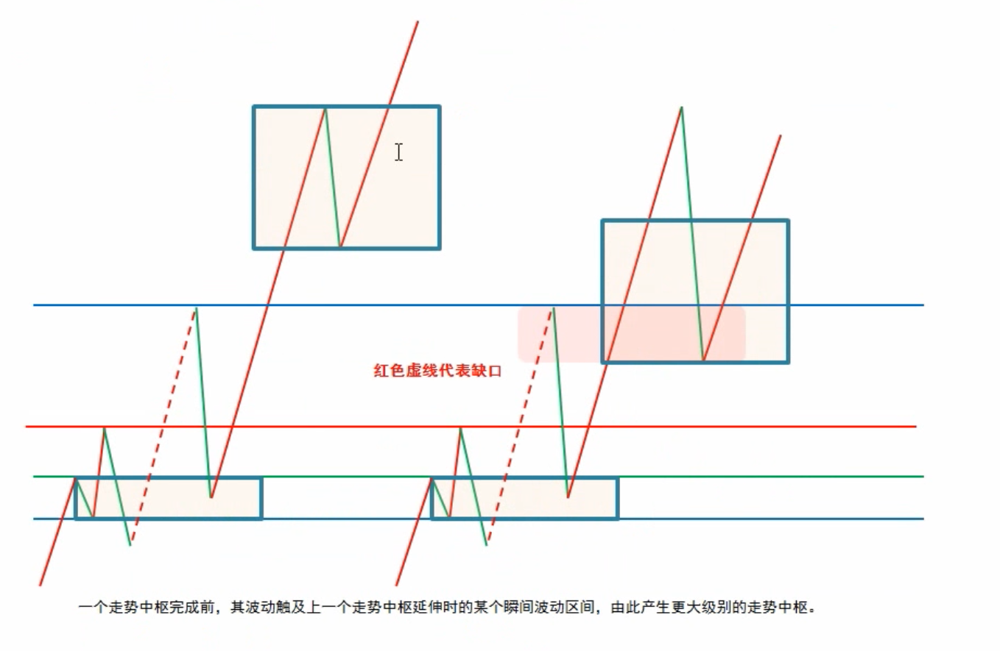

---

**一个简单的例子就能区别以上的情况**，例如，一个股票开盘立刻封涨停，那么，只能算是一分钟级别上出现了走势中枢的延伸，无论这个延伸有多长时间，都不可能产生更大级别的走势中枢。如果该股票第二天开始继续开盘涨停，那么就形成一个一分钟级别上的趋势，这个趋势可以无限延伸下去，但只要依然只是只形成一分钟的走势中枢，无论能连续涨停多少天，都不足以形成即使是五分钟的走势中枢，除非中途有打开涨停的时候。还有一种特殊的情况，就是所谓的庄股，如果有一个庄家特别有毛病，每天就成交一次，每天的价位都一样，这样也只形成一个一分钟的走势中枢，大级别的中枢都不能形成。
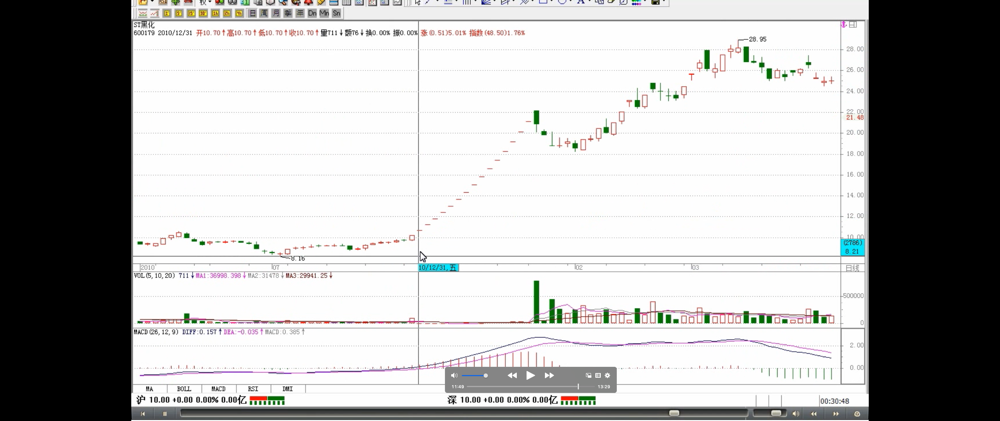

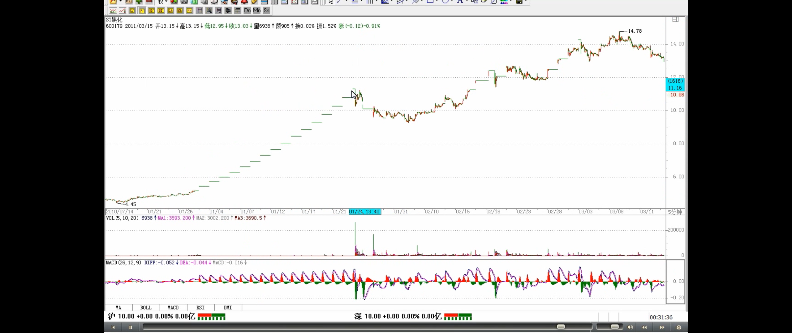

> 三种情况：中枢延伸、趋势（新的中枢）、更大级别中枢
>
> 形成一个更大级别中枢的走势的条件
>
> 走势级别延续定理一
>
> - 延续的是级别（参考韶山映山红）
> - 走势级别，应该依赖于中枢级别

换言之，走势中枢的延伸（注解：不超过 9 段）与不断产生新的走势中枢并相应围绕波动互不重叠而形成趋势，在这两种情况下，一定不可能形成更大级别的走势中枢。**而要形成一个更大级别的走势中枢，必然要采取第三种的方式**，就是围绕新的同级别走势中枢产生后的波动与围绕前中枢的某个波动区间产生重叠。**由此可马上得到一个重要的定理**：

**缠中说禅走势级别延续定理一：** 在更大级别缠中说禅走势中枢产生前，**该级别走势类型将延续**（疑问🤔️：根据走势分解定理一就可以推理出该定理。延续是延伸？）。也就是说，只能是只具有该级别缠中说禅走势中枢的盘整或趋势的延续。
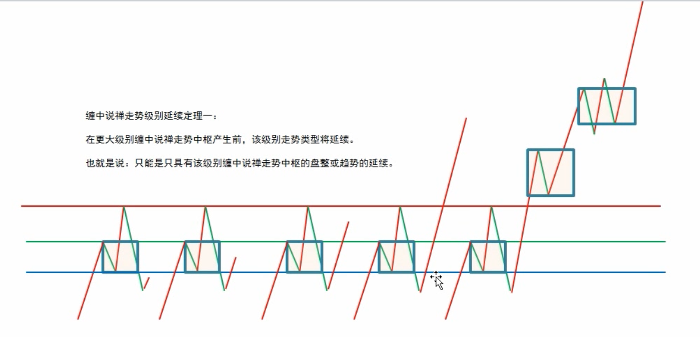

> 例子

**看看去年指数的走势，就知道该定理的重要。很多人总是说，怎么都涨那么多了还涨**，明白这个定理，就知道，要这个市场跌，现在这种最多只出现过日线走势中枢的走势，**在周线走势中枢出现前，不可能结束**。而且，从去年 8 月份开始的走势，甚至连日线的走势中枢都没形成过，最多就是 30 分钟的，要结束这种走势，首先要形成日线的中枢。明白这个定理，就不会整天自己吓自己。
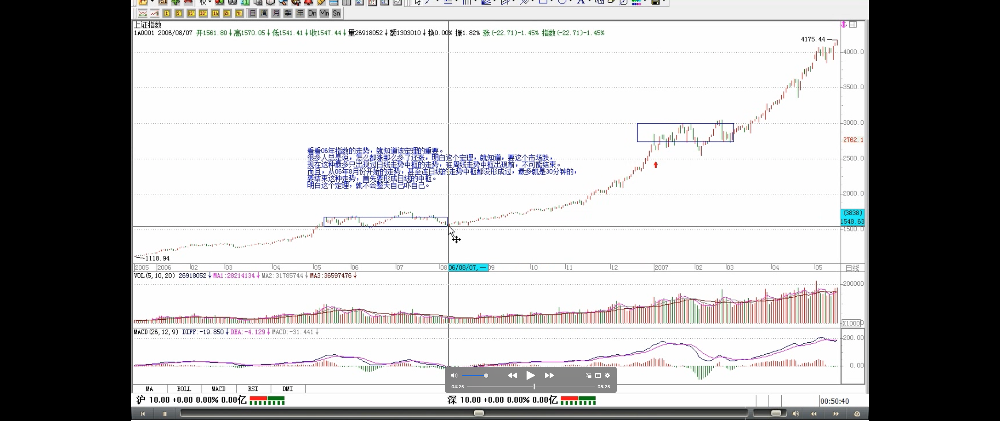

> 走势级别延续定理二（定义：中枢级别扩张---中枢升级-更大级别中枢）

这里由定理一很简单就能证明一个更重要的定理对走势改变给一个更精确、预先的界定：
**缠中说禅走势级别延续定理二：** 更大级别缠中说禅走势中枢产生，当且仅当围绕连续两个同级别缠中说禅走势中枢产生的波动区间产生重叠。
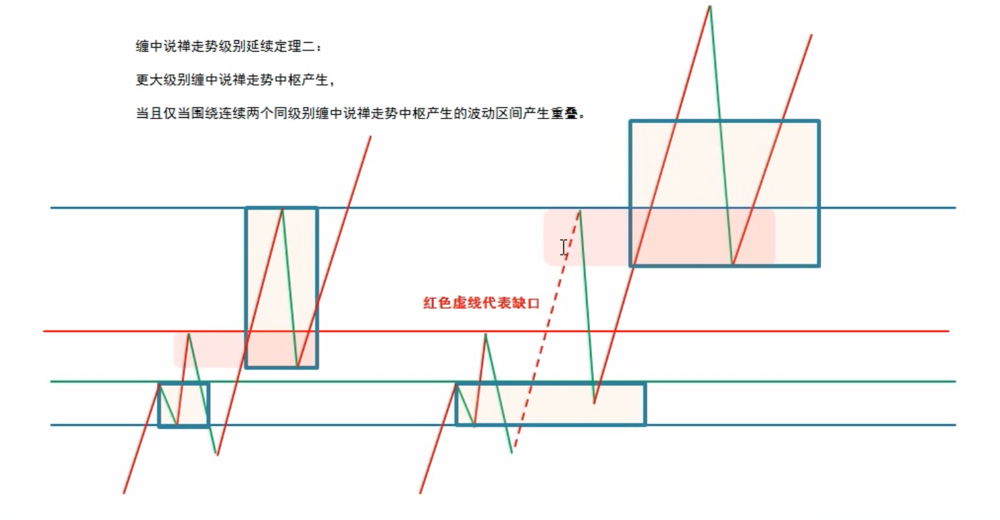

> 类比：中枢如同恒星，围绕中枢的波动如同行星

这里来一个比喻就好理解了，缠中说禅走势中枢就如同恒星，和围绕该恒星转动的行星构成一个恒星系统。而两个同级别恒星系统要构成一个更大级别的系统，首先必然要至少是其中的外围行星之间发生关系，这就是定理二说的东西。

> **走势中枢的数学表达式**（中枢区间-ZG/ZD、GG、G、D、DD）
>
> 定义：中枢方向（回升/回涨形成的中枢方向为向上，回调/回跌形成的中枢方向为向下）
>
> 定义：中枢区间（回升形成的中枢，由向上的次级别走势类型的区间重叠确定，反之依然）
>
> 组成中枢的次级别走势类型
>
> 定义：Z 走势段

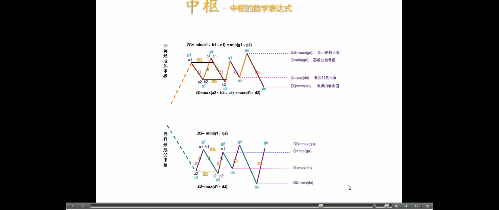
有了上面的定理，就可以很精确地讨论走势中枢的问题了：根据**走势中枢的数学表达式：** A、B、C，分别的高、低点是 a1\a2,b1\b2,c1\c2，则**中枢的区间就是**[max（a2,b2,c2），min（a1,b1,c1）]。而中枢的形成无非两种，**一种是回升形成的，一种是回调形成的**。对于第一种有 a1=b1,b2=c2；对第二种有 a2=b2,b1=c1。但无论是哪种情况，中枢的公式都可以简化为[max（a2,c2），min（a1,c1）]。显然，**A、C 段，其方向与中枢形成的方向是一致的**，由此可见，在中枢的形成与延伸中，由与中枢形成方向一致的次级别走势类型的区间重叠确定。**例如，回升形成的中枢，由向上的次级别走势类型的区间重叠确定，反之依然**。为方便起见，以后都把这些与中枢方向一致的次级别走势类型称为**Z 走势段**，按中枢中的时间顺序，分别记为 Zn 等，而相应的高、低点分别记为 gn、dn,定义四个指标,GG=max(gn),G=min(gn),D=max(dn),DD=min(dn)，n 遍历中枢中所有 Zn。特别地，再定义 ZG= min(g1、g2),ZD=max(d1、d2)，显然，[ZD，ZG]就是缠中说禅走势**中枢的区间**，由此有了如下定理：

> 中枢中心定理一
>
> - 定义：中枢延伸（数学表达式定义）

**缠中说禅走势中枢中心定理一：** 走势中枢的延伸等价于任意区间[dn，gn]与[ZD，ZG]有重叠。换言之，若有 Zn，使得 dn>ZG 或 gn<ZD，则必然产生高级别的走势中枢或趋势及延续。
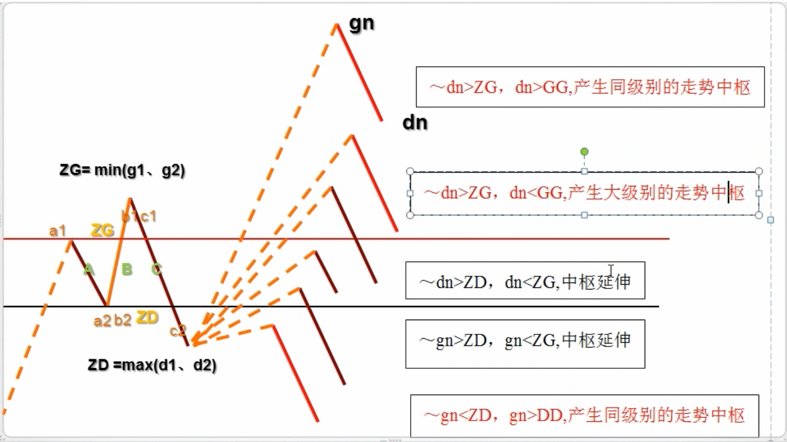

> 中枢中心定理二
>
> - 定义：下跌（数学表达式定义）
> - 定义：上涨（数学表达式定义）
> - 定义：中枢升级（数学表达式定义）

**缠中说禅走势中枢中心定理二：** 前后同级别的两个缠中说禅走势中枢，后 GG〈前 DD 等价于**下跌**及其延续；后 DD〉前 GG 等价于**上涨**及其延续。后 ZG<前 ZD 且后 GG〉=前 DD，或后 ZD〉前 ZG 且后 DD=<前 GG，则等价于**形成高级别的走势中枢**。
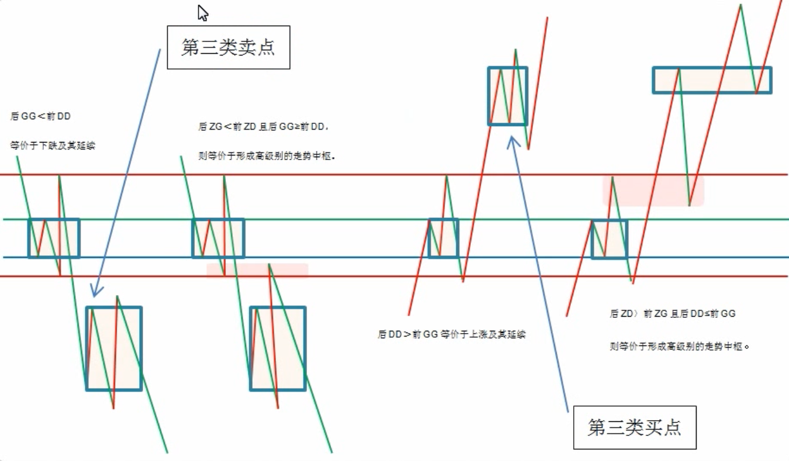

> 第三类买卖点定理（并不是任何回调回抽都是第三类买卖点，必须是第一次）
>
> - 定义：第三类买点
>
> - 定义：第三类卖点

由定理一，可以得到**第三类买卖点定理：** 一个**次级别**走势类型向上离开缠中说禅走势中枢，然后以一个**次级别**走势类型回试，其低点不跌破 ZG，则构成**第三类买点**；一个次级别走势类型向下离开缠中说禅走势中枢，然后以一个次级别走势类型回抽，其高点不升破 ZD，则构成**第三类卖点**。

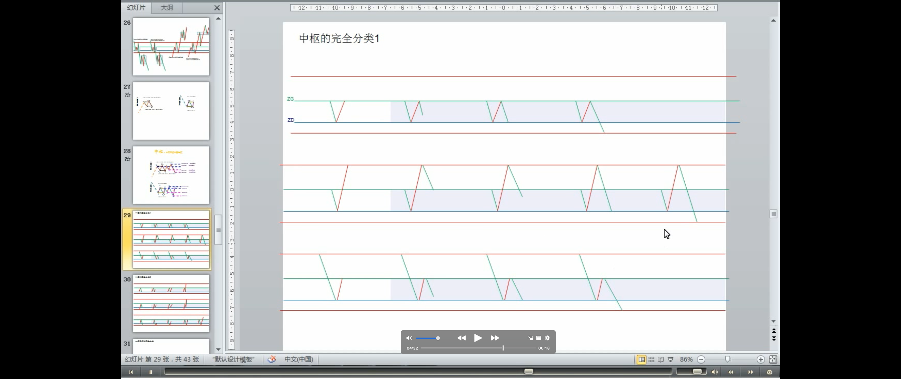

> 第三类买卖点的注意点（并不是任何回调回抽都是第三类买卖点，必须是第一次）
>
> - 第三类买卖点后，并不必然是趋势，也有进入更大级别盘整的可能
> - 缺点：比第一、二类要后知后觉
> - 优点：短线技术好，不用浪费盘整的时间
> - 第三类买卖点必然盈利的原因
> - 操作策略
>
> 疑问：这里的例子买点跟后面笔线段定义不同？

例如，工商银行在 12 月 14 日构成典型的日线级别第三类买点；北辰实业在 11 月 14 日构成典型的日线级别第三类买点；000803 在 1 月 20 日构成典型的日线级别第三类卖点。**注意，第三类买卖点比第一、二类要后知后觉**，但如果抓得好，**往往不用浪费盘整的时间**，比较适合短线技术较好的资金，但一定要注意，**并不是任何回调回抽都是第三类买卖点，必须是第一次**。而且，**第三类买卖点后，并不必然是趋势，也有进入更大级别盘整的可能**，**但这种买卖之所以必然赢利**，就是因为即使是盘整，也会有高点出现。**操作策略**很简单，一旦不能出现趋势，一定要在盘整的高点出掉，这和第一、二类买点的策略是一样的。
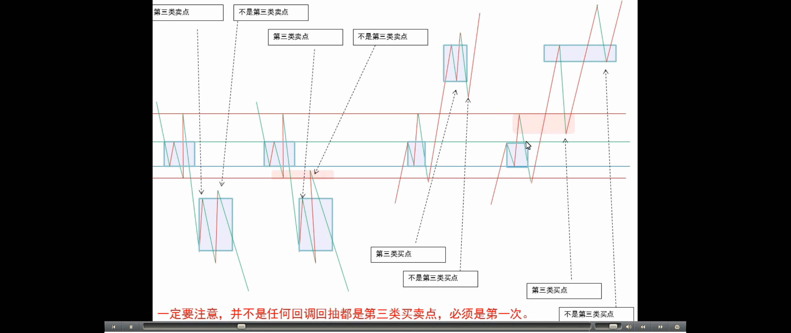

思考题一：第三类买卖点有可能和同级别的第二类买卖点重合吗？

思考题二：工商银行在 12 月 22 日构成日线级别第三类买点吗？
