# 教你炒股票 21：缠中说禅买卖点分析的完备性

> 只有三类买卖点
>
> 三类买卖点，100%安全（投资中的高手都是厌恶风险的，即不是赌徒，对贪婪控制的很好，贪婪不能让你盈利，只会让你亏损）
>
> 充分理解，三类买卖点的绝对安全性
>
> 市场交易，归根结底就是买卖点的把握（盈利的本质是低点买高点卖）

前面已经说过三类的买卖点，一个很现实的问题，就是**除了这三类买卖点之外，还有什么其他类型的买卖点？答案是否定的**。这里必须强调的是，**这 三类买卖点，都是被理论所保证的，100%安全的买卖点，如果对这三类买卖点的绝对安全性没有充分的理解，就绝对不可能也绝对没有对缠中说禅技术分析理论有一个充分的理解**。**市场交易，归根结底就是买卖点的把握**，买卖点的完备性就是理论的完备性，因此，对这个问题必须进行一个概括性的论述。

> 100%安全的含义：买点之后必然涨，卖点之后必然跌
>
> 市场交易的原则
>
> 影响缠论最终效果的是使用者的水平
>
> 想使用好缠论，需要在市场中修炼和学习《论语》

**所谓 100%安全的买卖点**，就是这点之后，市场必然发生转折，没有任何模糊或需要分辨的情况需要选择。**市场交易，不能完全建筑在或然上，这市场的绝对必然性，是交易中唯一值得信赖的港湾**。有人可能要反驳说，世界上没有绝对的东西。那么，世界上没有绝对的绝对性又是哪个上帝所保证的？任何的绝对性，都是建立在“不患”之上的，而市场本身，也是建立在“不患”之上的，“不患”本“患”，“患”本“不患”，但这不影响其精彩与绝对。相关方面的理解，请多看本 ID 所解释的《论语》。股票市场，不是一个单纯的理论问题。虽然在理论上，本 ID 可以向所有人揭示其买卖点的完备性，**但买卖点不可能自动去买卖，最终的交易是人去完成的，相同的工具，可能在不同的人手下就有了完全不同的结果（注解🐷：打个比方，一样锋利的菜刀在不同水平人的手里，切出来的土豆丝的质量一定是不一样的）**，而市场只看结果，任何人，哭着喊着说自己所用的理论是完备的、最好的都没用，是人使理论，而非理论使人，**要让这人使理论达到理论一般的完美，最终只能靠自己在市场中的修炼了，这就与《论语》有着密切的关系了。修、齐、治、平，同样适用于股票市场的交易**。

> 走势中的任何一个点的两种可能走势
>
> 对于一个必然的买点，必须满足以下的两种情况之一
>
> - 一个向上的延续（三买）
> - 一个由下往上的转折（一、二买）
>
> 分析买点、卖点的特点：
>
> - 其前面必然有一个中枢
> - 该点后面的走势，或延续或转折
>
> 自己分析第一/二/三卖点的特点

从上面一系列关于缠中说禅走势中枢的分析可知，**在走势中的任何一个点，必然面临两种可能：走势类型的延续（疑问：延伸？）或转折**。换言之，例如**对于一个必然的买点，必须满足以下的两种情况之一**：一个向上的延续或一个由下往上的转折。对于延续的情况，能产生的，只能是在一个上升的过程中，否则就无所谓延续了，对于上升的延续中产生的买点，**必然有一个中枢在前面存在着**；对于转折，被转折的前一段走势类型只能是下跌与盘整，而无论的下跌还是盘整，**买点之前都必然有一个走势中枢存在**。**归纳上述，无论前面的走势是什么情况，都唯一对应着一个中枢存在后走势的延续或转折**，这分析对卖点同样有效。
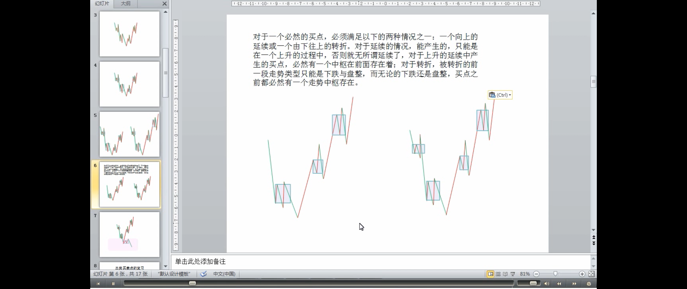
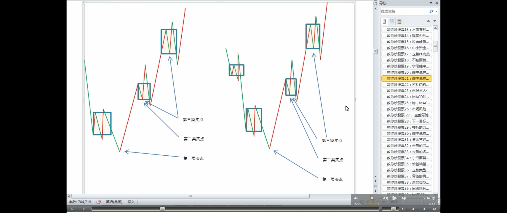

> 买点的特点：中枢下面产生的买点后面必然是转折，中枢上面产生的买点后面必然是延续（延伸）
>
> 中枢三种走势：
>
> - 中枢延伸（中枢延续）
>
> - 中枢升级（中枢扩张）
> - 中枢新生（形成趋势）
>
> 第三类买点的特点
>
> - 在中枢上产生，然后延续（延伸？）
> - 第三类买点在这两种情况下，才会产生（第三类买点后必然出现的两种情况）
>   - 中枢升级（扩张）
>   - 中枢新生（趋势力度大于升级）

因此，所有买卖点都必然对应着与该级别最靠近的一个中枢的关系。**对于买点来说，该中枢下产生的必然对应着转折，中枢上产生的必然对应着延续**。而**中枢有三种情况：** 延续、扩张与新生。如果是中枢延续（疑问🤔️：中枢延伸？趋势延伸？），那么在中枢上是不可能有买点的，因为中枢延续必然要求所有中枢上的走势都必然转折向下，在这时候，只可能有卖点（疑问🤔️：延伸要求返回中枢，有可能有卖点吗？）。而中枢扩张或新生，在中枢之上都会存在买点，这类买点，就是**第三类买点**。也就是说，**第三类买点是中枢扩张或新生产生的**。**中枢扩张**导致一个更大级别的中枢，而**中枢新生**，就形成一个上涨的趋势，**这就是第三类买点后必然出现的两种情况**。对于更大级别中枢的情况，肯定没有马上出现一个上涨趋势的情况诱人，所以对于实际操作中，任何尽量避免第一种情况（注解：中枢升级/中枢扩张）就是一个最大的问题。**但无论是哪种情况，只要第三类买点的条件符合，其后都必然要赢利，这才是问题的关键。**
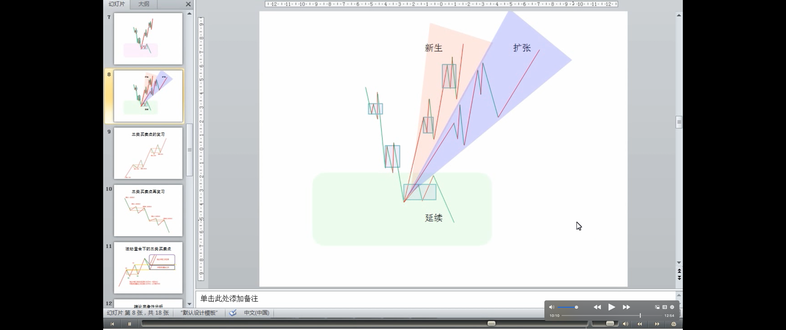

> 第一类买点的特点
>
> - 中枢下形成的
> - 下跌趋势的中枢（第二个或之后的中枢）下的买点，才可能出现一买。盘整的情况下，中枢下也不必然产生买点。
>
> 第二类买点的特点
>
> - 定义：第二类买点
> - 第二类买点和第一类买点的关系
> - 第二类买点绝对安全的原因
> - 第二类买点在前中枢的不同位置，可能的走势
>   - 在中枢下出现的 < 在中枢中出现的 < 在中枢上出现的（第二、三类买点重合）
>   - 但无论哪种情况，赢利是必然的

对于**中枢下形成的买点**，如果该中枢是在上涨之中的，在中枢之下并不能必然形成买点（疑问：上涨中，中枢下面一定不能形成买点吧？），**中枢下的买点，只可能存在于下跌与盘整的走势类型中**。换言之，**一个上涨趋势确定后，不可能再有第一类与第二类买点，只可能有第三类买点**。
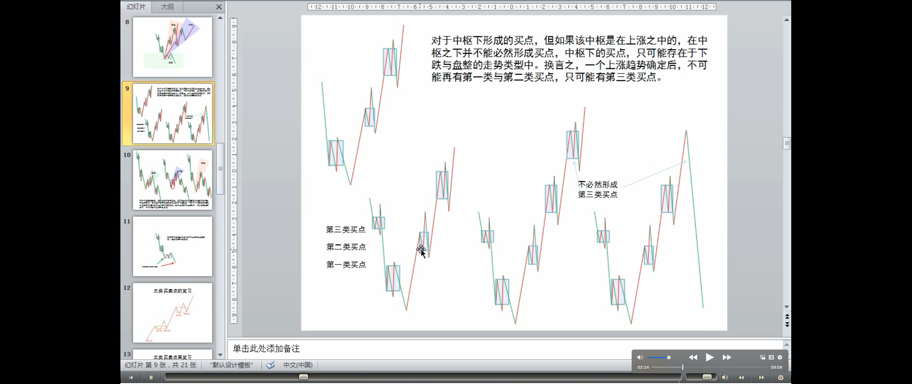

> 疑问：这里分析没理解
>
> 盘整的情况下，中枢下也不必然产生买点

而对于盘整的情况，其中枢的扩张与新生，都不能必然保证该买点出现后能产生向上的转折，因为其扩张与新生完全可以是向下发展的，而对于中枢延续的情况，中枢形成后随时都可以打破而结束延续，也不必然有向上的转折，**所以盘整的情况下，中枢下也不必然产生买点**。
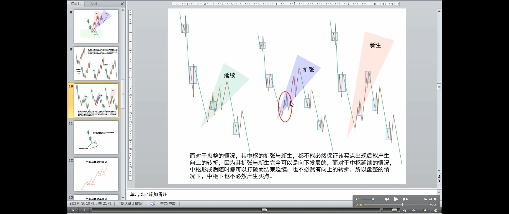
**因此，只有在下跌确立后的中枢下方才可能出现买点。这就是第一类买点。**
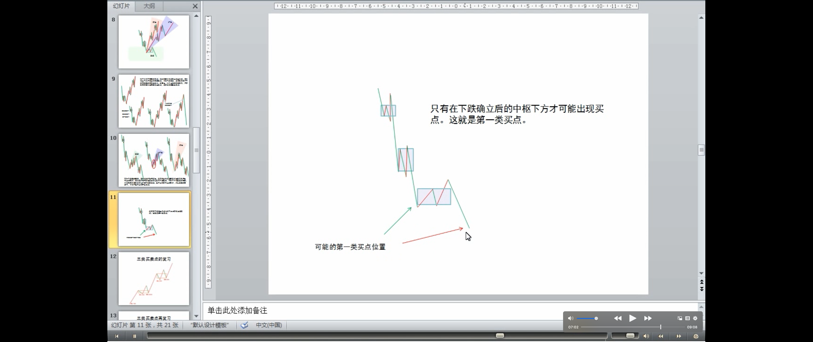
**第二类买点是和第一类买点紧密相连的**，因为出现第一类买点后，必然只会出现盘整与上涨的走势类型，而第一买点出现后的第二段次级别走势低点就构成**第二类买点**，根据走势必完美的原则，其后必然有第三段向上的次级别走势出现，**因此该买点也是绝对安全的**。第二类买点，不必然出现在中枢的上或下，可以在任何位置出现，**中枢下出现的**，其后的力度就值得怀疑了，出现扩张性中枢的可能性极大，**在中枢中出现的**，出现中枢扩张与新生的机会对半，**在中枢上出现**，中枢新生的机会就很大了。**但无论哪种情况，赢利是必然的**。
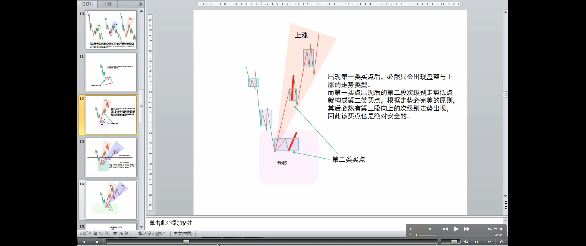
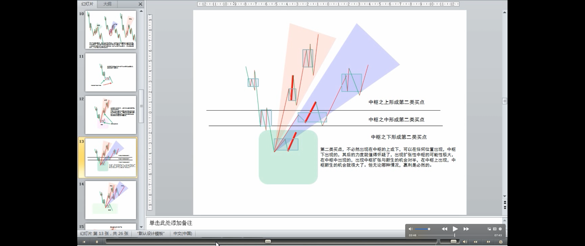

> 第二、三类买点重合的分析
>
> - 第一类、第二类买点不可能重合，第一类、第三类买点不可能重合，只有第二类、第三类买点可能重合
>
> - 二、三买点重合的走势
> - 二、三买点重合后面的走势
>   - 一旦出现这种情况，一个大级别的上涨往往就会出现

显然，第一类买点与第二类买点是前后出现的，不可能产生重合，而第一类与第三类买点，一个在中枢之下、一个在中枢之上，也不可能产生重合。**只有第二类买点与第三类买点是可能产生重合的，这种情况就是：** 但第一类买点出现后，一个次级别的走势凌厉地直接上破前面下跌的最后一个中枢，然后在其上产生一个次级别的回抽不触及该中枢，这时候，就会出现第二类买点与第三类买点重合的情况，也只有这种情况才会出现两者的重合。当然，在理论上没有任何必然的理由确定第二、三类买点重合后一定不会只构成一个更大级别的中枢扩张，但实际上，**一旦出现这种情况，一个大级别的上涨往往就会出现。**
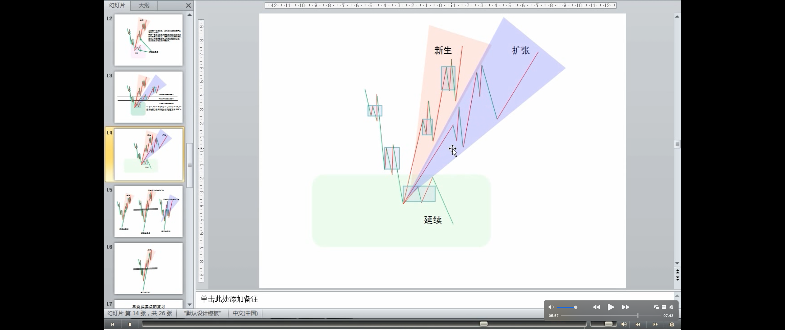
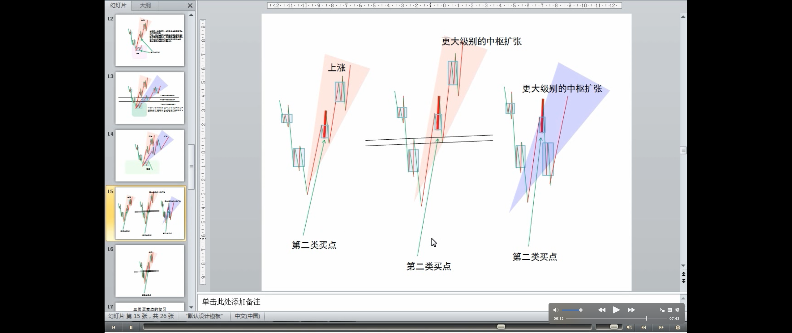

> 例子

一个最典型的例子，就是大盘在 94 年 7 月底部跌到 325 点后，8 月 1 日跳空高开，5 分钟上形成单边上涨突破前面的 30 分钟中枢，第二天大幅上冲后突然大幅回洗形成 5 分钟的走势级别的回抽，那时候最高已经摸到快 500 点，一天半上涨 50%，又半天回跌 15%，这样的回抽，一般来说是很恐怖的，但如果明白第二类买点与第三类买点的重合道理，就知道这是最好的补进机会，结果第三天又开始单边上扬，第六天达到 750 点。这是指数上最典型的一个例子了。而且，325 点留下的缺口至今未补，中国几十年的一个大牛市，从指数上看，这是一个最重要的缺口了，将支持中国股市几十年甚至上百年的大牛市。


补充一句，站在特大型牛市的角度，中国就从来没出现过熊市，大家打开上海的年线图就可以看到，从 1992 年到 2005 年，一个完美的年级别缠中说禅中枢的三段次级别走势完成，时间刚好是 13 年，一个完美的时间之窗。站在年线的角度，中国股市的真正大牛市才真正开始，因为该中枢是中国股市的第一个年中枢，区间在 998 到 1558 点。站在年线级别，在下一个年线级别中枢确立之前，中国股市的调整只可能出现一个季级别的调整，而第一个出现的季级别的调整，只要不重新跌回 1558 点，就将构成中国股市年线级别上的第三类买点，其后至少出现如去年类型幅度的上涨。**由此可见，本 ID 的理论是可以站在如此宏观的视角上判断大趋势的**。目前中国的股市没有任何可担心的地方，即使出现调整，最多就是季级别的，其后反而构成第三类买点。而且更重要的是，站在年线的级别看，目前还在第一段的次级别上扬中，要出现第二段的季级别调整，首先要出现月线级别的中枢，目前连这个中枢都没出现，换言之，年线级别的第一段走势还没有任何完成的迹象，这第一段，完全可以走到 6000 点才结束。**今后十几年，中国股市的辉煌，用本 ID 走势必完美的原则，会看得一清二楚。该原则无论是对年线还是 1 分钟线，都一视同仁，这就是缠中说禅技术分析理论厉害之处**，这叫大小同杀，老少咸宜。

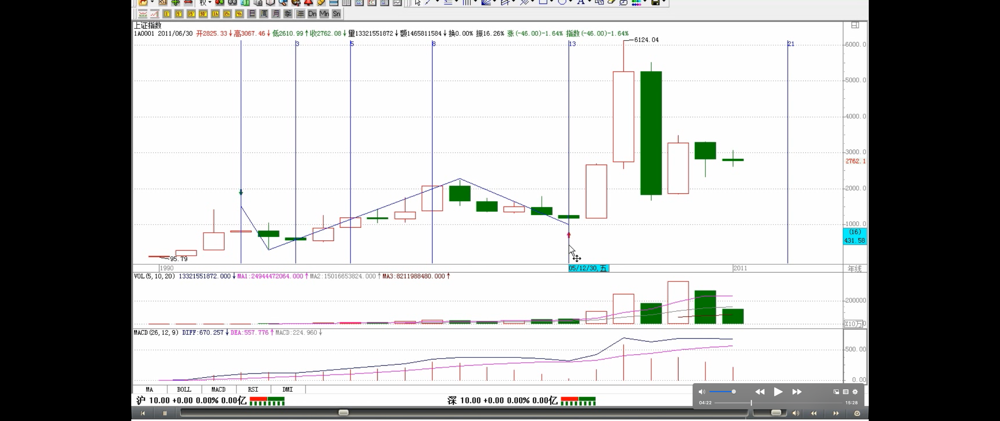
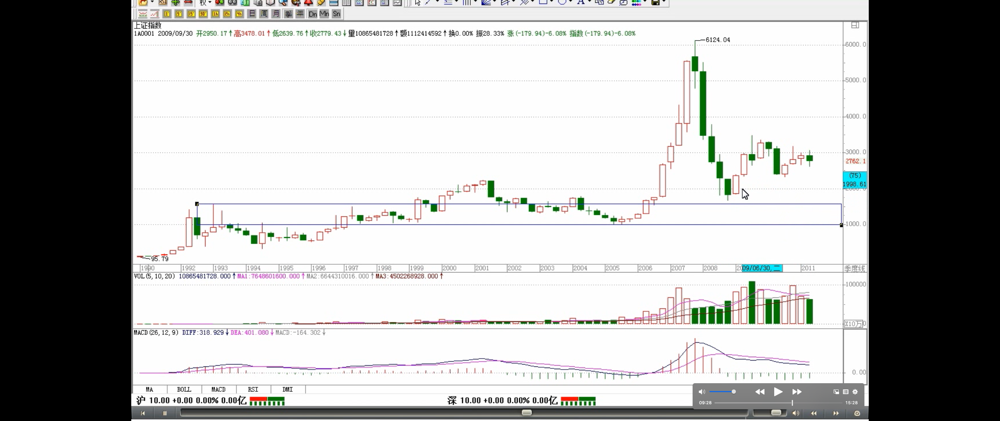
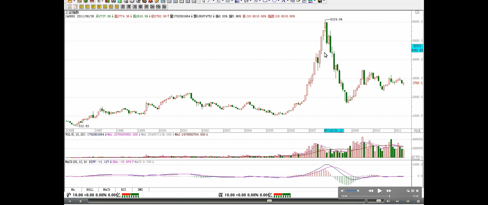

> 买卖点的完备性定理
>
> 升跌完备性定理

对卖点的分析是一样的，归纳起来，就有缠中说禅**买卖点的完备性定理**：市场必然产生赢利的买卖点，只有第一、二、三类。
相同的分析，可以证明缠中说禅**升跌完备性定理**：市场中的任何向上与下跌，都必然从三类缠中说禅买卖点中的某一类开始以及结束。换言之，市场走势完全由这样的线段构成，线段的端点是某级别三类缠中说禅买卖点中的某一类。

思考题：任何一个线段，其端点必然是一买点及一卖点，请完全列出各类买卖点之间可能的组合。如果一线段的端点是同级别的买卖点，有什么组合是绝对不可能出现的。

```
1. 第一类买点---第一类卖点
2. 第一类买点---第二类卖点
3. 第一类买点---第三类卖点
4. 第二类买点---第一类卖点
5. 第二类买点---第二类卖点
6. 第二类买点---第三类卖点
7. 第三类买点---第一类卖点
8. 第三类买点---第二类卖点
9. 第三类买点---第三类卖点？这种应该也可以
```