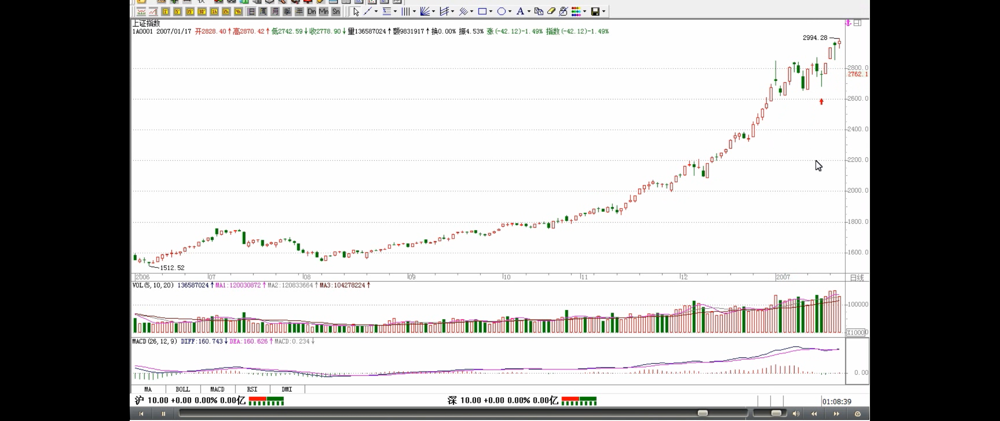
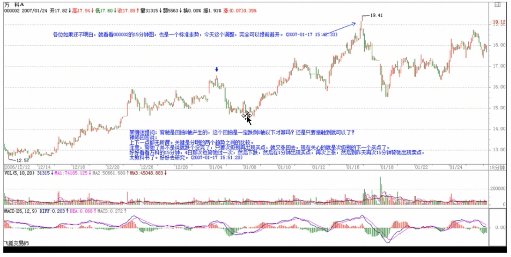
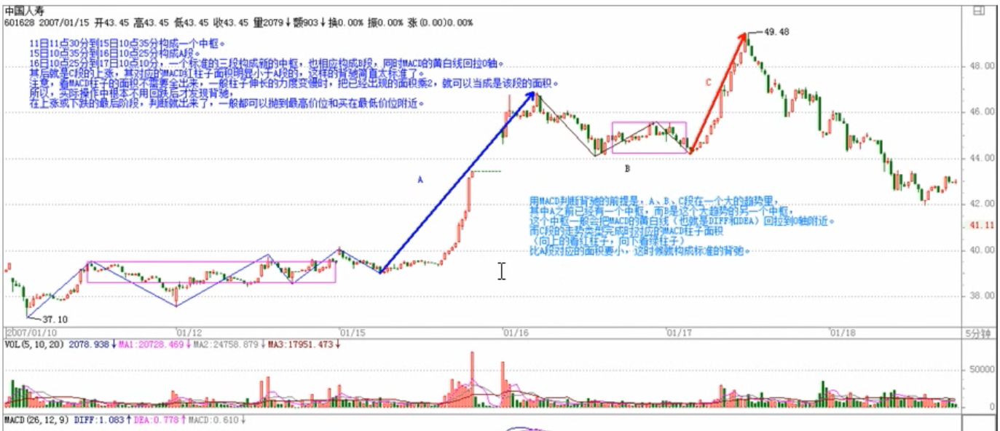
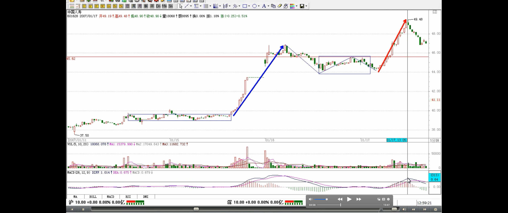
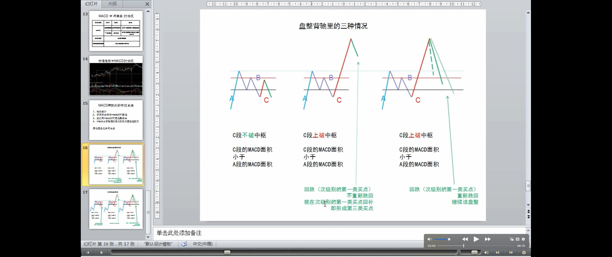
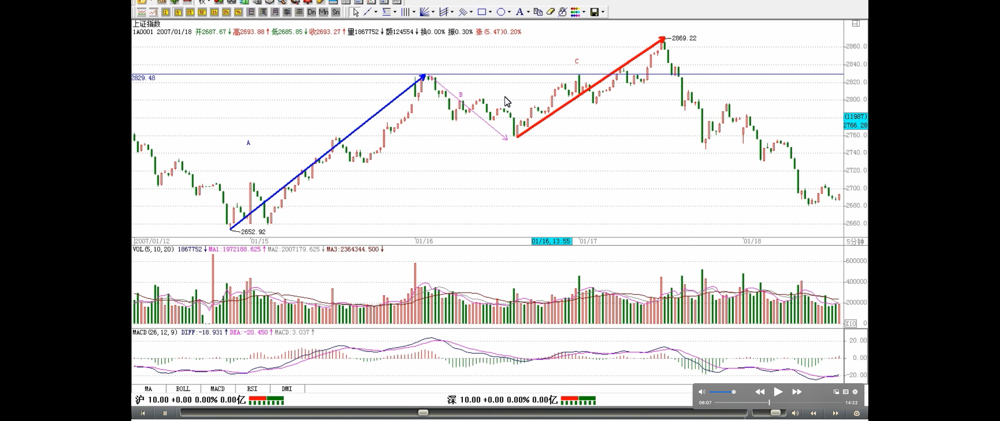
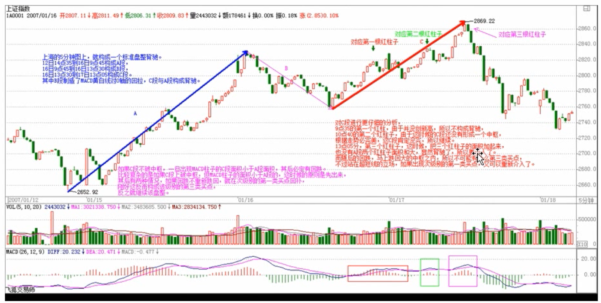
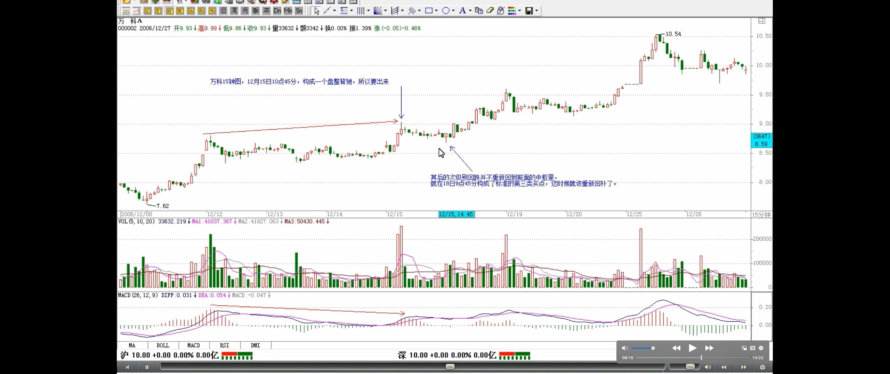
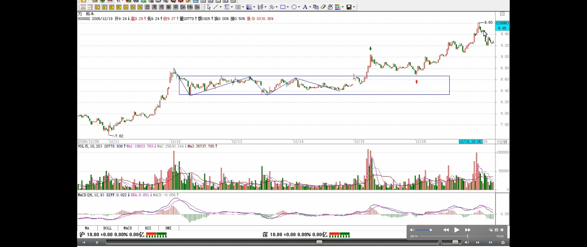

# 教你炒股票 24：MACD 对背弛的辅助判断

> 参考芷涵的音频

> 解释为什么写这篇文章：没有几个人真明白中枢，还急于用，因此讲解 MACD 这个辅助方法
>
> MACD 方法：背驰的辅助判断方法
>
> - 缺点：不精确（小级别不准确，大级别还比较准确）
> - 优点：对那些还没把握中枢基本分析的人，是有帮助的。方便，容易理解，足以应付一般的情况了
>
> 完全解决背驰问题，要依赖中枢

这一章完全不在计划之中，其实该问题以前已说过，现在有点炒冷饭。但发现这里的人，绝大多数还是搞不懂，也就不妨结合点例子再说一次。**要完全解决背弛问题，必须对中枢进行更进一步的分析，这是以后章节的事情了**。但现在大家好象都急于用，而对中枢，好象真理解的没几个，继续深入下去，浅的都一团浆，深的更没法弄。因此，详细说说 MACD 对背弛的辅助判断这样一种**不绝对精确，但比较方便，容易理解的方法，对那些还没把握中枢基本分析的人，是有帮助的**。也就是说，**_如果你一时真搞不懂中枢的问题，那就用这个方法，也足以应付一般的情况了_**。

> 背驰的含义：**价格新高或新低（价格越来越高或越来越低）**，而趋势力度在减弱，可能会转折（教你炒股票 15：没有趋势，没有背驰）
>
> 背驰也有级别：1 分钟级别的背驰、日线级别的背驰、周线级别的背驰
>
> - 小级别和大级别同时背驰
>
> 背驰后，反向走势逆转（转折）多少？
>
> - 重新出现新的次级别或次次级别的买卖点为止
>
> 背驰与买卖点的关系
>
> - 背驰与某级别的第一类买卖点密切相关
>
> - 背驰-买卖点定理

首先，**背弛同样有级别的问题**，一个 1 分钟级别的背弛，在绝大多数的情况下，不会制造一个周线级别的大顶，除非日线上同时也出现背弛。但出现背弛后必然有逆转，这是没任何商量余地的。有人要问，**究竟逆转多少？** 那很简单，就是**重新出现新的*次级别*买卖点为止**。由于所有的买卖点，最终都可以归到某级别的第一类买卖点，而**背驰与该种买卖点密切相关**，所以可以这样说，任何的逆转，必然包含某级别的背驰，以后用严格的方法，可以证明如下定理：

**缠中说禅背驰-买卖点定理：** 任一背驰都必然制造某级别的买卖点，任一级别的买卖点都必然源自某级别走势的背驰。

> 例子
>
> 逆转（转折）并不意味着永远的，次级别或次次级别出现买卖点

该定理的证明这理暂且不说了，换句话说，只要你看到某级别的背驰，必然意味着要有逆转。**但逆转并不意味着永远的，例如，日线上向上的背驰（注解🐷：这次向上的分力力度不够）制造一个卖点，回跌后，在 5 分钟或 30 分钟出现向下的背驰制造一个买点，然后由这买点开始，又可以重新上涨，甚至创新高，这是很正常的情况**。

> MACD 判断背驰步骤
>
> - 首先要有趋势（教你炒股票 15：没有趋势，没有背驰）
> - 然后根据背驰定义判断是否背驰

**用 MACD 判断背驰**，**首先**要有两段同向的趋势（注解：指代 A、C）。同向趋势之间一定有一个盘整或反向趋势连接（疑问 🤔️：应该是A、C同级别的走势类型），把这三段分别称为 A、B、C 段。显然，B 的中枢级别比 A、C 里的中枢级别都要大，否则 A、B、C 就连成一个大的趋势或大的中枢了。A 段之前，一定是和 B 同级别或更大级别的一个中枢，而且不可能是一个和 A 逆向的趋势，否则这三段就会在一个大的中枢里了。

> 定义：背弛
>
> 用 MACD 判断背驰的前提：

> - 前提 1:a+A+b+B+c，且 B 一般会把 MACD 的黄白线回拉到 0 轴附近
> - 前提 2:c 完成时的 MACD 柱子面积 < b 的（c 跟 b 的特点：同方向，b 是 B 的进入段/A 的离开段，c 是 B 的离开段）

归纳上述，**用 MACD 判断背驰的前提**是，A、B、C 段在一个大的趋势里，其中 A 之前已经有一个中枢，而 B 是这个大趋势的另一个中枢，这个中枢一般会把 MACD 的黄白线（也就是 DIFF 和 DEA）回拉到 0 轴附近。而 **C 段的走势类型完成时**对应的 MACD 柱子面积（向上的看红柱子，向下看绿柱子）比 A 段对应的面积要小，**这时候就构成标准的背弛**。

> MACD 的最基本常识

估计有些人连 **MACD 的最基本常识**都没有，不妨说两句。首先你要打开带 MACD 指标的图（千万别问本 ID 怎么才会有 MACD 的图，本 ID 会彻底晕倒的），MACD 上有黄白线，也有红绿柱子，红绿柱子交界的那条直线就是**0 轴**。上面说的颜色都是通常系统用的，如果你的系统颜色不是这样，那本 ID 只能说上面两条绕来绕去的曲线就是黄白线，有时一组向上、有时一组向下的就是红绿柱。本 ID 也只能描述到这样地步了，如果还不明白，到任意一个证券部举个牌子，写上“谁是黄白线、谁是红绿柱”，估计会有答案的。

> 例子：趋势背驰
>
> 抛到最高价位和买在最低价位附近的方法
>
> - 看 MACD 柱子面积的技巧

这样说有点抽象，就用一个例子，请看 601628 人寿的 5 分钟图：11 日 11 点 30 分到 15 日 10 点 35 分构成一个中枢。15 日 10 点 35 分到 16 日 10 点 25 分构成 A 段。16 日 10 点 25 分到 17 日 10 点 10 分，一个标准的三段构成新的中枢，也相应构成 B 段，同时 MACD 的黄白线回拉 0 轴。其后就是 C 段的上涨，其对应的 MACD 红柱子面积明显小于 A 段的，这样的背驰简直太标准了。**注意，看 MACD 柱子的面积不需要全出来，一般柱子伸长的力度变慢时，把已经出现的面积乘 2，就可以当成是该段的面积。所以，实际操作中根本不用回跌后才发现背驰，在上涨或下跌的最后阶段，判断就出来了，一般都可以抛到最高价位和买在最低价位*附近*。**

> 定义：盘整背驰
>
> 如何应用盘整背驰
>
> - 如果 C 段不破中枢，一旦出现 MACD 柱子的 C 段面积小于 A 段面积，其后必定有回跌
> - 比较复杂的是如果 C 段上破中枢，但 MACD 柱子的面积小于 A 段的，这时候的原则是先出来，其后有两种情况
>   - 如果回跌不重新跌回，就在次级别的第一类买点回补，刚好这反而构成该级别的第三类买点
>   - 继续该盘整

上面是一种最标准的背驰判断方法。那么，背驰在盘整中有用吗？首先，为明确起见，一般不特别声明的，背驰都指最标准的趋势中形成的背驰。**而盘整，利用类似背驰的判断方法，也可以有很好的效果**。这种盘整中的类似背驰方法的应用，称为**盘整背弛**判断。盘整中往上的情况为例子，往下的情况反之亦然。**如果 C 段不破中枢，一旦出现 MACD 柱子的 C 段面积小于 A 段面积，其后必定有回跌**。**比较复杂的是如果 C 段上破中枢，但 MACD 柱子的面积小于 A 段的，这时候的原则是先出来，其后有两种情况**，如果回跌不重新跌回，就在次级别的第一类买点回补，刚好这反而构成该级别的第三类买点，反之就继续该盘整。

> 例子：盘整背驰

> 疑问：这里的 B 的级别大于 A、C？图上明显不是，B、C 感觉是一个级别的

昨天上海的 5 分钟图上，就构成一个标准盘整背驰。12 日 14 点 35 到 16 日 9 点 45 构成 A 段，16 日 9 点 45 到 16 日 13 点 30 构成 B 段，16 日 13 点 30 到 17 日 13 点 05 构成 C 段。其中 B 段制造了 MACD 黄白线对 0 轴的回拉，C 段与 A 段构成背驰。对 C 段进行更仔细的分析，**9 点 35 的第一个红柱，由于并没创新高，所以不构成背驰（疑问 🤔️：背驰一定要有创新高、新低吗？这是事后的分析，当下判断时，能这么判断吗？）**，10 点 40 的第二个红柱子，由于这时候的 C 段还没有形成一个中枢，根据走势必完美，这 C 段肯定没完，所以继续(疑问 🤔️：这里没懂，C 段形成了一个中枢---第二个红柱子之前有反向反抗，感觉缠师解释得牵强)。13 点 05 分，第三个红柱子，这时候，把三个红柱子的面积加起来，也没有 A 段两个红柱子面积和大，显然背驰了，所以要走人了。而随后的回跌，马上跌回大的中枢之内，所以不可能有什么第三类买点，不过站在超短线的立场，如果出现次级别的第一类买点，又可以重新介入了。

> 例子：盘整背驰后回跌形成第三类买点的例子

那么，有没有盘整背驰后回跌形成第三类买点的例子，其实这种例子太多了，第三类买点，有一种情况就是这样构成的。例如，000002 万科的 15 分钟图，12 月 15 日 10 点 45 分，构成一个盘整背驰，所以要出来，其后的次级别回跌并不重新回到前面的中枢里，就在 18 日 9 点 45 分构成了标准的第三类买点，这时候就该重新回补了。

> 趋势背驰是最重要的
>
> 盘整背驰的应用场景：在盘整中弄短差时用到
>
> - 突破中枢后，回跌的两种情况（上面讲的）

背驰与盘整背驰的两种情况中，**背驰是最重要的，一旦出现背驰，其回跌，一定至少重新回到 B 段的中枢里**，看看 601628 人寿昨天的回跌，就一目了然了。而**盘整背驰，一般会在盘整中弄短差时用到**，如果其间突破中枢，其回跌必须分清楚上面的两种情况。

必须注意，**无论背驰与盘整背驰，只要满足上面相应的标准，其技术上都是绝对的，没有任何的或然**。问题不在于这种技术的准确性，而在于操作者判断的准确性，也就是说，**必须先把什么是背驰，什么是盘整背驰，他们之间的标准是什么**，如果连这些都搞不清楚，那是无法熟悉应用这项技术的。

> 要精确地判断背驰与盘整背驰，还是要从中枢本身出发

**必须说明的是，由于 MACD 本身的局限性，要精确地判断背驰与盘整背驰，还是要从中枢本身出发，但利用 MACD，对一般人理解和把握比较简单点**，而这已经足够好了。光用 MACD 辅助判断，即使你对中枢不大清楚，只要能分清楚 A、B、C 三段，其准确率也应该在 90%以上。而配合上中枢，那是 100%绝对的，因为这可以用纯数学的推理逻辑地证明，具体的证明，以后会说到。
