# 教你炒股票 25：吻，MACD、背弛、中枢

> 参考芷涵的音频

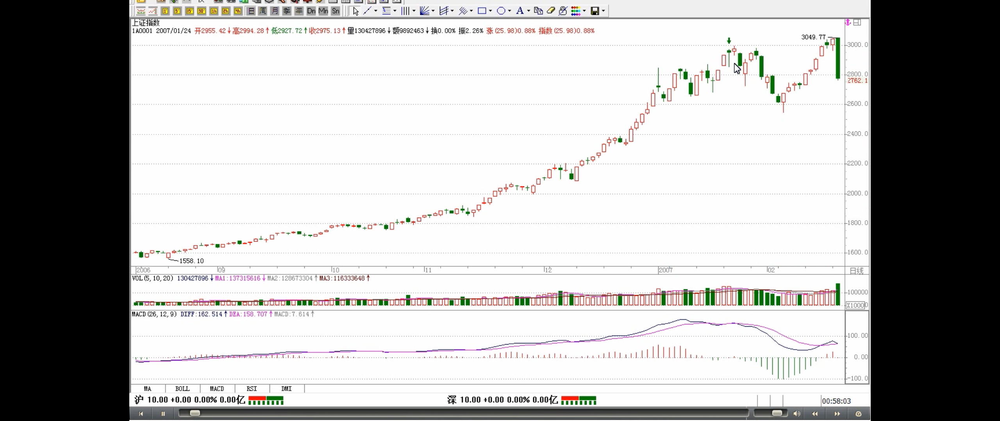

> 均线和中枢等概念是完全不同的
>
> 均线系统的缺点
>
> - 简单数学处理
> - 离不开或然率
> - 只能是一种辅助性工具
> - 跟 MACD 是一回事
>
> 均线系统的优点
>
> - 比较通俗，掌握起来比较简单

**发现很多人把以前的东西都混在一起了，所以先把一些问题再强调一下**。所谓的“吻”，是和均线系统相关的，而**均线系统**，只是走势的一个**简单数学处理**，说白了，**离不开或然率**，这和后面所说的中枢等概念是完全不同的，所以一定要搞清楚，**不要把均线系统和中枢混在一起了**。均线系统，**本质上和 MACD 等指标是一回事，只能是一种辅助性工具**。由于这些工具**比较通俗，掌握起来比较简单**，如果不想太深研究的，可以先把这些搞清楚。

> 技术上想穷根究底，还是得搞清楚中枢等
>
> **用 MACD 判断背驰的特殊情况 1：一个太快速的走势，1 分钟图**
>
> - 这种走势如何把握超短的卖点？
> - 这种回调因为变动太快，在 1 分钟上都不能表现其背驰，所以必须用单纯的 MACD 柱子伸长来判断
> - 注意，这种判断的前提是 1 分钟的急促上升，其他情况下，必须配合黄白线的走势来用

但“学如不及”，对事情如果不能穷根究底，最终都是“犹恐失之”的，因此，**最终还是要把中枢等搞清楚**。MACD，当一个辅助系统，还是很有用的。**MACD 的灵敏度，和参数有关，一般都取用 12、26、9 为参数，这对付一般的走势就可以了，但一个太快速的走势，1 分钟图的反应也太慢了，如果弄超短线，那就要看实际的走势**，例如看 600779 的 1 分钟图，从 16。5 上冲 19 的这段，明显是一个 1 分钟上涨的不断延伸，**这种走势如何把握超短的卖点？** 不难发现，**MACD 的柱子伸长，和乖离有关，大致就是走势和均线的偏离度**。打开一个 MACD 图，首先应该很敏感地去发现该股票 MACD 伸长的一般高度，在盘整中，一般伸长到某个高度，就一定回去了，而在趋势中，这个高度一定高点，那也是有极限的，**一般来说，一旦触及这个乖离的极限，特别是两次或三次上冲该极限，就会引发因为乖离而产生的回调**。**这种回调因为变动太快，在 1 分钟上都不能表现其背驰，所以必须用单纯的 MACD 柱子伸长来判断**。**注意，这种判断的前提是 1 分钟的急促上升，其他情况下，必须配合黄白线的走势来用。从该 1 分钟走势可以看出，17。5 元时的柱子高度，是一个标杆，后面上冲时，在 18。5 与 19 元分别的两次柱子伸长都不能突破该高度，虽然其形成的面积大于前面的，但这种两次冲击乖离极限而不能突破，就意味着这种强暴的走势，要歇歇了。**

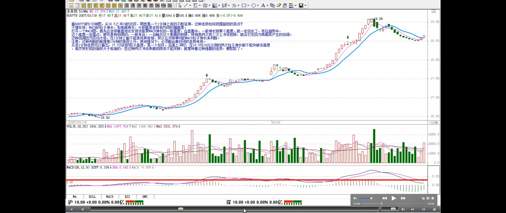

> 用 MACD 判断背驰的特殊情况 2：股票不断一字涨停

还有一种，就是**股票不断一字涨停**，这时候，由于 MACD 设计的弱点，在 1 分钟、甚至 5 分钟上，都会出现一波一波类似正弦波动的走势，**这时候不能用背弛来看**，最简单，就是用 1 分钟的中枢来看，只要中枢不断上移，就可以不管。直到中枢上移结束，就意味着进入一个较大的调整，然后再根据大一点级别的走势来判断这种调整是否值得参与。**如果用 MACD 配合判断，就用长一点时间的，例如看 30 分钟**。一般来说，这种走势，其红柱子都会表现出这样一种情况，就是红柱子回跌的低点越来越低，最后触及 0 轴，甚至稍微跌破，然后再次放红伸长，这时候就是警告信号，如果这时候在大级别上刚好碰到阻力位，一但涨停封不住，出现大幅度的震荡就很自然了。例如 600385，在 2。92 那涨停，MACD 出现一点的绿柱子，然后继续涨停，继续红柱子，而 3。28 元是前期的日线高位，结果 3。22 涨停一没封住，就开始大幅度的震荡。
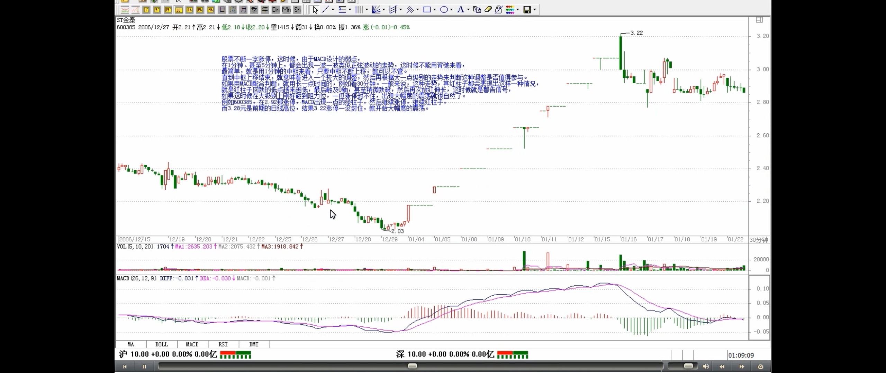

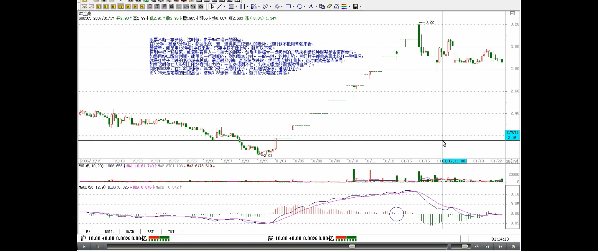

> 关键是要抓住大级别的调整，不参与其中，这才是最关键的

注意，如果这种连续涨停是出现在第一段的上涨中，即使打开涨停后，震荡结束，形成一定级别的中枢后，往往还有新一段的上涨，**必须在大级别上形成背驰才会构成真正的调整，因此，站在中线的角度，上面所说的超短线，其实意义并不太大，有能力就玩，没能力就算了**。**关键是要抓住大级别的调整，不参与其中，这才是最关键的**。

> 趋势背驰
>
> - 跌幅：至少回到中枢区间内
>
> 盘整背驰
>
> - 盘整背驰的三种情况
> - 跌幅：不一定都要大幅下跌

此外，一定要先分清楚趋势和盘整，然后再搞清楚背驰与盘整背驰。**盘整背驰里的三种情况**，特别是形成第三类买点的情况，一定要搞清楚。**注意，盘整背驰出来，并不一定都要大幅下跌，否则怎么会有第三类买点构成的情况**。而**趋势中产生的背驰，一定至少回跌到 B 段中**，这就可以预先知道至少的跌幅。

> **背驰的回跌力度**
>
> - 和级别很有关系
>   - 上涨最后阶段的小级别背驰可能引发暴跌
>   - 上涨最后阶段的背驰导致暴跌的可能性 > 上涨中段的背驰
> - 所以这一点必须多级别地综合来考察，绝对不能一看背驰就抛等跌 50%，世界上哪里有这样的事情。

**对背驰的回跌力度，和级别很有关系**，**_如果日线上在上涨的中段（疑问🤔️：是不是上涨的第一个中枢？看 btc 2020-4-23）刚开始的时候_**，MACD 刚创新高，红柱子伸长力度强劲，这时候 5 分钟即使出现背驰，其下跌力度显然有限，所以只能打点短差，甚至可以不管。**_而在日线走势的最后阶段（疑问🤔️：第二个中枢？看btc 2020-4-30），特别是上涨的延伸阶段_，一个 1 分钟的背驰足以引发暴跌**，**所以这一点必须多级别地综合来考察，绝对不能一看背驰就抛等跌 50%**，世界上哪里有这样的事情。

> **_这一段非常重要_**
>
> 标准的两个中枢上涨的 MACD 形态
>
> - 背驰的 MACD 形态
>   - c 对应的柱子面积 < b 的
>   - c 对应的最高柱子 < b 的？
>   - c 对应的黄白线高度 < b 的

**_一般来说，一个标准的两个中枢的上涨，在 MACD 上会表现出这样的形态_**，就是第一段，MACD 的黄白线从 0 轴下面上穿上来，在 0 轴上方停留的同时，形成相应的第一个中枢，同时形成第二类买点（疑问🤔️：一买在哪里？），其后突破该中枢，MACD 的黄白线也快速拉起，这往往是最有力度的一段，一切的走势延伸等等，以及 MACD 绕来绕去的所谓指标钝化都经常出现在这一段，**这段一般在一个次级别的背驰中结束**，然后进入第二个中枢的形成过程中，同时 MACD 的黄白线会逐步回到 0 轴附近，最后，开始继续突破第二个中枢，MACD 的黄白线以及柱子都再次重复前面的过程，但这次，**黄白线不能创新高，或者柱子的面积或者伸长的高度（能）不能突破新高，_出现背驰_**，这就结束了这一个两个中枢的上涨过程。**明白这个道理，大多数股票的前生后世，一早就可以知道了。**
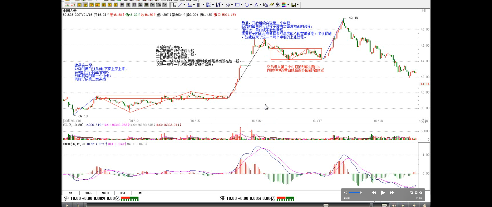
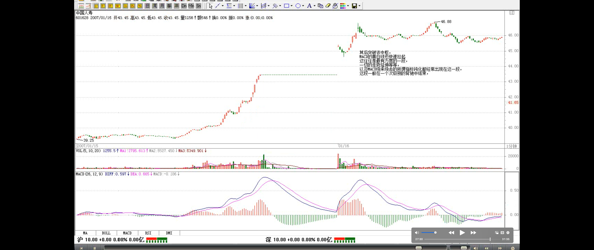
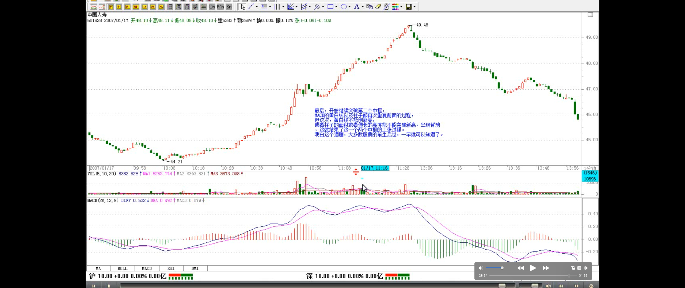

> 上一段的例子
>
> 疑问：这个例子 c 和 b 出现 MACD 背驰，但后面的实际走势并没下跌调整

用最近涨得最厉害的一个股票来说明，000572。该股票的力度，其实是和他在日线与周线上出现双重的第二类买点有关，相应地，就有了 MACD 双重在 0 轴停留形成第一个中枢的情况。在周线上，该股从 20051209 到 20060714，形成第一段，同时 MACD 也回到 0 轴上面。其后就开始形成第一个中枢，最终在 20061117 形成第二类买点（疑问🤔️：一买在哪里？），同时，黄白线在 0 轴附近横盘。然后，开始逐步摆脱该中枢，黄白线也逐步拉起。在日线上，这个过程也是一样的， 20061113 到 20061206，形成日线上的第一段，同时 MACD 回到 0 轴上面。然后三段回拉在 20070104 结束，形成第一个中枢，其后突破中枢，MACD 在 0 轴附近拉起，摆脱第一个中枢。该股以后的走势就很简单了，首先形成一个至少是日线级别的新中枢，同时 MACD 回抽 0 轴，然后再突破，出现背驰，构成一个大调整，从而导致一个至少周线以上级别的中枢，使得 MACD 出现回拉 0 轴，然后再拉起来，出现背驰，其后的调整就大了去了，至少是月线级别的。
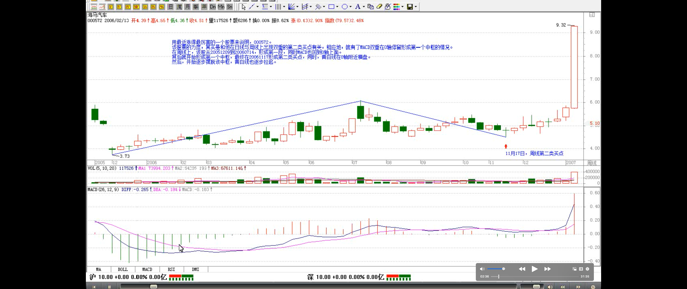
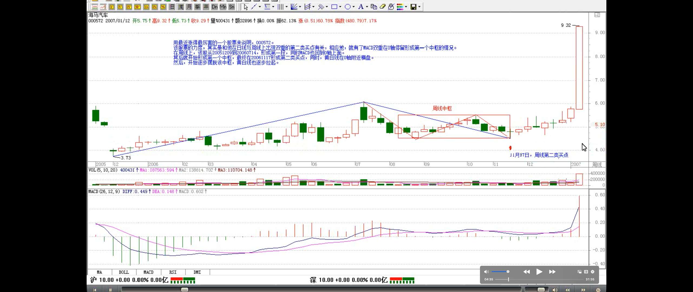
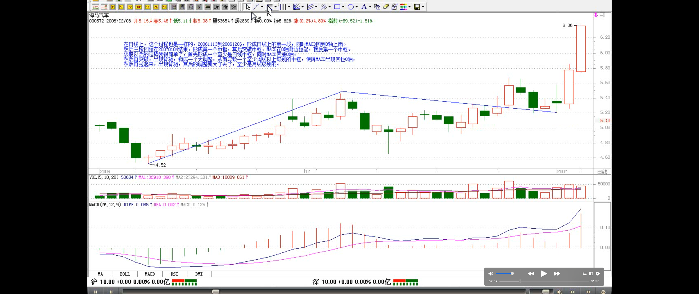
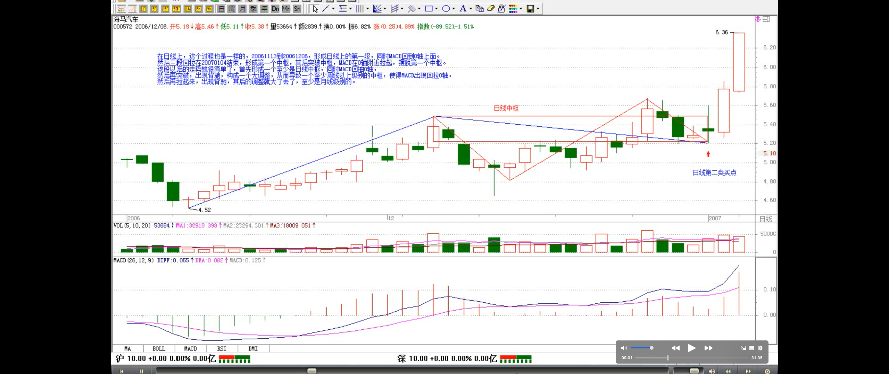
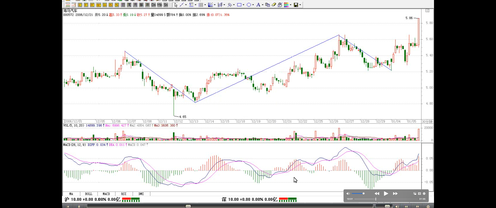
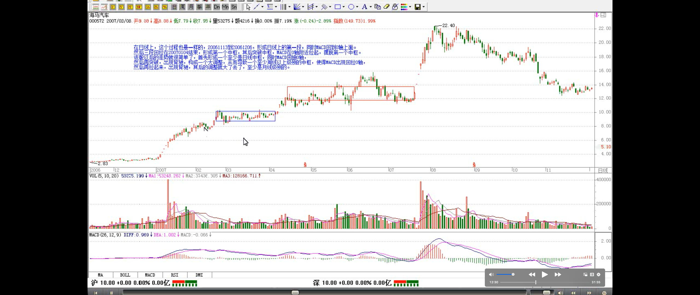
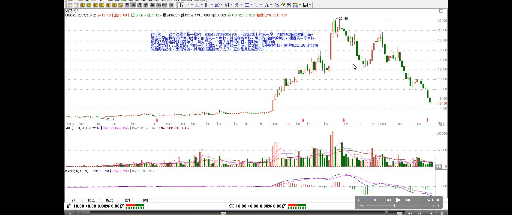
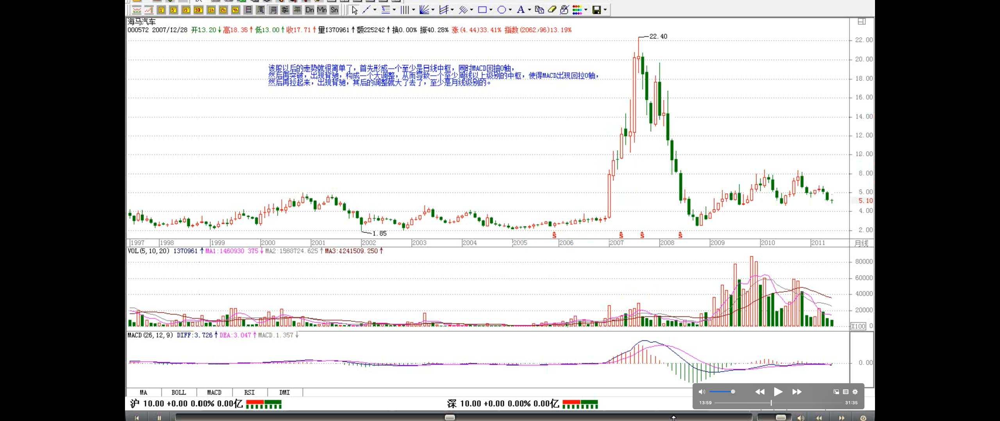

**必须注意，MACD 在 0 轴附近盘整以及回抽 0 轴所形成的中枢，不一定就是相应级别的中枢，而是至少是该级别的中枢**。例如日线 MACD 的 0 轴盘整与回拉，至少构成日线的中枢，但也可以构成周线的中枢，这时候就意味着日线出现三段走势。
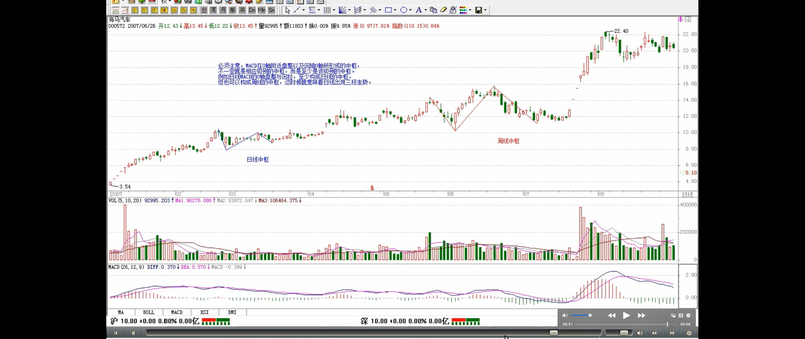
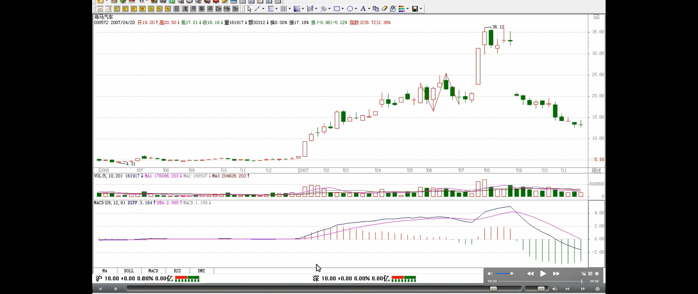
