# 教你炒股票 32：走势的当下与投资者的思维方式
(2007-02-28 08:44:37)

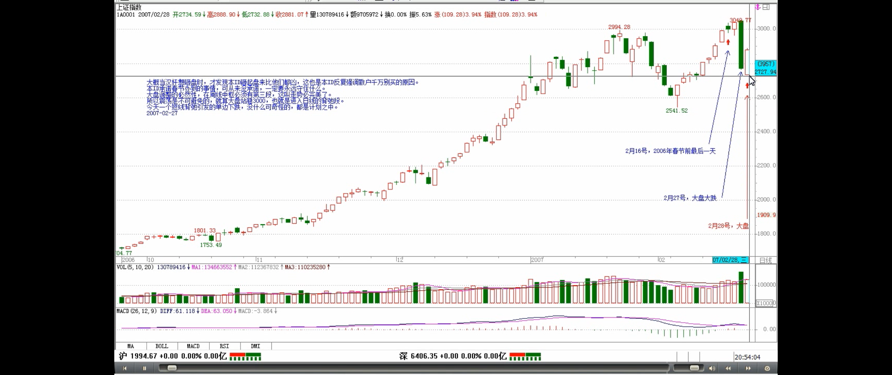

> 这里能看出缠师的境界

所有非汉奸、非奸细的各位请注意了，这里奸细少不了，如果你把这里当成一个纯粹的课堂，那就太小看这里了。但，有一点是无疑的，就是一旦你掌握本 ID 的理论，你根本无须听任何话，无论谁的话，任何话都是废话，走势永远第一。**牛顿不能违反万有引力，本 ID 也不能违反本 ID 的理论，这才是最关键的地方**。而只有这样，才有可能有一个正确的思维基础。你无须尊重本 ID，甚至，你学会本 ID 的理论，还可以专门和本 ID 作对，企图在市场上挣本 ID 的钱，但你必须尊重本 ID 的理论，就像你必须尊重万有引力一样，否则市场的走势每分每秒都会给你足够的教训。

> 投资者最大的毛病
>
> 最基本的节奏：牛市是快跌慢涨、熊市是快涨慢跌
> 
> **中枢的前三段**

**投资者最大的毛病**，就是只有一种思维方式，把自己的喜好当成了市场的现实。按这种逻辑，做多的就永远要做多，做空的就永远要做空，那不有毛病吗？好象这次，春节前的走势，为什么要做多，**因为技术上有形成中枢第二段的要求**，这就是做多的客观条件，而当第二段出现背弛，就意味着做多的客观条件没有了，继续硬撑着不是有毛病吗？**牛市是快跌慢涨、熊市是快涨慢跌，这最基本的节奏不应该不知道**。
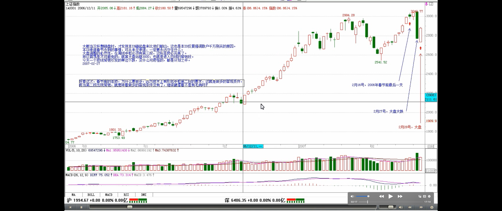

> 有一种更坏的毛病就是涨了才高兴，一跌就哭着脸
>
> 大跌完以后涨得最快的是什么？
>
> - 就是跌出第三类买点来的股票
>
> 真正的节奏与思维

**有一种更坏的毛病就是涨了才高兴，一跌就哭着脸**。请问，光做多，怎么把成本降为 0？股票都是废纸，光涨光做多，永远顶着一个雷。在前面的文章已经多次强调，**只有 0 成本的股票才是真正安全的**。如果死多死空思维不改变，永远都是股票的奴隶。而且，**跌完以后涨得最快的是什么？** 就是跌出第三类买点来的股票，看看 000416 上次的那一跌，一个完美的第三类买点，后面是一个月 100%幅度的上涨，中间还带了一周的假期。**大跌，就把眼睛放大，去找会形成第三类买点的股票，这才是股票操作真正的节奏与思维**。本 ID 的理论里没有风险的概念，风险是一个不可操作的上帝式概念，**本 ID 的眼里只有买点、卖点，只有背驰与否**，这些都是有严格定义的、可操作的，这才是让股票当你奴隶的唯一途径。
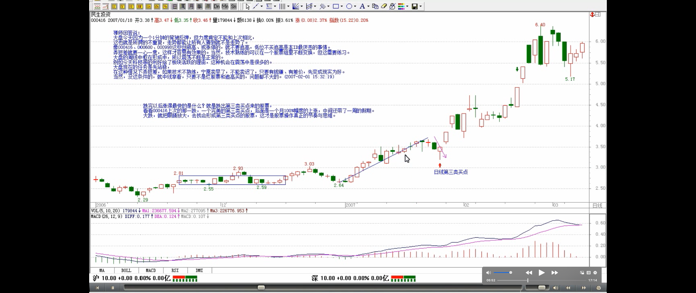
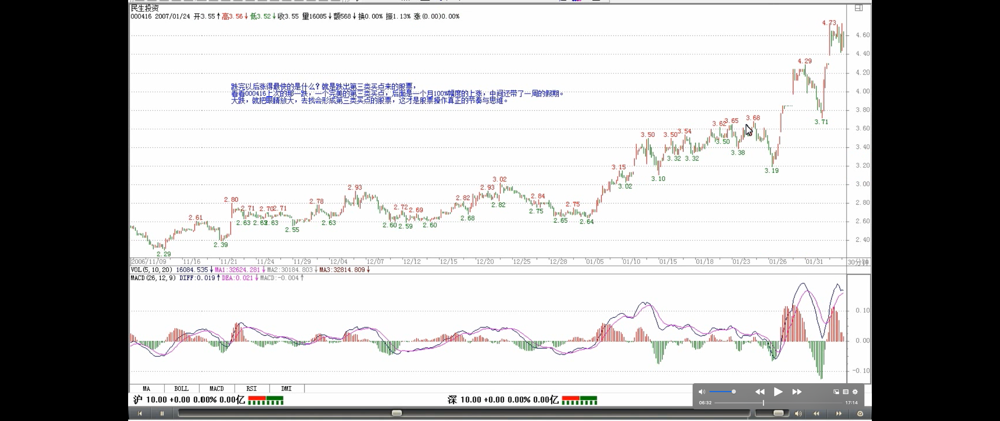

有人可能要反问本 ID，你不是说中国的地盘中国人做主吗？请问，难道中国人做主，就只能做多的主，不能做空的主？这还算什么主？如果你把握了本 ID 的理论，严格按买点买、卖点卖，那你就是股票的主人。所谓汉奸，不过是希望通过他们的伎俩来把中国的血给吸走，而如果你有本事让汉奸低卖高买，那汉奸就死定了。就像这次，去问问联通上谁吃了哑巴亏。前面本 ID 说过，N 年前干过一个阻击，从 14 元一直阻击上 25 全出掉，也是春节前后的，算起来就 10 来个交易日，一分钱没花，为什么？就是把某些人的节奏给搞乱了，大家应该记得赵本山和范伟拍卖那场对话，有点类似。具体怎么样，以后和大家说如何阻击的时候再说。不过可以告诉大家最终的结果，那股票最终跌回 3 元多。

> 股票，如同跳舞，关键是节奏。买点买、卖点卖，就是一个最合拍的节奏。和那合力一致，这样才是顺势而为。

**股票，如同跳舞，关键是节奏**，节奏一错，就没法弄了。**买点买、卖点卖，就是一个最合拍的节奏**，任何不符合这个节奏的，都要出乱子。例如，你是按 30 分钟级别操作的，明明顶背驰了，你不卖，一定要想着还要高，然后底背驰的时候忍不住了，杀出去，这样下来，你很快就不用玩股票了，因为股票很快就玩死你。**走势有其节奏，你操作股票，如同和股票跳舞，你必须跳到心灵相通，也就是前面说的，和那合力一致，这样才是顺势而为，才是出色的舞者**。如果不明白的，今天去跳一下舞，找一个舞伴，把他的节奏当成股票的节奏，感应一下。

> **走势当下，分析判断a+A+b+B+c 的向上走势：这一段很重要**
> 
> **走势是不可能预测的（但可以完全分类可能的情况）**
> 
> **所有的操作都是在走势当下判断的**
> 
> 走势的生长：1分钟走势生长出来确定后，才构成5分钟走势，才能分析判断5分钟走势。5分钟走势生长出来确定后，才构成30分钟走势，才能分析判断30分钟走势。以此类推...
>
> **走势的当下性**
> - 所有的意义都是当下赋予的
> - 你不可能在 A 走出来后就说一定有 B
> - 怎么知道 b 段里走还是不走？
> 

感应，是当下的，如果当下你还想着前后，那你一定跳不好舞。**股票也一样，永远只有当下的走势状态，股票的走势，没有一个必然的、上帝式的意义，所有的意义都是当下赋予的**。**例如**，一个 30 分钟的 a+A+b+B+c 的向上走势，**你不可能在 A 走出来后就说一定有 B，这样等于是在预测，等于假设一种神秘的力量在确保 B 的必然存在，而这是不可能的**。**那么，怎么知道 b 段里走还是不走？** 这很简单，这不需要预测，因为 b 段是否走，不是由你的喜好决定的，而是由 b 段当下的走势决定的。如果 b 段和 a 段相比，出现明显的背驰，那就意味着要走，否则，就不走。而参考 b 段的 5 分钟以及 1 分钟图，**你会明确地感觉到这 b 段是如何生长出来的**，**这就构成一个当下的结构，只要这个当下的结构没有出现任何符合区间套背驰条件的走势，那么就一直等待着，走势自然会在 30 分钟延伸出足够的力度，使得背驰成为不可能（注解🐷：b没有盘整背驰的情况）**。**这都是自然发生的，无须你去预测**。
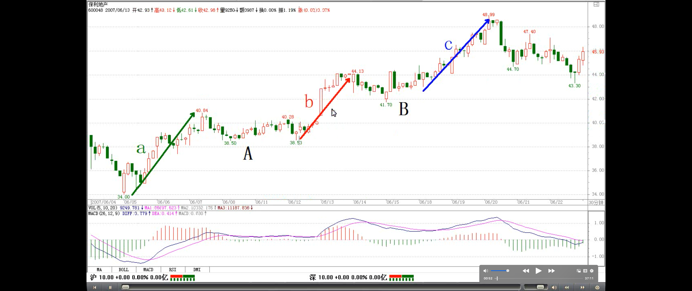
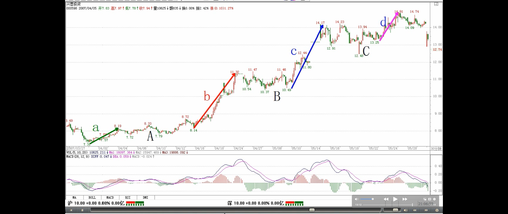

> **走势当下，分析判断a+A+b+B+c 的向上走势：这一段很重要**
> 
> - a+A+b+B+c走势的操作模式：
>   - 上涨中的详细说明
>   - 中枢中的详细说明
> - 中枢的第一段、第二段、第三段的定义，中枢区间是前两个z走势段确定
>
> 三买的含义：要出现 c 段，如同要出现 b 段，都必须有一个针对 30 分钟的第三类买点出现，这样才会有（疑问🤔️：三买在 b、c 之前还是之后？如果三买是在 b、c之前，那三买之前的突破30分钟中枢的两个上下的5分钟走势类型是什么呢？不是b、c吗？解答：【韶山映山红】a+A+b的b、a+A+b+B+c的c要有中枢的第三类买卖点。没有第三类买卖点的时候，离开段只有中枢震荡的身份，有了第三类买卖点，中枢延伸结束，离开段才有了b、c的身份。没有第三类买卖点的离开段不算b、c。换一个角度说，由于有了第三类买卖点，a+A+b的b、a+A+b+B+c的c都至少由三段次级别走势构成。当 然，a+A+b+B+c的b不一定还有三段，b的后两段可能成为B的组成部分。**注释🐷：有第三类买卖点也不一定就确定b、c，必须后面形成中枢**）
>
> 不需要你去预测什么，只要你能感应到走势当下的节奏，而这种感应也没有任何的神秘，就是会按定义去看而已

详细说，在上面例子 30 分钟的 a+A+b+B+c 里，**A 是已出现的，是一个 30 分钟的中枢**，这可以用定义严格判别，没有任何含糊、预测的地方。而**b 段一定不可以出现 30 分钟的中枢**，也就是只能最多是 5 分钟级别的。**如果 b 段一个 5 分钟级别的开始上涨已经使得 30 分钟的图表中不可能出现背驰的情况**（注解🐷：在30分钟级别查看，与 a 比， b 没有盘整背驰），那么你就可以有足够的时间去等待走势的延伸，等待他形成一个 5 分钟的中枢，一直到 5 分钟的走势出现背驰（注解🐷：b 内部背驰），这样就意味着 **B 要出现了**，一个 30 分钟的新中枢要出现了。是否走，这和你的资金操作有关了，如果你喜欢短线，你可以走一点，等这个中枢的**第一段（注解🐷：第一个z走势段）** 出现后，回补， **第二段**高点看 5 分钟或 1 分钟的背弛出去， **第三段**下来再回补，然后就看这个中枢能否继续向上突破走出 c 段。 **注意，c 段并不是天经地义一定要有的**，就像 a 也不是天经地义一定要有的。**要出现 c 段，如同要出现 b 段，都必须有一个针对 30 分钟的第三类买点出现，这样才会有**。所以，你的操作就很简单了，每次，5 分钟的向上离开中枢后，一旦背驰，**就要出来**，然后如果一个 5 分钟级别的回拉不回到中枢里，就意味着有第三类买点，那就要回补，等待 c 段的向上（疑问🤔️：三买在 b、c 之前还是之后？如果三买是在 b、c之前，那三买之前的突破30分钟中枢的两个上下的5分钟走势类型是什么呢？不是b、c吗？回答：详细回答在上面👆，【韶山映山红】这时候离开段才正式成为c段。）。而 c 段和 b 段的操作是一样的，是否要走，完全可以按当下的走势来判断，无须任何的预测。不背驰，就意味着还有第三个中枢出现，如此类推。**显然，上面的操作，不需要你去预测什么，只要你能感应到走势当下的节奏，而这种感应也没有任何的神秘，就是会按定义去看而已。**

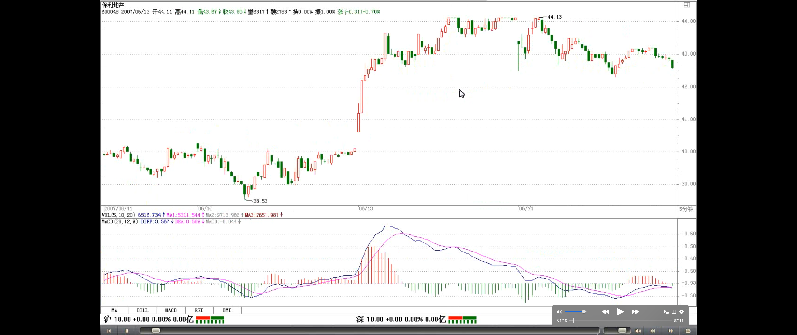
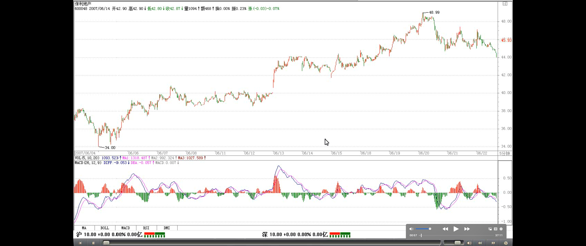

> 当 a+A+b 出现，可能的后面走势，及处理方法
>
>
> **中枢在操作上的意义：在中枢里，是最容易打短差降成本的，关键利用好各种次级别的背驰或盘整背驰就可以了**

**那么，30 分钟的 a+A+b+B+c 里，这里的 B 一定是 A 的级别？** 假设这个问题，同样是不理解走势的当下性。**当 a+A+b 时，你是不可能知道 B 的级别的**，只是，只要 b 不背驰，那 B 至少和 A 同级别，但 B 完全有可能比 A 的级别大，那这时候，就不能说 a+A+b+B+c 就是某级别的上涨了，**而是 a+A+b 成为一个 a\`，成为 a\`+B 的意义了**。但，无论是何种意义，在当下的操作中都没有任何困难，例如，**当 B 扩展成日线中枢，那么就要在日线图上探究其操作的意义，其后如果有 c 段，那么就用日线的标准来看其背驰，这一切都是当下的**。至于中枢的扩展， 其程序都有严格的定义，按照定义操作就行了，**在中枢里，是最容易打短差降成本的，关键利用好各种次级别的背驰或盘整背驰就可以了**。

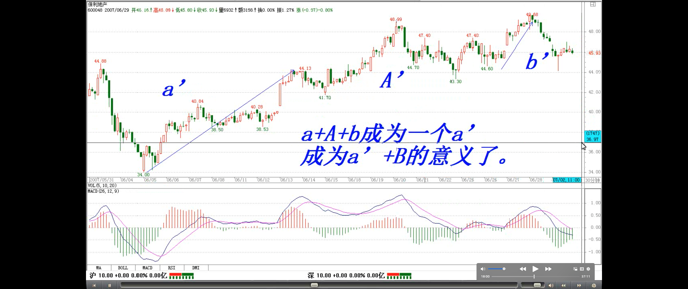
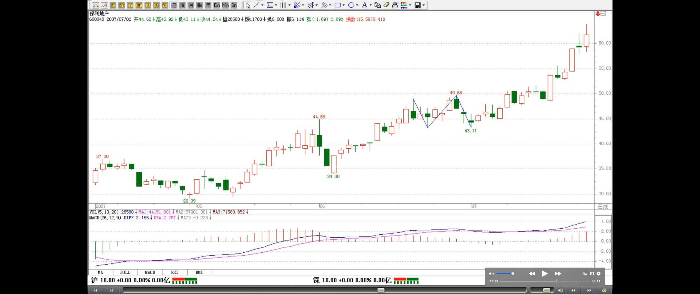

> **必须随时读懂市场的信号（走势力度/背驰、走势类型），这是应用本 ID 理论最基础也是最根本的一点**
>
> **在最精确的转折点操作成功**：利用区间套，从大级别到最小级别，一直可以到盘口的异动
>
> 利用缠论+各种面（缠论+基本面+比价关系的数学原则）

**所以，一切的预测都是没意义的，当下的感应和反应才是最重要的。你必须随时读懂市场的信号，这是应用本 ID 理论最基础也是最根本的一点**。如果你连市场的信号、节奏都读不动，其他一切都是无意义的。但，**还有一点很重要**，就是你读懂了市场，但却不按信号操作，那这就是思维的问题了，老有着侥幸心理，这样也是无意义的。**按照区间套的原则，一直可以追究到盘口的信息里**，如果在一个符合区间套原则的背驰中发现盘口的异动，**那么，你就能在最精确的转折点操作成功**。本 ID 的理论不废一法，盘口工夫同样可以结合到本理论中来，但关键是在恰当的地方，并不是任何的盘口异动都是有意义的。**本 ID 的理论由于是从市场的根子上考察市场，所以把握了，你就可以结合各种理论，什么基本面、政策面、资金面、庄家等等因数，这些因数如何起作用、有效与否，都在这市场的基本走势框架上反应出来。**

> 联通的例子
>
> 由于市场是当下的，那么，投资者具有的思维也应该是当下的

**_由于市场是当下的，那么，投资者具有的思维也应该是当下的_，而任何习惯于幻想的，都是把幻想当成当下而掩盖了对当下真实走势的感应**。这市场，关键的是操作，而不是吹嘘、预测。有人可能要反问，怎么这里也经常说些类似预测、吹嘘的话，**例如前两天本 ID 说让汉奸砸盘联通**。请问，汉奸可能有几十亿股的联通吗？汉奸砸盘本 ID 就要接？本 ID 为什么不可以先砸？为什么一定要在顶背弛接砸盘？本 ID 又没毛病，汉奸如果有爱好，最好在底背弛的时候砸盘，本 ID 一定欢迎。而对于本 ID 来说，如果有些话能当百万兵，本 ID 凭什么不说？本 ID 也没兴趣知道，联通昨天 936 到 945 推出 5.52 元是谁中风了，竟然勇敢地顶出一个顶背弛来，那时候，本 ID 只看到了卖点，如此而已。就算不知道本 ID 的理论，最简单的，难道连 1 月 4 日和 1 月 30 日的连线在哪里都看不清楚？
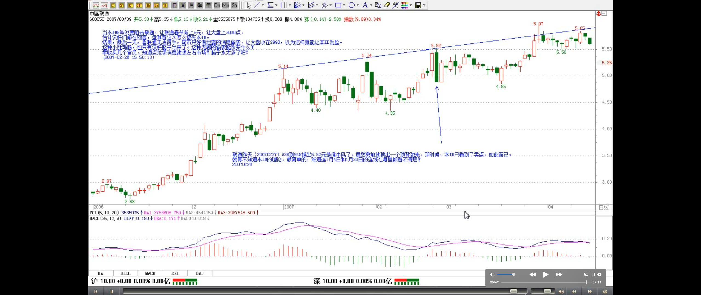
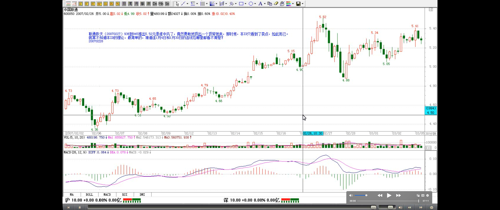
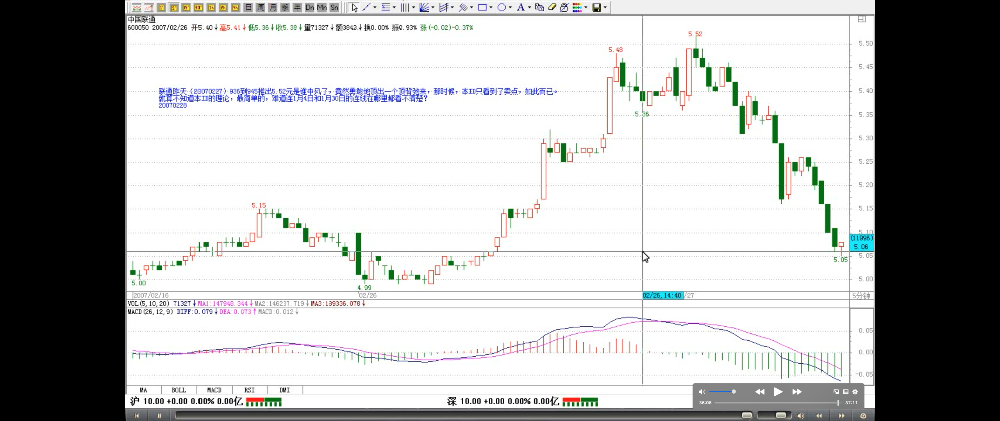
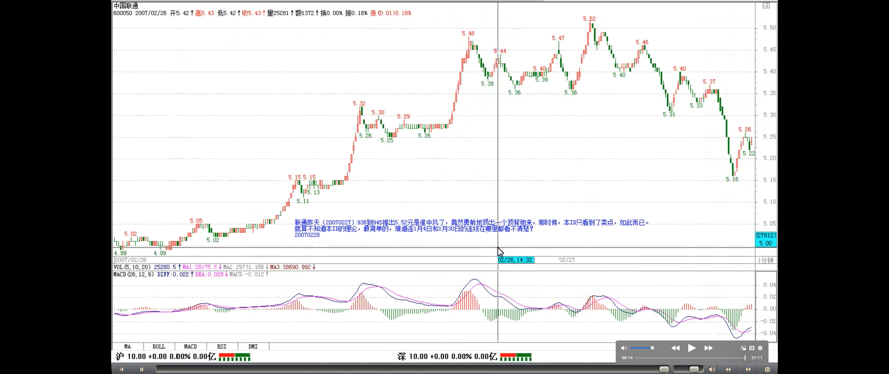

> 走势永远第一：走势是钱堆出来的，它最诚实了

所有非汉奸、非奸细的各位请注意了，这里奸细少不了，如果你把这里当成一个纯粹的课堂，那就太小看这里了。但，有一点是无疑的，就是一旦你掌握本 ID 的理论，你根本无须听任何话，无论谁的话，任何话都是废话，**走势永远第一**。**牛顿不能违反万有引力，本 ID 也不能违反本 ID 的理论，这才是最关键的地方**。而只有这样，才有可能有一个正确的思维基础。**你无须尊重本 ID，甚至，你学会本 ID 的理论，还可以专门和本 ID 作对，企图在市场上挣本 ID 的钱，但你必须尊重本 ID 的理论，就像你必须尊重万有引力一样，否则市场的走势每分每秒都会给你足够的教训。**

补充：回帖很多，怕有人看不到，把今天收盘的讲评放在这里：

> 初二水平

今天之所以如此早就发课程，就是让各位现场学习。看看 a+A+b+B+c 是如何变成 a`+B，如果早上不敢回补，那么 1351 的第三类买点，怎么都应该回补了。而且个股与大盘的节奏不同，这两天深圳低价本地股表现怎样，今天哪个板块先涨停的，除非你的眼睛有毛病，大概都应该能看明白了。如果今早没看到课程的，那么就好好对照这两天的 1 分钟图研究一下。**如果把本课程吃透，那你的水平可以上初二了。**

大盘后面的走势很简单，就是 2915，昨天一分种中枢的高点。如果看不懂的，就看 5 日线。上不去，那就要二次探底，否则就 V 型反转，重新攻击 3000 点。

至于个股方面，没什么可说的，今天的课程里专门让大家去找第三类买点的：“大跌，就把眼睛放大，去找会形成第三类买点的股票，这才是股票操作真正的节奏与思维。”不仅是思维本身，心态如何调整，有了这次现场直播，大家对这节奏，不知道有没有感觉。今天一早看课程又能理解的，有福了。

表扬一下 CCTV，为了这几句话：

[匿名] CCTV

2007-02-28 10:20:59
[匿名] 老新手

2007-02-28 09:53:25
第二个 1 分钟中枢形成，就看后面是否背驰了。

-
不一定，你仔细研究一下妹妹今天举的两个例子。

[匿名] CCTV

2007-02-28 10:24:40
我觉得，大盘还存在一种可能，就是形成妹妹文章里说的 a\`+B，然后突破 B 直接上去。现在应该按 a\`+B 来看了。
