# 教你炒股票 36：走势类型连接结合性的简单运用

---

**注意，任何一次失误都要马上总结**，不能连续失误再调整。如果真的出现连续失误，那就是你的方法有很大问题，必须改进，好好想好再操作。

方法的问题无非几种:**参与过小级别的操作、没有按买卖点操作，参照（参与）过于频繁、对图形判断不熟练、有盲点、乱听消息等等**。先把问题找出来，究竟是什么问题。
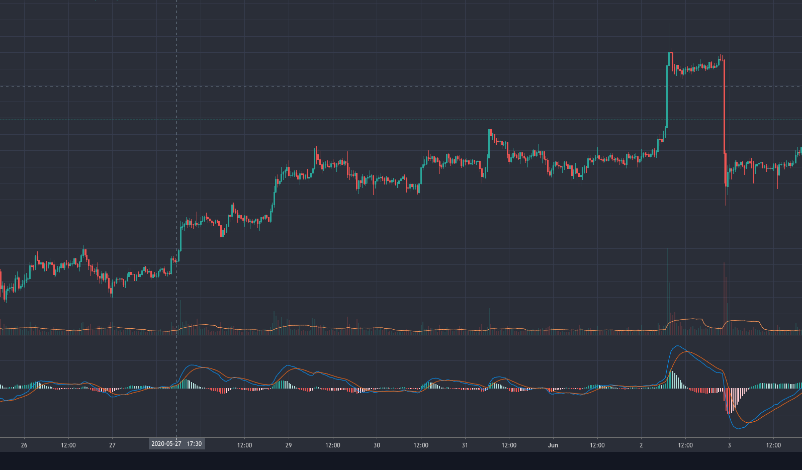
 
注意，失误的原因永远与市场无关，找原因，只能找自己的原因。

---

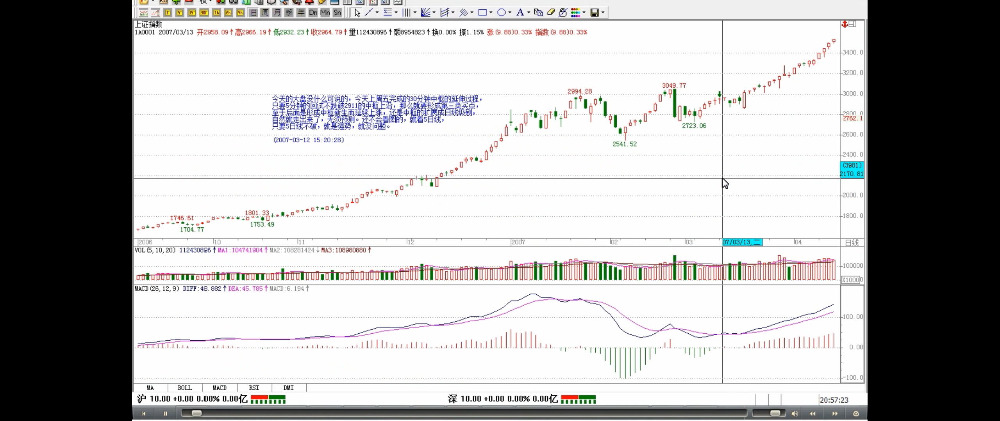

> 走势类型连接运算
>
> - A+B+C=（A+B）+C=A+（B+C）
>
> 结合律
>
> - A+B+C=（A+B）+C=A+（B+C）
> - A、B、C 的走势类型级别可以不同
>
> 多义性
>
> - 多义性1：根据该结合律，就不难知道，任何一段走势，都可以有很多不同的释义
> - 多义性2：任何一段走势，都可以根据不同的级别进行分解
> - 用同一理论的不同视角对同一现象进行分析

上堂课提到**走势类型连接运算的结合性**，也就是走势类型的连接符合**结合律**，即 A+B+C=（A+B）+C=A+（B+C），**A、B、C 的走势类型级别可以不同**。因此，站在多义性的角度，**根据该结合律，就不难知道，任何一段走势，都可以有很多不同的释义**。必须注意，多义性不是含糊性，一个含糊的理论，其分类、概念等呈现的含糊性，只是证明该理论基础的含糊。而**多义性**，是站在一个严格、精确的理论基础上，**用同一理论的不同视角对同一现象进行分析**。

> 多义性2：任何一段走势，都可以根据不同的级别进行分解

**一个最简单的释义角度，就是级别，任何一段走势，都可以根据不同的级别进行分解**，不妨用 An-m 的形式表示根据 n 级别对 A 段进行分解的第 m 段，就有， A=A1-1+A1-2+A1-3+…+A1-m1=A5-1+A5-2+A5-3+…+A5-m5=A30-1+A30-2+A30-3+…+A30-m30= A 日-1+A 日-2+A 日-3+…+A 日-m 日等等，显然这些分解都符合本 ID 理论。**而根据某级别进行操作，站在纯理论的角度，无非等价于选择该等式列中某个子式子进行操作，这在上一课中已经有具体说明**。
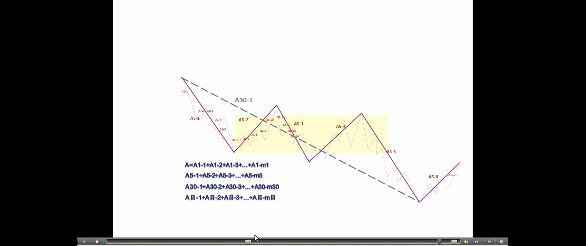

> 需好好理解
>
> 走势的当下判断

**还有一种应用，就是关于走势的当下判断。当下判断，其基础在于采取的分解方式。例如**，**一个按 5 分钟分解的操作角度与一个按 30 分钟分解的操作角度，在同一时间看到的走势意义是不同的**。更重要的是，在 5 分钟分解中完成的走势，在 30 分钟却不一定完成。例如 A+B，A、B 都是 5 分钟的走势类型，那么 A+B 走势，对于 30 分钟的分解就是未完成的。**根据走势必须完美的原则，未完成的走势必完成，也就是，在不同的分解角度，可以在当下看到不同级别的未完成走势根据走势必完美原则产生的运动，这方面的仔细分析留待专门的课程**。
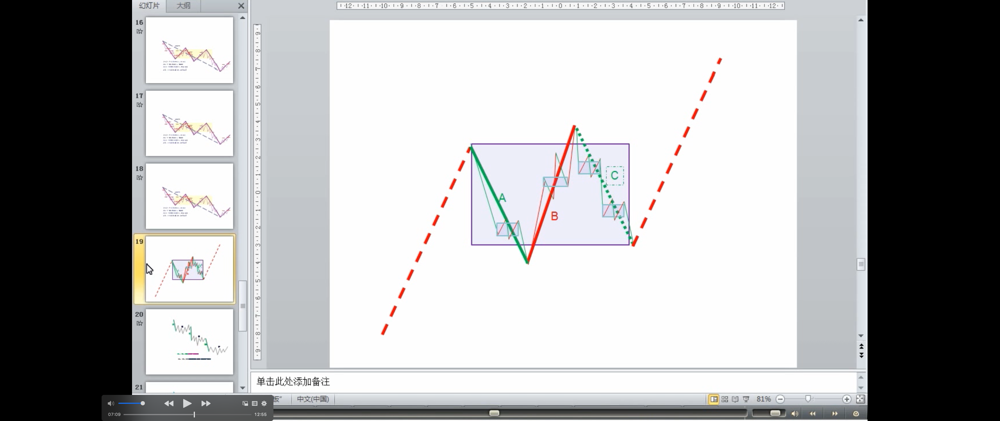

> 结合性的应用：把走势重新组合，使得走势更加清晰
>
> 很多人一看走势就晕的原因
>
> 具体的组合有很多可能

**还有一种应用，就是把走势重新组合，使得走势更加清晰**。_**很多人一看走势就晕，最主要是不了解走势连接的结合性，任何的走势，在结合律上，都可以重新组合，使得走势显示明显的规律性**_。假设 A+B+C+D+E+F，A、C、E 是 5 分钟级别的，B、D、F 是 30 分钟级别的，其中还有延伸等复杂情况。这时候，就可以把这些走势按 5 分钟级别重新分解，然后按中枢的定义重新组合走势，按结合律的方法，把原来的分解变成 A\`+B\`+C\`+D\`+E\`+F\`，使得 A\`、B\`、C\`、D\`、E\`都是标准的只是 30 分钟级别，而最后的 F\`变成在 30 分钟意义上未完成的走势，这样进行分析，就会很明晰了。当然，**具体的组合有很多可能，如何根据当下的走势选择一种最有利指导操作的，就是考功夫的事情**。
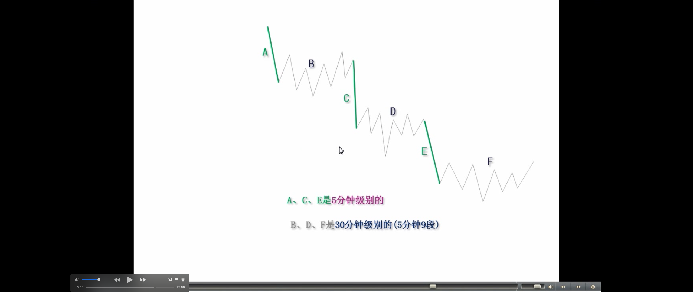
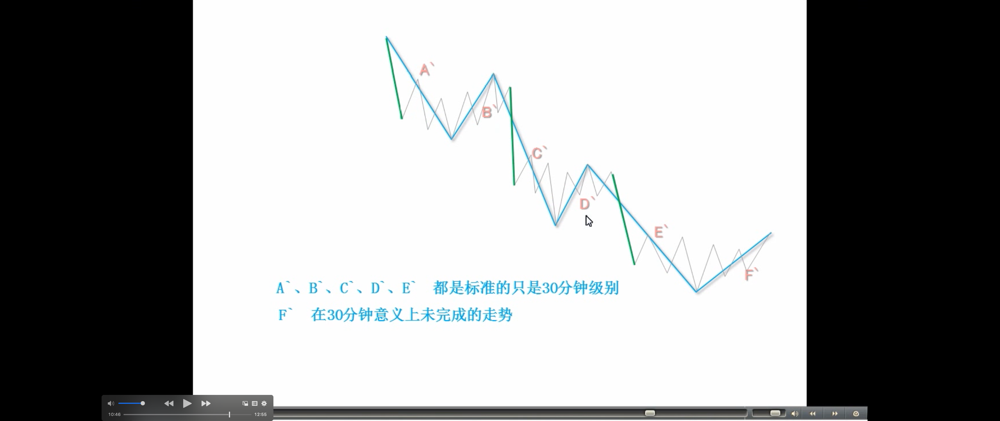
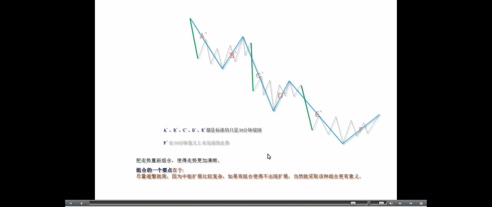

> 最佳组合，是根据市场当下的走势随时变化的
>
> **结合性的实盘讲解**
> - 两种组合划分，一个是两个中枢的上涨趋势；一个是两个中枢扩张升级等待确认。
> 
> **这里的中枢是前期的标准，不符合后期的标准**

而这种根据结合律的**最佳组合，是根据市场当下的走势随时变化的**，**而所有的变化，都符合理论要求且不会影响实际操作，是对实际操作起着更有力的帮助**。例如，在最近走势中，30 分钟图上，**2760 到 2858 这 30 分钟中枢**，03081000 的 5 分钟回抽确认了一个**第三类买点**，然后其后就继续走出一个新的 30 分钟中枢，而 030810005 分钟回抽低点 2871 点比上一中枢的最高点 2888 点要低，而后来关于 03071330 开始的这个 **30 分钟中枢出现延伸**，这样，我们就可以对这个分解**进行重新组合**，给出一个更清晰的组合方法，把 03081000 的 5 分钟回抽组合到 03051330 开始的这段 5 分钟走势中，形成一个 5 分钟的上涨（疑问🤔️：没懂！），然后新的 30 分钟中枢就从 03091030，这样的好处在于，这个中枢震荡的低点 2892 点比 2888 点高，如果其后的震荡不出现跌破 2888 的走势，那么就是一个 30 分钟的上涨走势形成了。但在这个新的中枢被一个新的第三类买点有效突破前，依然存在震荡跌破 2888 点甚至最终确认中枢扩展。但这样的重新组合，对看图就有了帮助。当然，站在纯中枢的角度，依然可以坚持让新中枢从 03071330 开始，这样对具体的操作也没有太大影响，但在判断上就没有重新组合的看起来方便了。

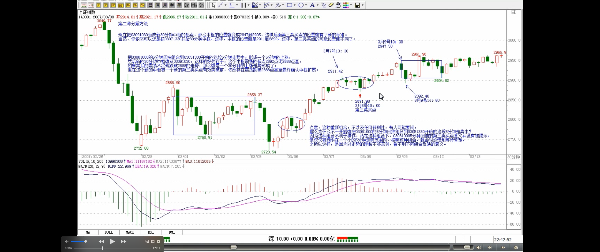
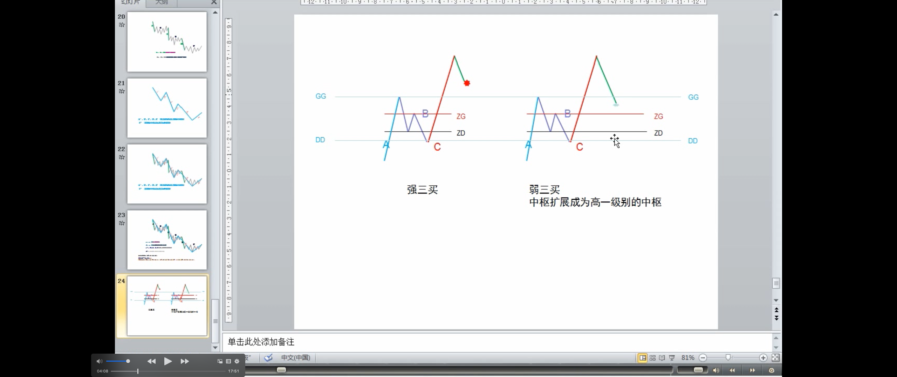

> **需好好的理解**

> 而任何组合的反映都是有意义的，对这些组合意义的全面把握，就是一个工夫上的长进了
>
> 组合的一个要点在于，尽量避繁就简，因为中枢扩展比较复杂，如果有组合使得不出现扩展，当然就采取该种组合更有意义
> 
> 但必须强调的是，当下采取什么组合，就要按该种组合的具体图形意义来判断、操作

注意，这种重新组合，不涉及任何预测性，有人可能要问，那么为什么不一开始就把 03081000 的 5 分钟回抽组合到 03051330 开始的这段 5 分钟走势中？**因为这种组合不利于操作，站在这种组合下，030810005 分钟回抽的第三类买点意义并没有被揭示，是仅仅被局限在一个小的 5 分钟走势范围内，按照这种组合，就会很恐慌地等待背驰，之所以这样，是因为对走势的理解不够深刻，看不到不同组合反映的意义**。**_而任何组合的反映都是有意义的，对这些组合意义的全面把握，就是一个工夫上的长进了_**。此外，**组合的一个要点在于，尽量避繁就简，因为中枢扩展比较复杂，如果有组合使得不出现扩展，当然就采取该种组合更有意义**。有人可能要问，那么中枢扩展的定义是否不适用？当然适用，中枢扩展的定义是在两个中枢都完全走出来的情况下定义的，而实际操作中，往往第二个中枢还没有走完，还在继续延伸中，所以，除非出现明确的、符合理论定义的破坏，就可以根据有利于判断、操作的原则，对走势进行当下的组合。**但必须强调的是，当下采取什么组合，就要按该种组合的具体图形意义来判断、操作**，例如，现在把 03091030 当成新 30 分钟中枢的起点，那么中枢的位置就变成 2947 到 2905，这样后面第三类买点的位置就有了新的标准。当然，你依然可以还是按 03071330 开始 30 分钟中枢，这样，中枢的位置就是 2911 到 2892，这样，第三类买点的可能位置就不同了。

> 还有一种更重要的应用，就是在中枢的震荡中，围绕中枢的震荡，不一定都是次级别的

**还有一种更重要的应用，就是在中枢的震荡中**。**围绕中枢的震荡，不一定都是次级别的，例如，一个日线中枢，围绕他的震荡，完全可以是 30 分钟以下的任意级别，甚至是一个跳空缺口**，例如有些股票，完全可以今天一字涨停，明天一字跌停，跳来跳去的。*一般这种走势，一般人看着就晕了。但如果明白走势连接的结合性，就知道，无论怎么跳，最终都要形成更大级别的，只要不脱离这日线中枢，最后都至少会形成 30 分钟级别的走势*。任何围绕日线级别的震荡，最终都必然可以按如下方式进行分解：A30-1+A30-2+A30-3+…+A30-m30+a，a 是未完成的 30 分钟走势类型，至少 a 依然围绕日线中枢继续震荡，那 a 一定最终会完成 30 分钟的走势类型。显然，这里，m30<9，否则就会变成周的中枢了，这样整个的分解就要按日线来，而道理是一样的。
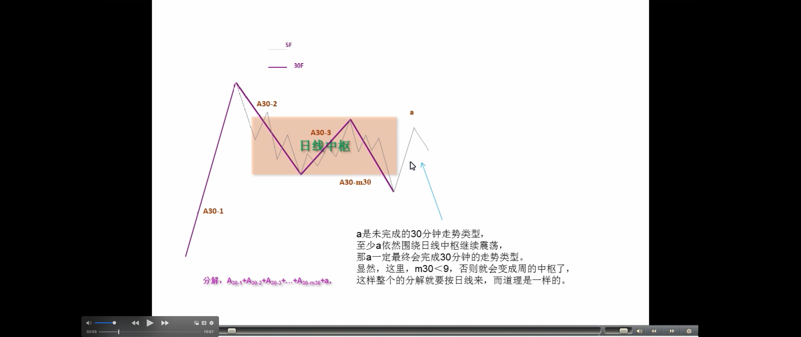

> **走势都是从未完成到完成，都是从小级别不断积累而来**
> 
> **小级别（30分钟）的三买远远小于大级别（日线）的三买**
> 
> **最后如果真出现日线的第三类买卖点，往往就在 30 分钟的第二个中枢附近就形成**

不过，更有实际意义的是，上面的 a 如果不再围绕日线震荡，例如，假设 a 是一个 5 分钟级别的，而其后一个 5 分钟级别的反抽也不回到中枢里，按照日线中枢，这并不构成第三类买卖点，但对于 A30-m30，可能就构成 30 分钟的第三类买卖点。**由于走势都是从未完成到完成，都是从小级别不断积累而来**，因此，**对于真正的日线第三类买卖点来说，这 A30-m30 的第三类买卖点，肯定在时间上要早出现**，对于 A30-m30，这绝对安全，但对日线却不一定，因为这 A30-m30 的第三类买卖点后完成的 30 分钟走势，可以用一个 30 分钟走势又重新回到日线中枢里继续中枢震荡。但这个 A30-m30 的第三类买卖点依然有参与的价值，因为如果其后的 30 分钟出现趋势，**最后如果真出现日线的第三类买卖点，往往就在 30 分钟的第二个中枢附近就形成了**，根本回不到这 A30-m30 的第三类买卖点位置，**因此，这样的买卖点，即使不符合你的操作级别，例如，如果你是日线级别操作的，但一旦这样的 A30-m30 的第三类买卖出现，至少要引起你充分的重视，完全可以适量参与了，一旦其后出现趋势走势，就要严重注意了**。
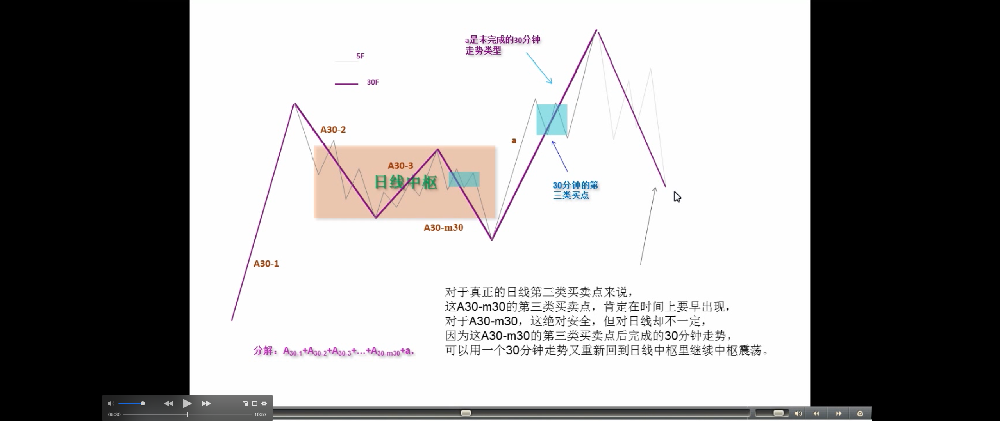
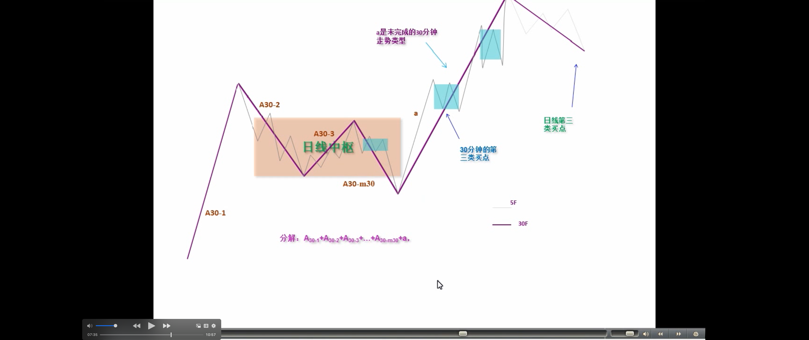
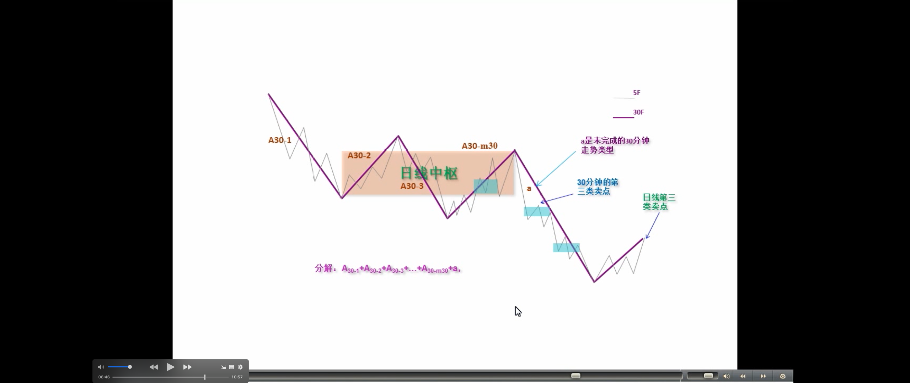

**不应该对走势进行任何的预测，但所有已走出来的走势，却可以根据级别与结合律等随意组合，无论任何组合，在该组合下，都必然符合本 ID 的理论，而任何最终的走势，都在所有组合中完全符合本 ID 的理论**，这也是本 ID 理论的神奇之处，无论你怎么组合，都不会出现违反本 ID 理论的情况。**但能否找到最合适的组合以适应操作，以及根据不同的组合，对走势进行综合分析，这就和经验有关了。这些最适合的分解，都是有相应答案的，关键是你能否看出来，而这根本不涉及任何的预测，只是对已有走势的分解，与对理论的把握与图形的熟悉度相关。而这些都是一些最基本的工夫，但必须在当下的走势中不断磨练才能真正掌握。如果真能把握这些最基本的当下走势的最合理组合以及用不同组合进行综合分析，那就可以开始继续读初三了。**
