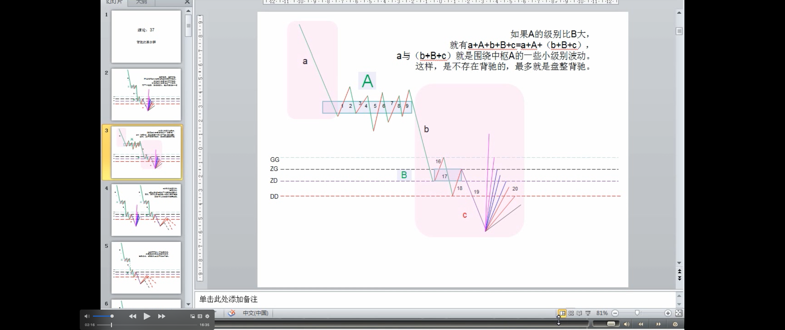
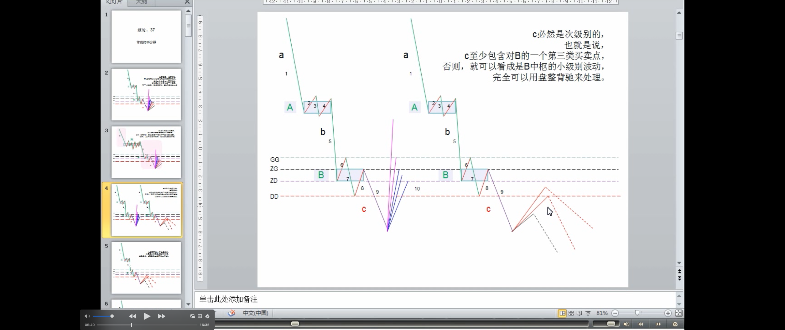
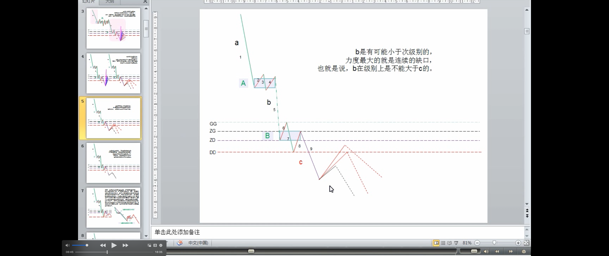
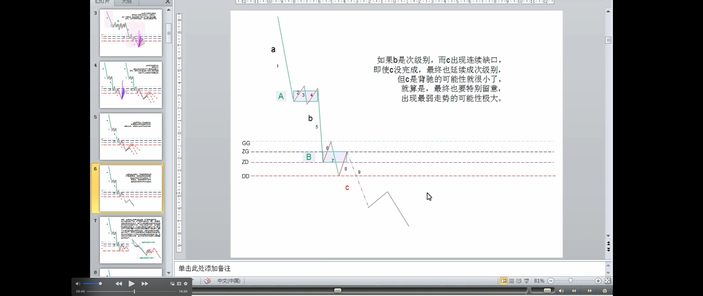
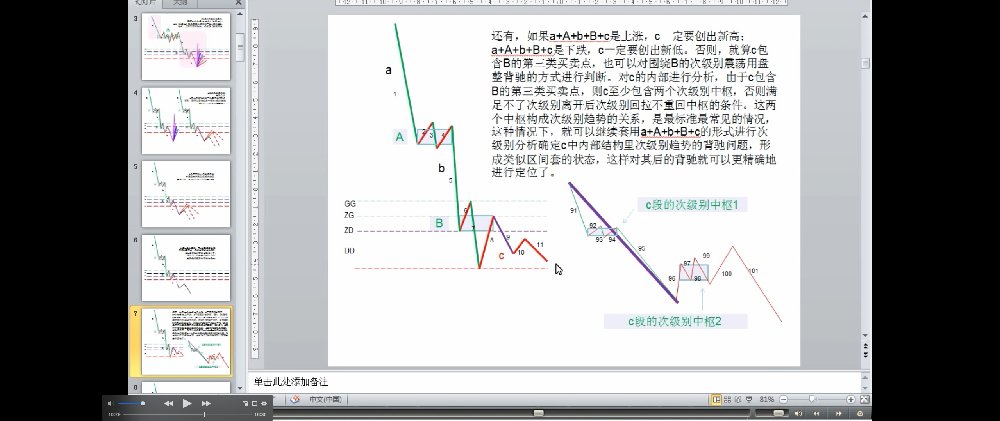

# 教你炒股票 37：背驰的再分辨
(2007-03-16 11:51:32)

现在如果要摆脱目前的中枢，没有金融股的配合基本是不可能的。但金融股由于某类人掌握得比较厉害，短线的攻击没问题，但一个持续的攻击，就有点困难了。不过金融股在中线角度，依然还是一大早的观点，用工行为例子，就是围绕 5 元上下的一个大级别震荡，要大跌，打压的人是要付出代价的。顺便说一句，中行里的汉奸实力小点，中行有奥运概念、业绩也较好一点，能否改造成一个反汉奸的武器，成为一个突破口，还需要很大的努力。其实这改造已经不是一天两天的事情，中行这几天已经连续比工行股价要高了，这就是成绩。具体的细节就不说了，总之，斗争是残酷的，是复杂的，不能赤膊上阵，要用最充分的耐心去消耗汉奸的实力。

背驰问题说过多次，但发现还有很多误解。不妨用最典型的 a+A+b+B+c 为例子把一些经常被混淆的细节进行说明。

没有趋势，没有背驰，不是任何 a+A+b+B+c 形式的都有背驰的。**当说 a+A+b+B+c 中有背驰时，首先要 a+A+b+B+c 是一个趋势**。而一个趋势，就意味着 **A、B 是同级别的中枢**，否则，就只能看成是其中较大中枢的一个震荡。例如，**如果 A 的级别比 B 大**，就有 a+A+b+B+c=a+A+（b+B+c），a 与（b+B+c）就是围绕中枢 A 的一些小级别波动。这样，是不存在背驰的，最多就是盘整背驰。**当然，对于最后一个中枢 B，背驰与盘整背驰有很多类似的地方，用多义性，可以把 b、c 当成 B 的次级波动**。但**多义性只是多角度**，不能有了把 b、c 当成 B 的次级波动这一个角度，就忘了 a+A+b+B+c 是趋势且 A、B 级别相同的角度。多义性不是含糊性，不是怎么干怎么分都可以，这是必须不断反复强调的。

其次，c 必然是次级别的，也就是说，c 至少包含对 B 的一个第三类买卖点，否则，就可以看成是 B 中枢的小级别波动，完全可以用盘整背驰来处理（疑问🤔️：这里没理解，c只是突破中枢的次级别走势，三买只能是c之后次级别回拉不回中枢形成，c怎么会包含对B的三买？）。而 b 是有可能小于次级别的，力度最大的就是连续的缺口，也就是说，b 在级别上是不能大于 c 的。例如，如果 b 是次级别，而 c 出现连续缺口，即使 c 没完成，最终也延续成次级别，但 c 是背驰的可能性就很小了，就算是，最终也要特别留意，出现最弱走势的可能性极大。

还有，**如果 a+A+b+B+c 是上涨，c 一定要创出新高；a+A+b+B+c 是下跌，c 一定要创出新低**。否则，就算 c 包含 B 的第三类买卖点，也可以对围绕 B 的次级别震荡用盘整背驰的方式进行判断。对 c 的内部进行分析，由于 c 包含 B 的第三类买卖点，则 c 至少包含两个次级别中枢，否则满足不了次级别离开后次级别回拉不重回中枢的条件。这两个中枢构成次级别趋势的关系，是最标准最常见的情况，这种情况下，就可以继续套用 a+A+b+B+c 的形式进行次级别分析确定 c 中内部结构里次级别趋势的背驰问题，形成类似区间套的状态，这样对其后的背驰就可以更精确地进行定位了。

最近太忙，不能写太长了。补充两句关于大盘目前的走势，说实在，现在如果要摆脱目前的中枢，没有金融股的配合基本是不可能的。但金融股由于某类人掌握得比较厉害，短线的攻击没问题，但一个持续的攻击，就有点困难了。不过金融股在中线角度，依然还是一大早的观点，用工行为例子，就是围绕 5 元上下的一个大级别震荡，要大跌，打压的人是要付出代价的。顺便说一句，中行里的汉奸实力小点，中行有奥运概念、业绩也较好一点，能否改造成一个反汉奸的武器，成为一个突破口，还需要很大的努力。其实这改造已经不是一天两天的事情，中行这几天已经连续比工行股价要高了，这就是成绩。具体的细节就不说了，总之，斗争是残酷的，是复杂的，不能赤膊上阵，要用最充分的耐心去消耗汉奸的实力。

下午一收盘就要去开反汉奸利器出炉的最后一次会议，就来不了了。大盘走势，很简单，在第三类买点出现前，继续震荡，这种走势已经反复很多次了，应该熟练应对了，所以也没必要多说了。
