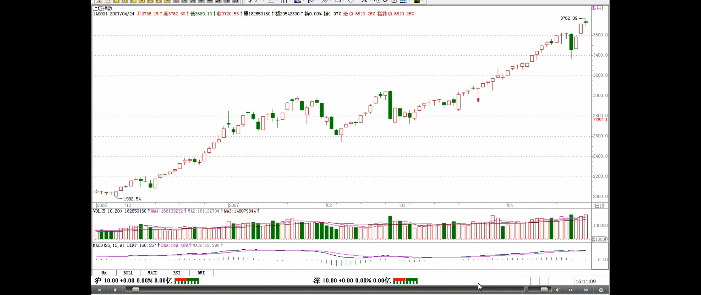
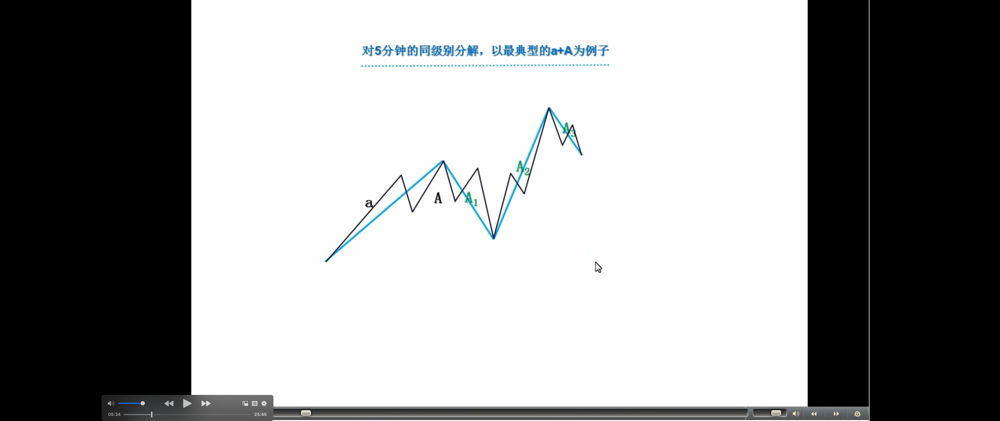
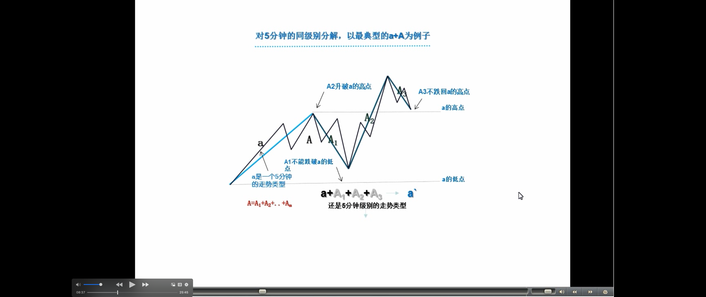
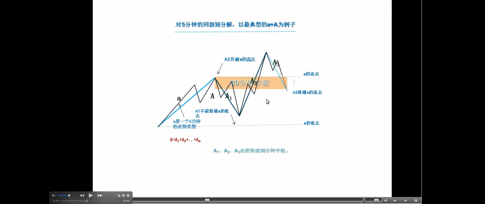
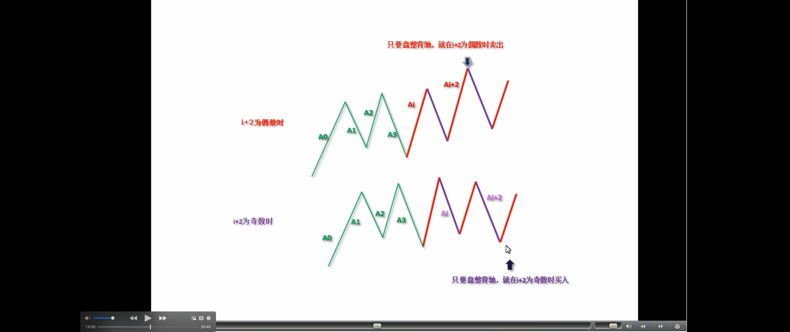
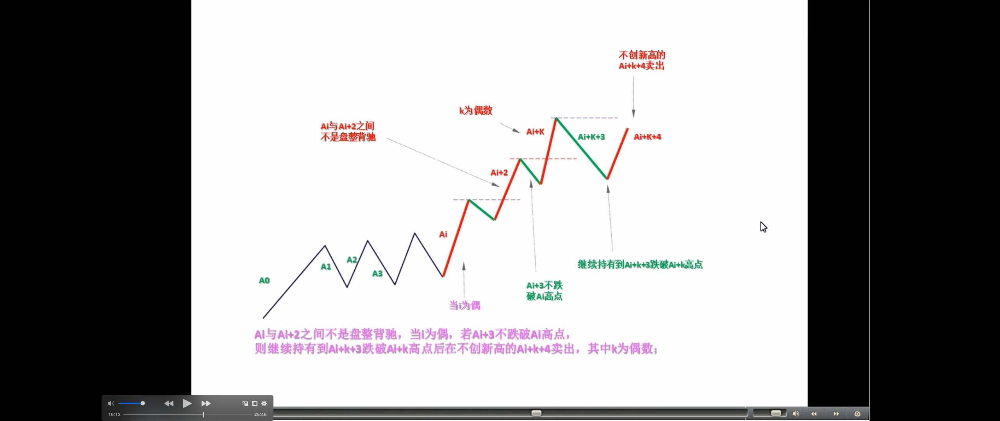
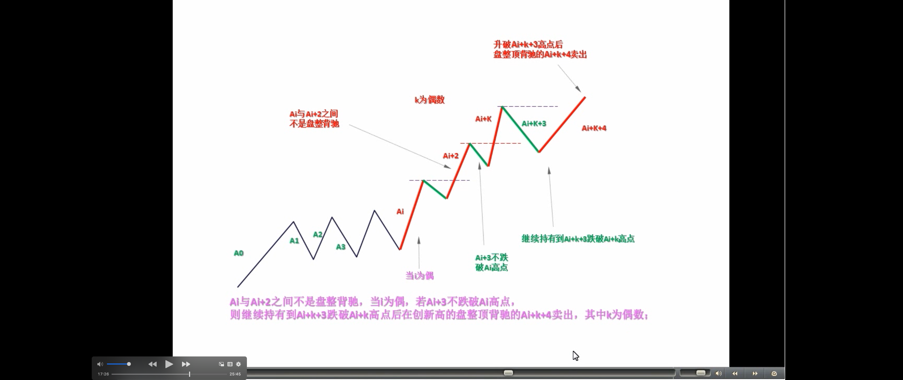
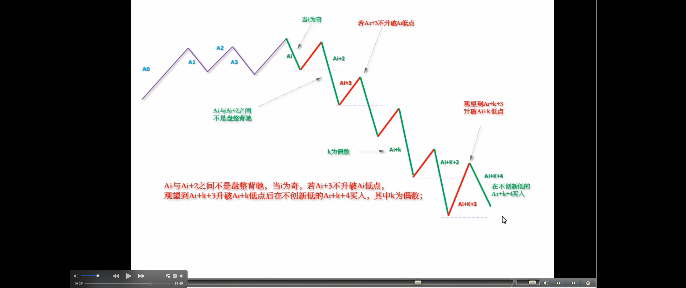
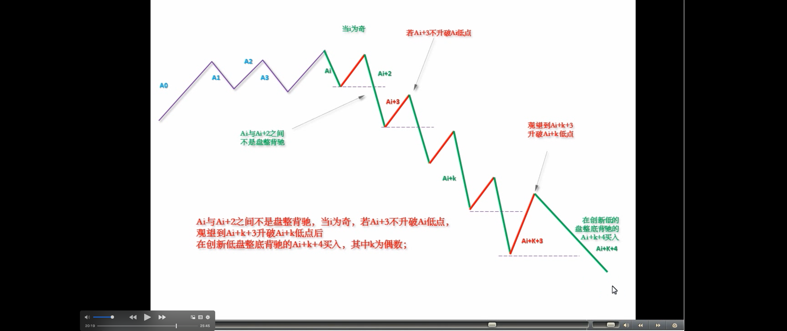

# 教你炒股票 39：同级别分解再研究

股票都是废纸，还怕有钱买不着废纸？因此，对于任何操作来说，只要赚钱卖出，是无所谓错误的；反过来，股票是吸血的凭证，没这凭证，至少在股票市场里是真吸不了血的，因此，只要卖了能低价位回补，就无所谓错误。**至于卖了可能还涨，回补可能还跌，这是技术的精确度问题**，就像**练短跑**，如果你永远只会撒腿乱跑，那你不可能达到高层次，而基础的练习都很枯燥，甚至 100 米，每段怎么跑，多少步，可能都要按一个机械的要求来，最终形成一个韵律，这才有可能达到高层次。**股票的操作一样，首先就要*培养这样一个韵律*，不排除在这个培养、训练的过程中，开始还比不上以前撒腿乱跑的速度，但坚持下去，等韵律感形成，那进步就不是撒腿乱跑的能比了。**

> 基本的韵律

**上节说了一个机械的操作程式，这就有一个基本的韵律**，其中最大的就是向上段先买后卖与向下段先卖后买的韵律，如果这个韵律都错了，那操作就一团糟。很多人的买卖其实都是靠天吃饭，买了，赌的就是上下两面，因此不管位置、不管时间、不管当下的走势结构，胡乱瞎买，然后又胡乱瞎卖。大的韵律把握了，还有就是每向上向下段中每小段间操作的韵律，显然，只要其中一步错了，这舞步就乱了。这时候，唯一正确的选择就是停止操作，先把心态、韵律调节好了才继续。**而且，当你按这个机械节奏不断操作下去，人身体的生物节奏都会慢慢有所感应，甚至可以达到这种程度，就是那种该操作的图形出现时，生理上就仿佛有感应一般**。其实，这一点都不神秘，就好象有些人睡觉，无论多晚，早上到点都会自动醒来，**而股票的操作，都有一定的紧张度，而同级别走势类型分解的节奏，大致有一定的周期性，长期下来，生理上有自然的反应就一点都不奇怪了**。

注意，下面的分析，如果对数学推理陌生的，大概要迷糊透，所以请先准备纸和笔，对着画图，才能搞清楚。

按同级别分解操作，还可能有更广泛、更精确的操作。对 5 分钟的同级别分解，以最典型的 a+A 为例子，一般情况下，a 并不一定就是 5 分钟级别的走势类型，但通过结合运算，总能使得 a+A 中,a 是一个 5 分钟的走势类型，而 A，也分解为 m 段 5 分钟走势类型，则 A=A1+A2+..+Am。想考虑 a+A 是向上的情况，显然，Ai 当 I 为奇数时是向下的，为偶数时是向上的，开始先有 A1、A2 出现，而且 A1 不能跌破 a 的低点，如果 A2 升破 a 的高点而 A3 不跌回 a 的高点，这样可以把 a+ A1+A2+A3 当成一个 a`，还是 5 分钟级别的走势类型（**疑问🤔️：** a+A1+A2 这三个 5 分钟的走势类型重叠，为什么还是 5 分钟走势类型？看 A1+A2+A3，没有重叠！又为什么不把 a 算在内？a 算是中枢进入段？）。因此，这里可以一般性地考虑 A3 跌破 a 的高点情况，这样，A1、A2、A3 必然构成 30 分钟中枢。因此，这一般性的 a+A 情况，都必然归结为 a 是 5 分钟走势类型，A 包含一 30 分钟中枢的情况。

**把 a 定义为 A0，则 Ai 与 Ai+2 之间就可以不断地比较力度，用盘整背驰的方法决定买卖点**。这和前面说的围绕中枢震荡的处理方法类似，但那不是站在同级别分解的基础上的。注意，在实际操作中下一个 Ai+2 是当下产生的，但这不会影响所有前面 Ai+1 的同级别唯一性分解。这种机械化操作，可以一直延续，该中枢可以从 30 分钟一直扩展到日线、周线甚至年线，但这种操作不管这么多，**只理会一点，就是 Ai 与 Ai+2 之间是否盘整背驰，只要盘整背驰，就在 i+2 为偶数时卖出，为奇数时买入**。如果没有，当 i 为偶，若 Ai+3 不跌破 Ai 高点，则继续持有到 Ai+k+3 跌破 Ai+k 高点后在不创新高或盘整顶背驰的 Ai+k+4 卖出，其中 k 为偶数；当 i 为奇数，若 Ai+3 不升破 Ai 低点，则继续保持不回补直到 Ai+k+3 升破 Ai+k 低点后在不创新低或盘整底背驰的 Ai+k+4 回补。

看完上面这段，至少 90%以上的人都心跳加速，头晕眼花。不过没办法，这是最精确的表述，画着图应该不难明白。**以上的方法，最大的特点是**，就是在同级别分解的基础上将图形基本分为两类，一类是“当 i 为偶 Ai+3 不跌破 Ai 高点”或“i 为奇数 Ai+3 不升破 Ai 低点”；一类是“Ai 与 Ai+2 之间盘整背驰”。对这两种情况采取不同的操作策略，构成了一种机械的操作方法。

附录：

今天大盘没什么可说的，周四、周五的血战已经在周三提前预告。今天中行主动示弱，不让汉奸有借利好出货的机会，为大盘以后的发展留下很大的余地。不过汉奸不会因为这两天的折腾而死心，那两个高点的连线依然在上面，没有效突破前，依然会人心浮动，汉奸依然会随时发难，所以耐心是最重要的，而震荡是稳定人心的最好办法。

各股方面，具体的不能说了，免得汉奸有口实，最近打小报告的人忒多，而这又是汉奸的强项。反正前面说的那五个板块，加上最近说的旅游、科技之类的都会陆续表现的。瓜田李下，本 ID 就不多说，说的都是梦话，如此而已。
