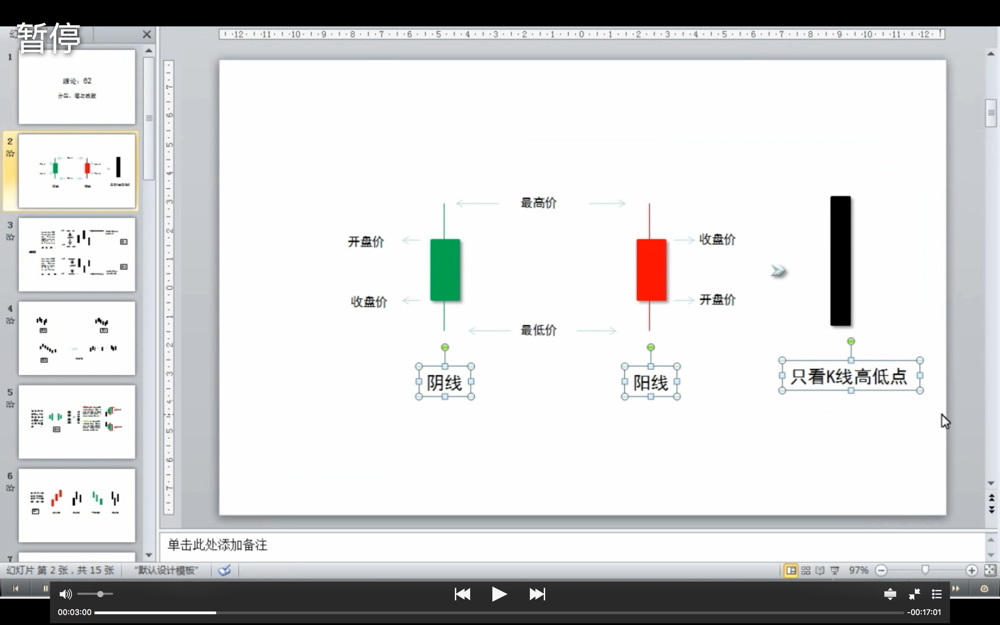
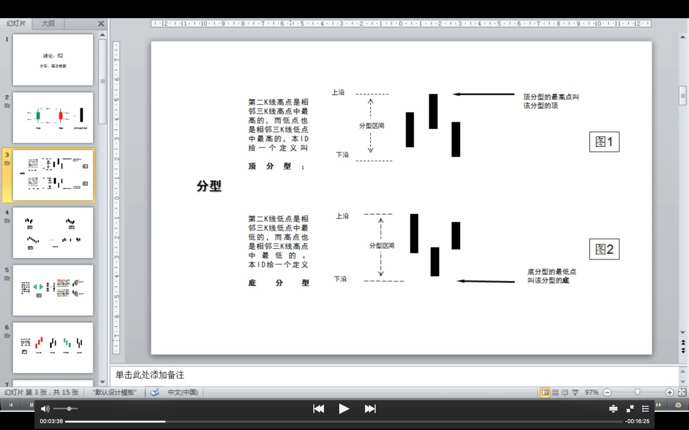
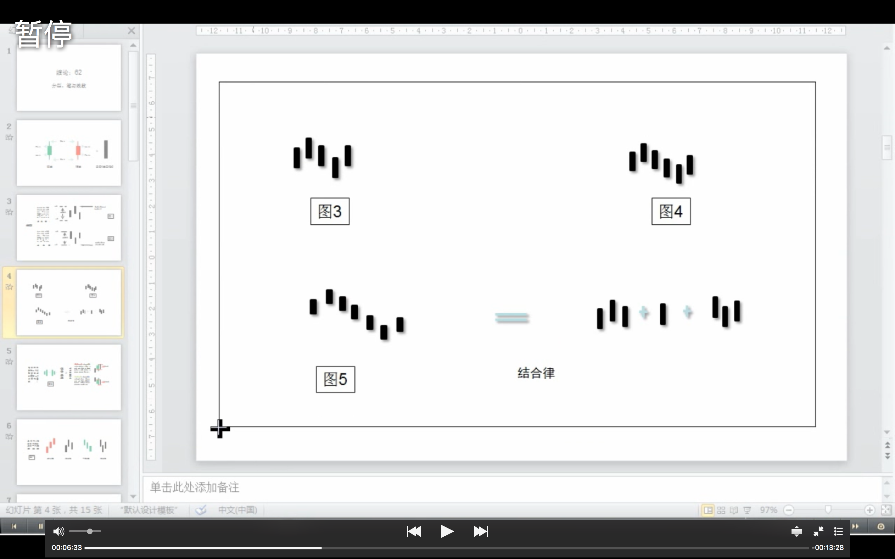
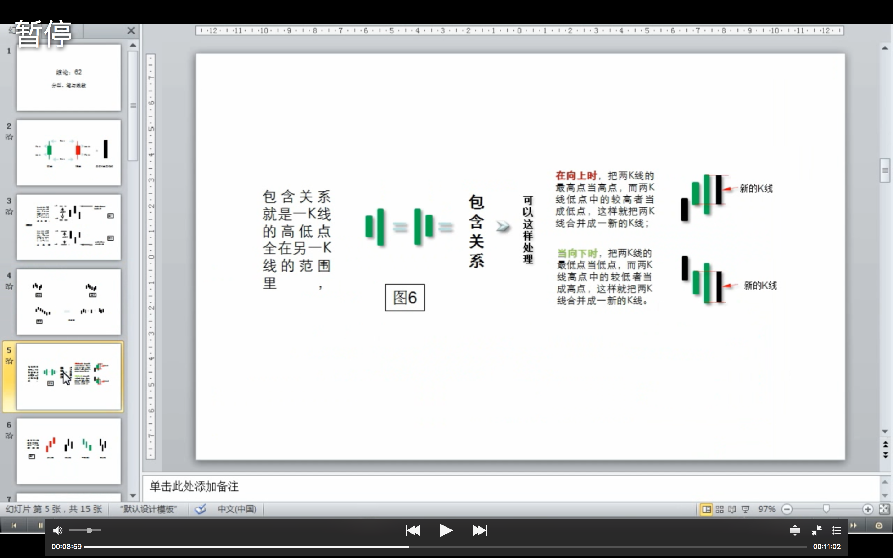
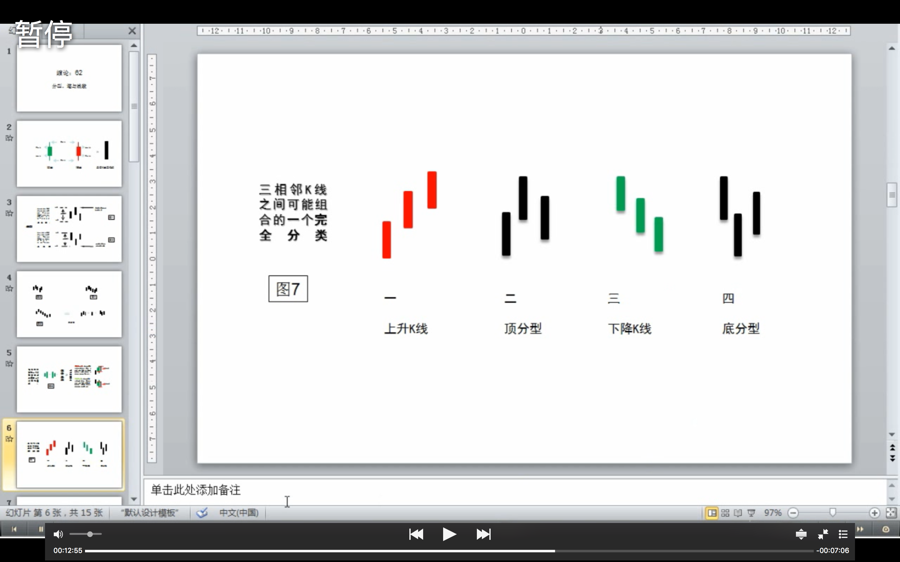
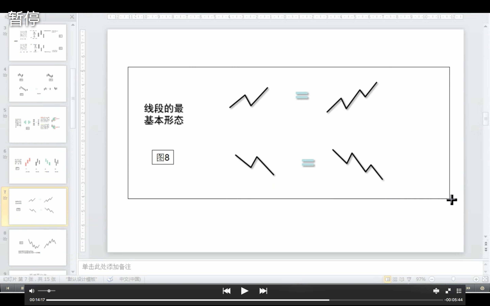
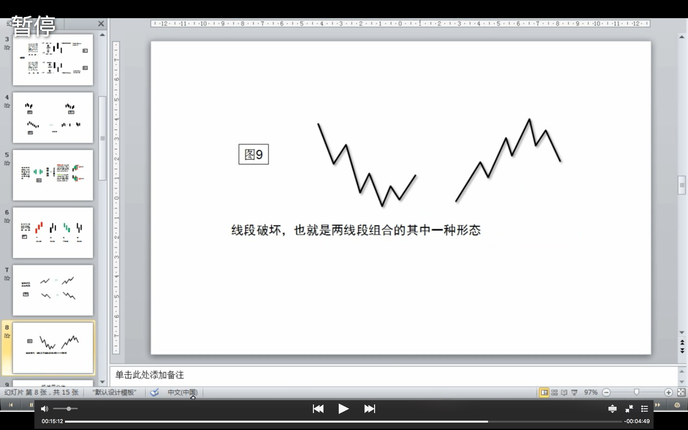

# 62.分型、笔与线段

在宾馆里闲着等着10点开始的腐败，半个小时，找个面首来面首有点时间紧张，还不如给各位写个主贴，来个课程，耗费一下各位周末腐败的时间。

瞧了一下，有位叫石猴的网友写了帖子来解释什么是线段，他的理解还行，但不够严密。**其实，本ID的线段是可以最精确定义的，本ID的理论，本质上是一套几何理论，其有效性就如同几何一般，本ID理论当然有失败不严谨的时候，但这前提是几何的基础失败不严谨，不明白这一点，就不明白本ID的理论。** 这里，就把本来是后面的课程提前说说。

下面的定义与图，都适合任何周期的K线图。先看图中的第1、2，图中的小线段代表的是K线，这里 **不分阳线阴线，只看K线高低点**。

像图1这种，第二K线高点是相邻三K线高点中最高的，而低点也是相邻三K线低点中最高的，本ID给一个定义叫 **顶分型**；图2这种叫 **底分型** ，第二K线低点是相邻三K线低点中最低的，而高点也是相邻三K线高点中最低的。看不明白定义的，看图就明白了，这么直观都不明白，那去和孔男人为伍吧。

顶分型的最高点叫该分型的顶，底分型的最低点叫该分型的底，由于顶分型的底和底分型的顶是没有意义的，所以顶分型的顶和底分型的底就可以简称为 **顶** 和 **底**。也就是说，当我们以后说顶和底时，就分别是说顶分型的顶和底分型的底。

*（粗壮的种子：上面两段定义了顶分型/底分型/顶/底）*

**两个相邻的顶和底之间构成一笔，所谓笔**，就是顶和底之间的其他波动，都可以忽略不算，但注意，**一定是相邻的顶和底，隔了几个就不是了**。而所谓的 **线段，就是至少由三笔组成**。但这里有一个细微的地方要分清楚，因为结合律是必须遵守的，像图3这种，顶和底之间必须共用一个K线，这就违反结合律了，所以这不算一笔，而图4，就光是顶和底了，中间没有其他K线，一般来说，也最好不算一笔，而图5，是一笔的最基本的图形，顶和底之间还有一根K线。**在实际分析中，都必须要求顶和底之间都至少有一K线当成一笔的最基本要求**。

*（粗壮的种子：疑问。该段的“顶”/“底”分别指的应该是顶分型/底分型）*

*（粗壮的种子：疑问。结合律是什么？35课：【韶山映山红】结合律是指运算的顺序不影响结果。结合律:(a+b)+c=a+(b+c)， (a×b)×c=a×(b×c)。）*

*（粗壮的种子：该段定义了笔/线段。笔：由相邻的顶分型和底分型构成，且顶分型与底分型不能共用k线（遵守结合律），且中间有一根独立的k线。）*

当然，实际图形里，有些复杂的关系会出现，就是相邻两K线可以出现如图6这种 **包含关系**，也就是一K线的高低点全在另一K线的范围里，这种情况下，可以 **这样处理**， **在向上时**，把两K线的最高点当高点，而两K线低点中的较高者当成低点，这样就把两K线合并成一新的K线；反之， **当向下时**，把两K线的最低点当低点，而两K线高点中的较低者当成高点，这样就把两K线合并成一新的K线。经过这样的处理，所有K线图都可以处理成没有包含关系的图形。

*（粗壮的种子：包含关系的定义/包含关系的处理规则：向上时，高点取高，低点取高；向下时，高点取低，低点取低）*

*（粗壮的种子：疑问：如果高点或低点相等，算不算包含关系？算，缠师回复答疑有说）*

而图7，就给出了经过以上处理，**没有包含关系的图形中，三相邻K线之间可能组合的一个完全分类**，其中的二、四，就是分别是顶分型和底分型，一可以叫上升K线，三可以叫下降K线。所以，**上升的一笔**，由结合律，就一定是底分型+上升K线+顶分型；**下降的一笔**，就是顶分型+下降K线+底分型。注意，这里的上升、下降K线，不一定都是3根，可以无数根，只要一 直保持这定义就可以。当然，简单的，也可以是1、2根，这只要不违反结合律和定义就可以。

*（粗壮的种子：上升的一笔/下降的一笔）*

*（粗壮的种子：疑问。结合律是什么？上面有答案）*

至于图8，就是 **线段的最基本形态**，而图9，就是 **线段破坏**，也就是两线段组合的其中一种形态。有人可能要说，这怎么有点像波浪理论，这有什么奇怪的，本ID的理论可以严格地推论出波浪理论的所有结论，而且还可以指出他理论的所有不足，波浪理论和本ID的理论一点可比性都没有。不仅是波浪理论，所有关于股市的理论，只要是关系到图形的，本ID的理论都可以严格推论，**因为本ID的理论是关于走势图形最基础的理论，谁都逃不掉**。

不能再废话了，下面车来了，腐败开始，大家也腐败去吧。
