# 67.线段的划分标准

笔的划分标准在前面已经严格给出，因此，下一关键问题，就是如何划分线段。下面，给出类似笔划分，但有重大区别的划分标准。用 S 代表向上的笔，X 代表向下的笔。那么所有的线段，无非两种：一、从向上笔开始；二、从向下笔开始。简单起见，以向上笔开始的线段为例子说划分的标准。
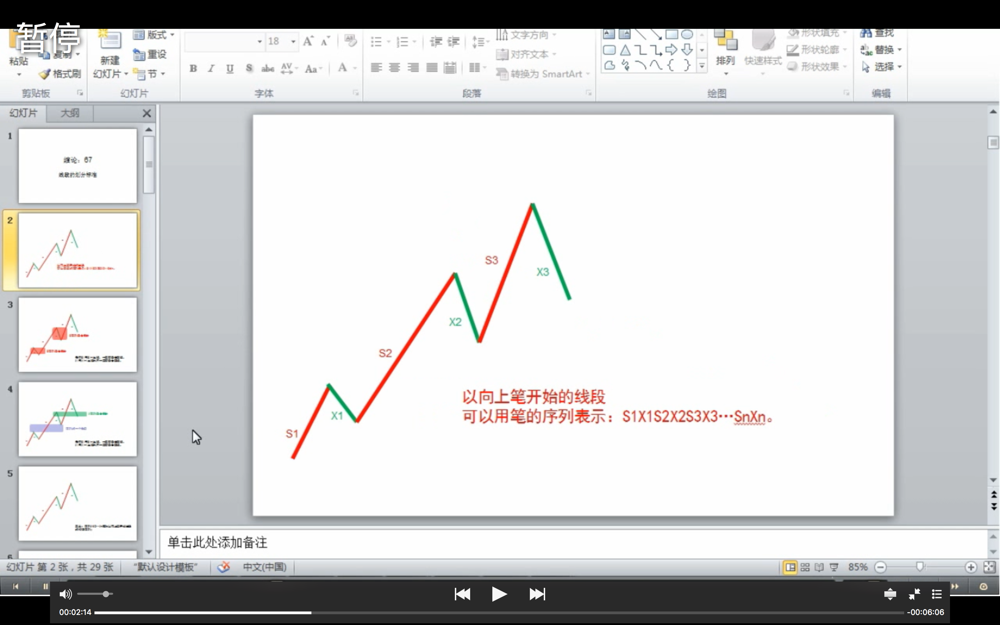
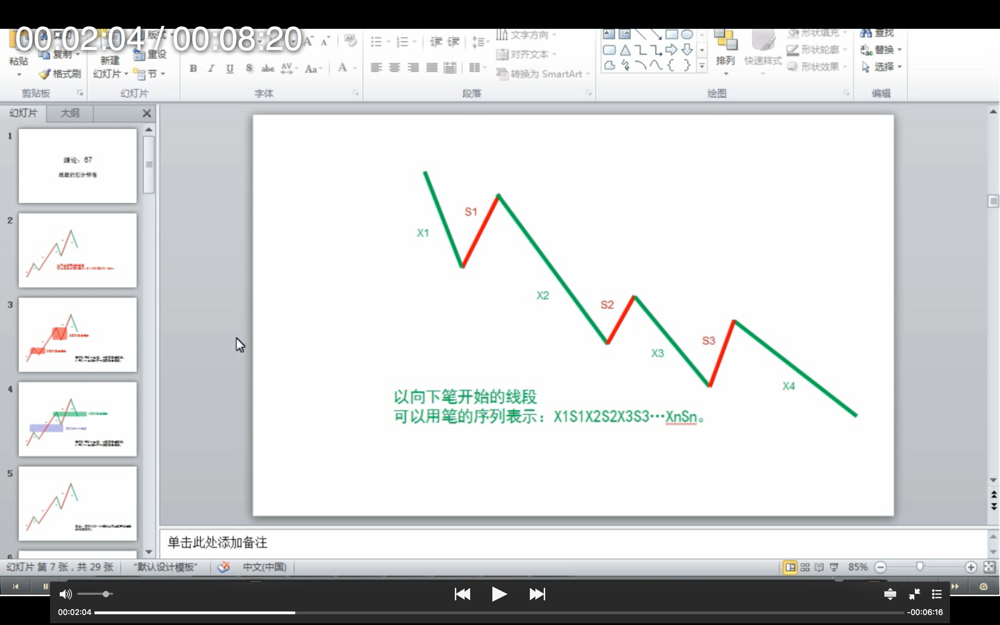

以向上笔开始的线段，可以用笔的序列表示：S1X1S2X2S3X3…SnXn。容易证明，任何 Si 与 Si+1 之间，一定有重合区间。而考察序列 X1X2…Xn，该序列中， **Xi 与 Xi+1 之间并不一定有重合区间，因此，这序列更能代表线段的性质**。
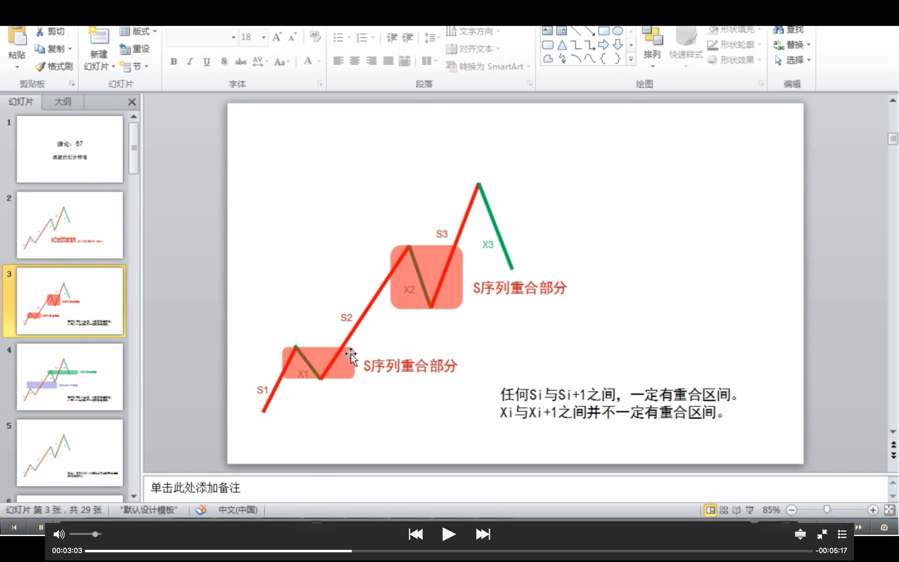
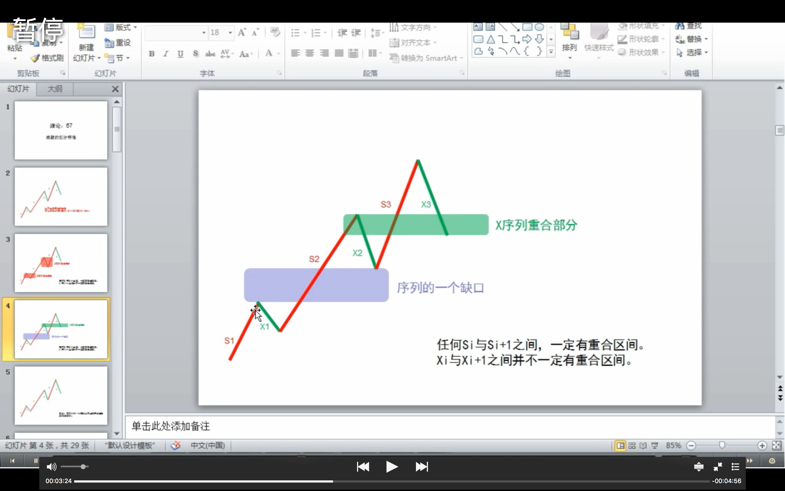


定义：序列 X1X2…Xn 成为 **以向上笔开始线段的特征序列**；序列 S1S2…Sn 成为 **以向下笔开始线段的特征序列**。特征序列两相邻元素间没有重合区间，称为该 **序列的一个缺口** 。
_（粗壮的种子：参考上面的图）_

关于特征序列，把每一元素看成是一 K 线，那么，如同一般 K 线图中找分型的方法，也存在所谓的包含关系，也可以对此进行非包含处理。经过非包含处理的特征序列，成为 **标准特征序列**。以后没有特别说明，特征序列都是指标准特征序列。
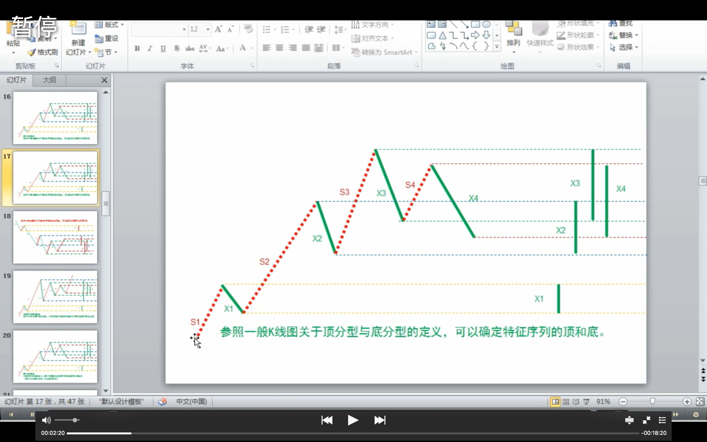
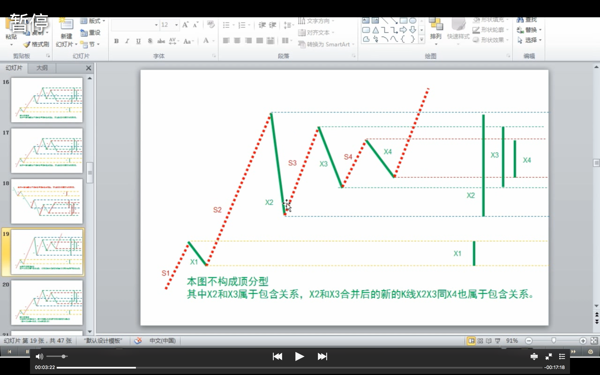
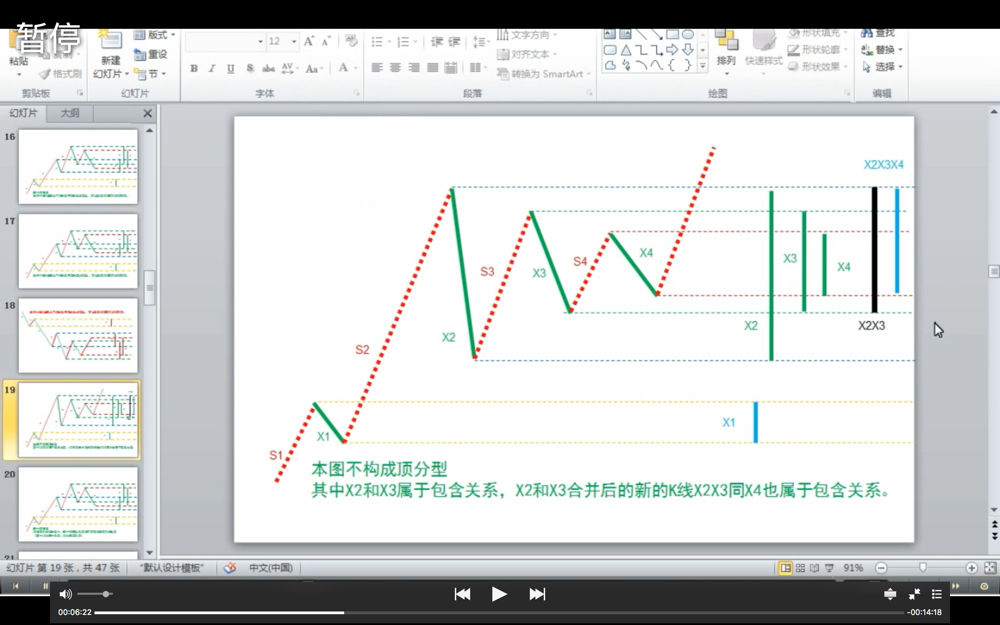

参照一般 K 线图关于顶分型与底分型的定义，可以确定特征序列的顶和底。**注意，以向上笔开始的线段的特征序列，只考察顶分型；以向下笔开始的线段，只考察底分型**。
_（粗壮的种子：参考上面 4 图）_

在标准特征序列里，构成分型的三个相邻元素，只有两种可能：

- 第一种情况：

**特征序列的顶分型中，第一和第二元素间不存在特征序列的缺口，那么该线段在该顶分型的高点处结束，该高点是该线段的终点；特征序列的底分型中，第一和第二元素间不存在特征序列的缺口，那么该线段在该底分型的低点处结束，该低点是该线段的终点**；
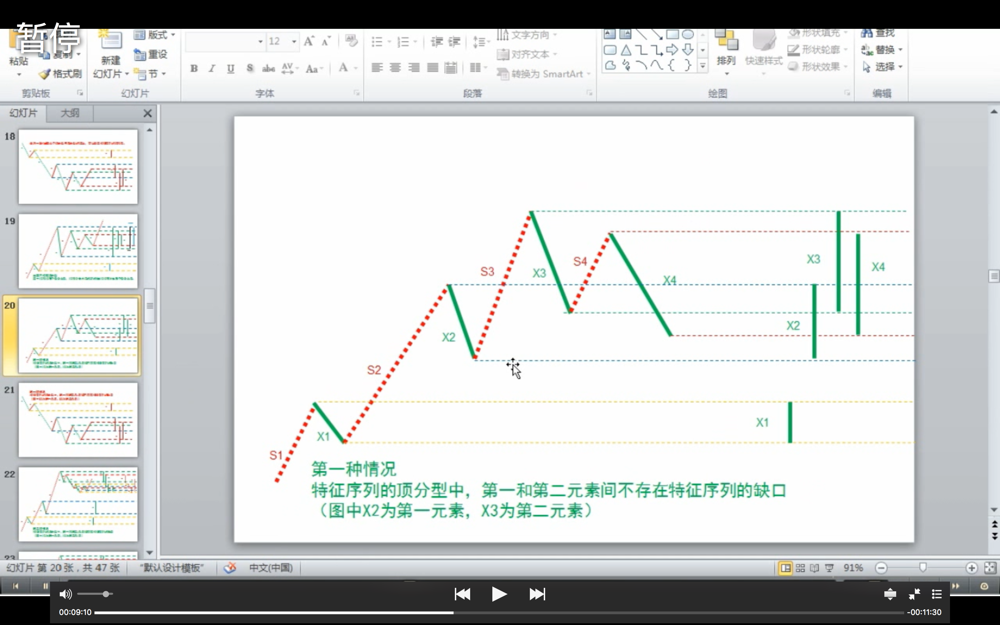
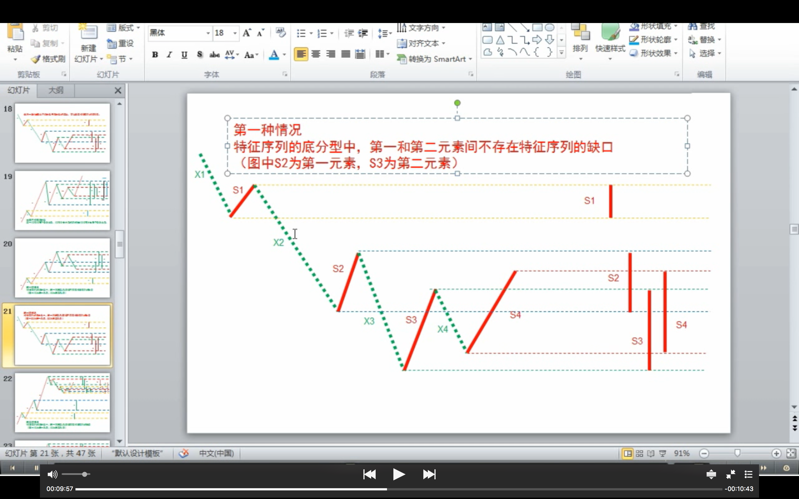

- 第二种情况：

**特征序列的顶分型中，第一和第二元素间存在特征序列的缺口，如果从该分型最高点开始的向下一笔开始的序列的特征序列出现底分型，那么该线段在该顶分型的高点处结束，该高点是该线段的终点；特征序列的底分型中，第一和第二元素间存在特征序列的缺口，如果从该分型最低点开始的向上一笔开始的序列的特征序列出现顶分型，那么该线段在该底分型的低点处结束，该低点是该线段的终点**；
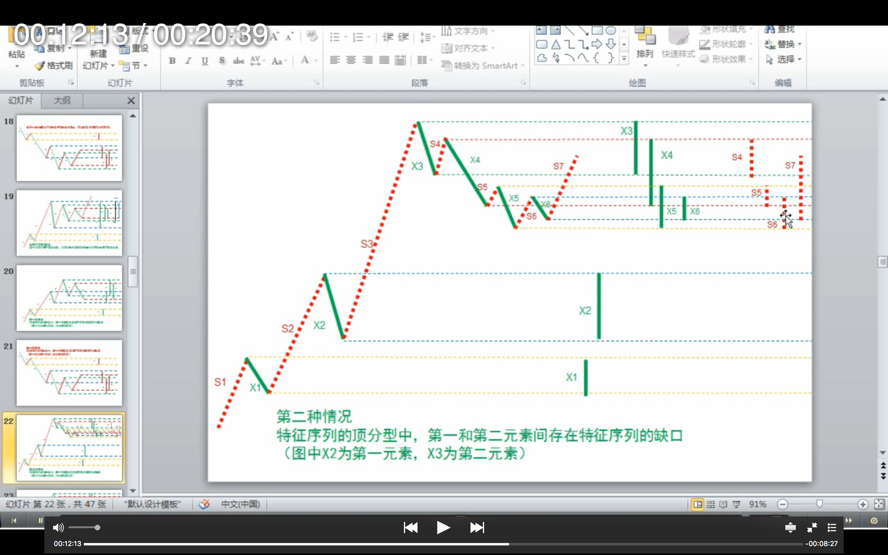
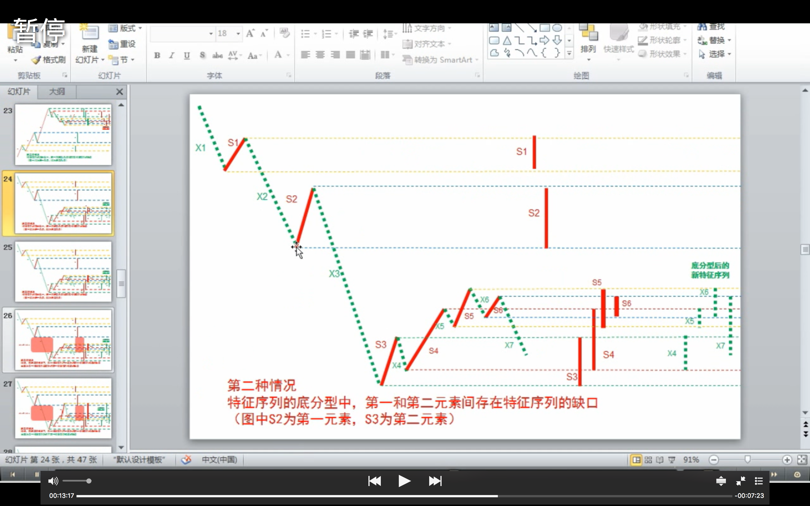

**强调，在第二种情况下，后一特征序列不一定封闭前一特征序列相应的缺口，而且，第二个序列中的分型，不分第一二种情况，只要有分型就可以。**

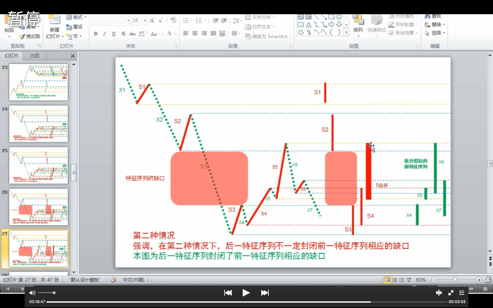
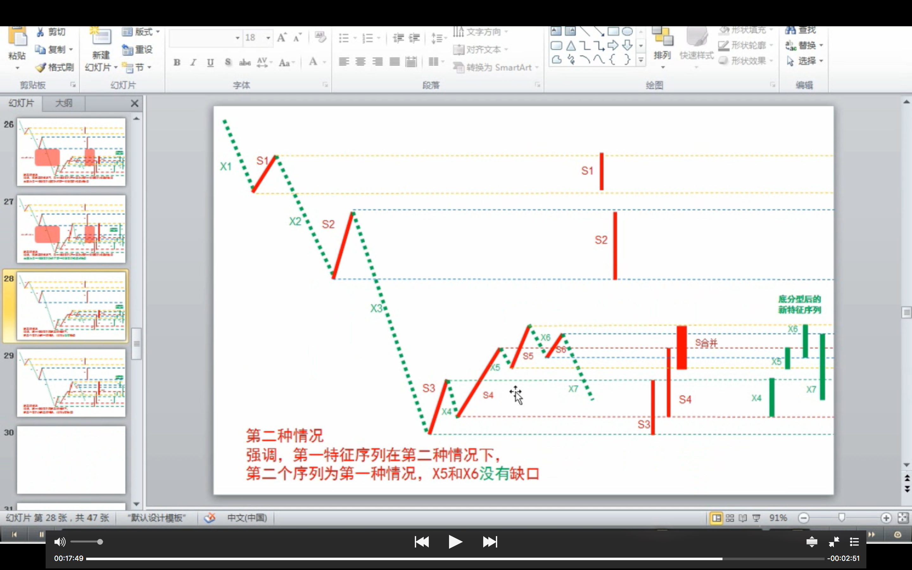
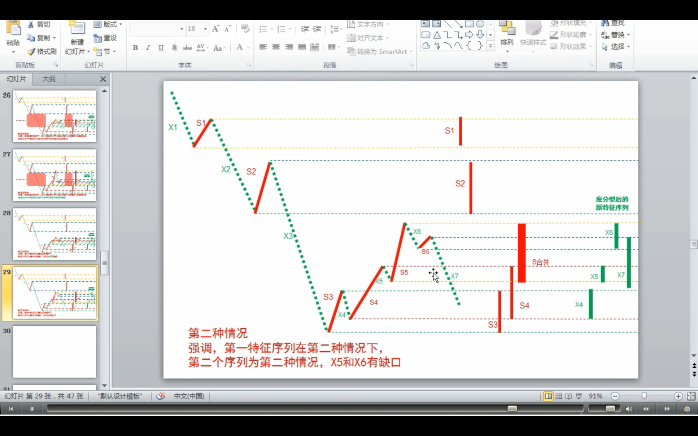

上面两种情况，就给出所有线段划分的标准。显然，**出现特征序列的分型，是线段结束的前提条件**。本课，就是把前面“线段破坏的充要条件就是被另一个线段破坏”精确化了。因此，以后关于线段的划分，都以此精确的定义为基础。

**这个定义有点复杂，首先请先搞清楚特征序列，然后搞清楚标准特征序列，然后是标准特征序列的顶分型与底分型。而分型又以分型的第一元素和第二元素间是否有缺口分为两种情况。一定要把这逻辑关系搞清楚，否则一定晕倒。**

**显然，按照这个划分，一切同一级别图上的走势都可以唯一地划分为线段的连接，正如一切同一级别图上的走势都可以唯一地划分笔的连接。有了这两个基础，那么整个中枢与走势类型的递归体系就可以建立起来**。这是基础的基础，请务必搞清楚，否则肯定学不好。

最后，尽量画点图，让各位分清楚上面的一些概念，但最好把定义看清楚，这才是真正理解，图只是一个辅助。前两个图形中标出了线段的划分。

